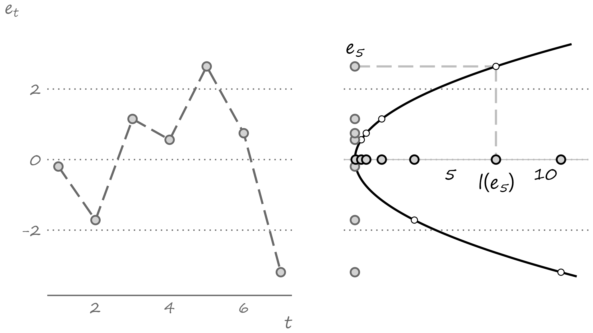

      


```{r setup, include=FALSE}
knitr::opts_chunk$set(echo = FALSE)
```


# People have made forecasts for ages

.pull-left[

]

.pull-right[
The roots of forecasting extend to the early days of human history. In their desire to predict the future, people have attempted to make forecasts of their own, or have used services of others. 
- Fortunetellers were been forecast 'experts' of some sort, basing their predictions on magic. They are less common in this age. 
- Astrologers, who rely on astronomical phenomena to foresee the future, maintain their relevance to this date. 
]

---


# Early forecasts mainly revolved around weather

.right-column[
Primarily because weather was the single most important factor that impacted the livelihood of people, and indeed the fate of civilizations.
 - The Babylonians based their weather forecasts on the appearance of clouds. 
 - The ancient Egyptians measured the levels of the Nile River’s waters to predict an approaching famine due to droughts or destructive floods.

]

---


# The tools and techniques improved over time

.right-column[
The inventions of the barometer and the thermometer contributed to the development of the study of meteorology.

The telegraph made these tools useful - it became possible for the weather forecast to travel sooner than the weather itself.
]

---


# Evolution of the economic forecasting

.right-column[
The history of economic forecasting is shorter. 
- Irving Fisher was one of the first academic economists who contributed to the study of forecasting through his "Equation of Exchange," which he used as the
foundation to forecast prices.
- Charles Bullock and Warren Persons ran a Harvard-affiliated quasi-academic center for business cycle research with main purpose to generate economic forecasts
based on historical precedents.

]

---


# Computers and the Internet are key

.right-column[
The failure to predict the Great Depression adversely impacted the early economic forecasters' reputation and, indeed, fortunes.

As with the telegraph back in the 19th century, the evolution of the computing power in the second half of the 20th century facilitated the resurrection of economic forecasting.

The evolution of the Internet and the ease of storage and distribution of high-frequency
granular data further aided the advancement of the study of forecasting.

]

---


# What is forecast if not a guess
	
.right-column[	
A forecast is a guess about the future event.

A guess may be based on one's experience and available knowledge. But, really, it can be any statement about the future, regardless of whether such statement is well founded or lacks any sound basis.

We may guess today whether it will rain tomorrow. It may or may not rain tomorrow. With each of these two outcomes having some chance of occurring, our claim about whether it will rain is a guess.
]

---


# We guess because we don't know
	
.right-column[	
These are events for which several outcomes, each with some chance of appearing, are possible.
- We can think of a rain as a discrete random variable (a binary random variable, to be precise): it either rains or it does not rain. 

By contrast, making a claim about whether the sun will rise tomorrow is hardly a guess. We know with absolute precision when will the sun rise. There is no prophecy about predicting the sunrise.
]

---


# Not all guesses are forecasts
	
.right-column[	
A guess that relies on some knowledge or understanding of the underlying
causes of an event is a forecast. 
- When commercial banks make a guess whether the central bank will increase or decrease the cash rates, they forecast.

Otherwise, a guess may as well be a gamble. 
- Everyone is welcome in a casino so long as gambling is what they
do. But when one attempts to "beat the house" using the knowledge accumulated
by counting cards, the gamble becomes an educated guess and the gambler becomes *persona non grata*.
]

---


# Some events are easier to forecast than others

.right-column[	
Events that are primarily guided by physical processes or relationships are easier to forecast. 
- A storm forecast can be highly accurate.

Events that involve people and their behavioral peculiarities are much less predictable. People, of course, are front and center in business and economic relationships.  
- Irving Fisher notoriously made the claim in early October 1929 that "*stock prices have reached [...] a permanently high plateau.*" The Wall Street Crash and Great Depression followed shortly after.
]

---


# Sometimes we cannot guess because we know

.right-column[	
The issue lies in our ability to influence the future because we could forecast it reasonably well.

Suppose we found out that stock prices of a publicly traded company would increase tomorrow. This creates a temporal arbitrage opportunity: we can buy the
stock today, when its price is still low, and sell it tomorrow, when its
price has increased.

However, as we (and many other people) act on this information at once, we create demand and drive the prices up today, thus absorbing the temporal arbitrage opportunity.

]

---


# Information is key in forecasting

.right-column[
Forecasters all rely (or, at least, pretend to rely) on *information*.

Information summarizes everything that we know about the event.

When the information is organized and stored in a certain way - chronologically and at regular intervals - we have the time series of historical data. 

Forecasting involves examining historical data to make an informed guess about what is to come in the near or the distant future.

]

---


# A time series, its density, and a forecast

.right-column[
```{r time-series, out.width = "90%"}

```
]

---


# Most of the time we don't get it right

.right-column[
The difference between the realized outcome and the point forecast for that period is the forecast error: $$e_{t+h|t} = y_{t+h} - \hat{y}_{t+h|t}$$

We may forecast with an error because:
- we don't know the future
- we don't know the model
- we don't know the parameters
]

---


# We try minimizing the risk of getting it wrong

.right-column[
The *optimal* point forecast is the best guess, one that minimizes the risk of getting it wrong.

We measure risk using a loss function, $l(e_{t+h|t})$. The following must hold for the loss function:
- $l(e_{t+h|t}) = 0$ for all $e_{t+h|t}=0$
- $l(e_{t+h|t}) \ge 0$ for all $e_{t+h|t} \ne 0$

And (assuming symmetric loss function) for all $t \ne s$:
- $l(e_{t+h|t}) \ge l(e_{s+h|s})$ for all $|l(e_{t+h|t})| \ge |l(e_{s+h|s})|$

]

---


# Quadratic loss function

.right-column[
```{r loss, out.width = "90%"}

```
]

---


# Loss minimization

.right-column[
```{r loss-animation, out.width = "90%"}
knitr::include_graphics("figures/lecture1/quadratic-loss.gif")
```
]

---


# Forecasting with time series models

.right-column[	
Economic forecasting lends itself naturally to time series analysis. In a way, time series econometrics has evolved as a by-product of the economists' quest for accurate forecasts.

In econometric time series analysis, the implied assumption is that the past tends to repeat itself. So, if we well study the past, we should be able to predict the future, at least with some degree of accuracy. 

But, of course, there is no such thing as perfect forecast. Best we can hope for is that we get close to it (on average).
]

---


# Additional Readings

.pull-left[

]

.pull-right[

Gonzalez-Rivera, Chapter 1

Hyndman & Athanasopoulos, [1.1](https://otexts.com/fpp3/what-can-be-forecast.html), [1.2](https://otexts.com/fpp3/planning.html), [1.3](https://otexts.com/fpp3/determining-what-to-forecast.html), [1.4](https://otexts.com/fpp3/data-methods.html), [1.5](https://otexts.com/fpp3/case-studies.html), [1.6](https://otexts.com/fpp3/basic-steps.html)
]


