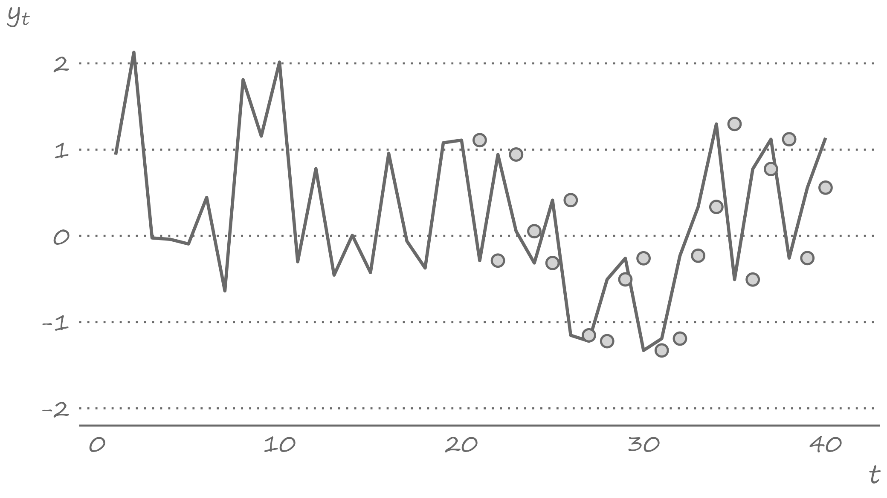

```{r setup, include=FALSE}
knitr::opts_chunk$set(echo = FALSE, fig.width = 11, fig.height = 7)
```


```{r echo=FALSE, include=FALSE, message=FALSE}
library(data.table)
library(ggplot2)
```


# Forecast is a random variable

.pull-left[

]

.pull-right[
Consider a forecast made in period $t$ for period $t+h$. So, a $h$-step-ahead forecast.

The complete forecast is fully summarized by its (conditional) distribution $F(y_{t+h}|\Omega_t)$ or the density $f(y_{t+h}|\Omega_t)$, where $\Omega_t$ is the information set.

Both $F(y_{t+h}|\Omega_t)$ and $f(y_{t+h}|\Omega_t)$ combine the knowns and unknowns about the potential values of $y$ in period $t+h$, given the knowledge in period $t$.
]

---


# Forms of a forecast

.right-column[
A *density forecast* is a very informative form of a forecast, but it is also rather complex, particularly when we try to convey the message.

The simplest and (therefore) most frequently presented form of a forecast is a *point forecast*, which is just a single (most likely) value of the forecast.

A relatively more informative (than the point forecast) but still not too complex form of a forecast is *interval forecast*, which is the lower and upper percentiles of the forecast distribution.
]

---


# Generating forecasts

.right-column[
When we make forecasts, we would want to have some idea of how accurate they are. 

We can get an idea about forecast accuracy by comparing the forecasts with the actual future realizations of the variable of interest.

But to assess forecast accuracy we need access the data from the future - a task that is neither feasible nor practical. 

Instead, we can resort to the so-called "pseudo-forecasting" routine.
]

---


# Pseudo forecasting routine

.right-column[
The pseudo forecasting routine involves splitting the available data into two segments referred to as 'in-sample' and 'out-of-sample'

- The in-sample segment of a series is also known as the 'estimation set' or the 'training set.'
- The out-of-sample segment of a series is also known as the 'hold-out set' or the 'test set.'
]

---


# Pseudo forecasting routine

.right-column[
Thus, we make the so-called 'genuine' forecasts using only the information from the estimation set, and assess the accuracy of these forecasts in a hold-out set.

Because forecasting is often performed in a time series context, the estimation set typically predates the hold-out set. In non-dynamic settings such chronological ordering usually is not needed.
]

---


# Recursive and rolling windows

.right-column[
As we carry out the pseudo-forecasting routine, we update the information set by including the more recent observations. In so doing, we may choose to keep or discard the more distant observations, which leads to two possible ways of selecting and updating information sets.
- The *recursive* window approach uses a sequence of expanding windows to update model estimates and the information set.
- The *rolling* window approach uses a sequence of windows of the same size to update model estimates and the information set.
]

---


# Recursive windows

.right-column[
```{r recursive-windows}

```
]

---


# Rolling windows

.right-column[
```{r rolling-windows}

```
]

---


# Recursive vs. rolling windows

.right-column[
The two pseudo-forecasting routines are technically very similar. But they can generate considerably differing sets of forecasts. 

The recursive scheme uses increasingly more data to generate successive forecasts. If the data-generating process does not change over time this may be a preferred scheme as it allows us to estimate the model parameters more precisely. 

But if the data-generating process changes over time, then the use of all available data may as well harm our forecasts—they will be biased toward the historical past that is no longer relevant. In such instances, the rolling scheme may be a preferred alternative. 
]

---


# Generating forecasts and obtaining forecast errors

.right-column[
To evaluate forecasts of a time series, $\{y_t\}$, with a total of $T$ observations, we divide the sample into two parts, the in-sample set with a total of $R$ observations, such that $R < T$ (typically, $R \approx 0.75T$), and the out-of-sample set with the remaining $T-R$ observations. 

If we are interested in the one-step-ahead forecast evaluation, this way we will produce a sequence of forecasts: $\{y_{R+1|R},y_{R+2|{R+1}},\ldots,y_{T|{T-1}}\}$.

Having observed $\{y_{R+1},y_{R+2},\ldots,y_{T}\}$ we can, then, obtain forecast errors, $e_{R+j} = y_{R+j} - y_{R+j|{R+j-1}}$, for $j = 1,\ldots,T-R$.
]

---


# Measures of forecast accuracy

.right-column[
The most commonly applied accuracy measures are the mean absolute forecast error (MAFE) and the root mean squared forecast error (RMSFE):
$$\begin{aligned}
\text{MAFE}  = & \frac{1}{P}\sum_{i=1}^{P}|e_i|\\
\text{RMSFE} = & \sqrt{\frac{1}{P}\sum_{i=1}^{P}e_i^2}
\end{aligned}$$
where $P$ is the total number of out-of-sample forecasts.
]

---


# Measures of forecast accuracy

.right-column[
The MAFE assumes absolute loss, while the RMSFE assumes quadratic loss. 

The lower is the measure of the forecast accuracy, the better is the model or the method used in generating forecasts. 

Unlike some of the better-known in-sample goodness-of-fit measures (e.g., R-squared), these accuracy measures, on their own, have little meaning. They gain the meaning when we compare two (or more) models or methods of forecasting. 
]

---


# Measures of forecast adequacy

.right-column[
MAFE and RMSFE (and other similar measures of forecast accuracy) are *relative* measures designed to compare forecasts. These are the mean values (or monotonic transformations thereof) of some loss functions. 

But there also exist *absolute* measures designed to evaluate each forecast separately. These are measures of forecast *unbiasedness* and *efficiency*, together forming the measure of forecast adequacy (or *rationality*).
]

---


# Forecast unbiasedness

.right-column[
A forecast is unbiased if the forecast error is zero, on average. 

This condition mimics that of the residuals of a model. But the residuals are, by construction, guaranteed to be mean-zero. This is not the case with forecast errors.

But we do want forecast errors to be mean-zero. Otherwise, we probably have an issue with the model or the method that we chose for generating the forecasts.
]

---


# Misspecified model can yield biased forecasts

.right-column[
Consider a positively trending time series. And suppose, due to ignorance or incompetence, we did not account for the trend. Instead, we assumed that an appropriate model was the simple mean of the observed series. 

The forecasts from this model will likely underestimate the realized future values of the time series. That is, the forecasts will be biased.

The following graph illustrates this assuming the rolling window approach.
]

---


# Biased forecasts

.right-column[
```{r bias-trending}
knitr::include_graphics("figures/lecture2/trending.png")
```
]

---


# Biased forecast errors

.right-column[
```{r errors-trending}
knitr::include_graphics("figures/lecture2/errors_trending.png")
```
]

---


# Biased forecast errors

.right-column[
It is obvious the mean of these forecast errors is some positive value, which is considerably different from zero. 

Of course, we are well aware of the issue - in generating the forecasts, we have ignored the presence of a trend in the time series.
]

---


# Biased forecast usually are less accurate

.right-column[
The bias, in this instance, contributes to the lack of accuracy of the applied model. The RMSFE, based on these 20 forecast errors, is $0.80$. Had there been no bias, the RMSFE, based on the bias-corrected 20 forecast errors, would have been $0.59$. 

Biased forecasts usually (albeit not necessarily) are less accurate than their unbiased counterparts.
]

---


# Forecast efficiency

.right-column[
A forecast is efficient if it incorporates all the relevant information that is available at the time when the forecast is made. 

This is akin to the concept of efficient markets. When a market is efficient, the available information is not helpful in predicting a change in the price of a stock, for example. Likewise, when a forecast is efficient, the forecast should not be of use in explaining the forecast error.
]

---


# Misspecified model can yield forecast inefficiency

.right-column[
Consider a series that follows a mean-reverting process. That is, any time the series deviate from the long-run mean, some forces pull the series back toward this long-run mean. 

Think of a market equilibrium price, for example. When, for some random reason, the price increases, producers follow by increasing their supply, and consumers by reducing their demand - both forces pulling the realized prices toward the equilibrium, that is, the long-run mean.
]

---


# Misspecified model can yield forecast inefficiency

.right-column[
Suppose we neglected the presence of a mean-reverting process, and assumed instead that the random walk best characterizes the time series dynamics. 

The outcome of this assumption will be that the generated forecasts will overestimate the realizations in the (extreme) positive range of the time series, and underestimate them in the (extreme) negative range of the time series. 
]

---

# Inefficient forecasts

.right-column[
```{r inefficient-meanreverting}

```
]

---


# Inefficient forecast errors

.right-column[
```{r errors-meanreverting}
knitr::include_graphics("figures/lecture2/errors_meanreverting.png")
```
]

---


# Inefficient forecast errors

.right-column[
As it was the case with the biased forecasts, the presence of inefficient forecasts also points to our lack understanding of the model used to generate forecasts. 

We are, of course, well-aware of this deficiency in our modeling effort - we completely ignored that the forecast in a given period depends on whether the most recent observed realization of the variable is greater or less than its long-run mean. 
]

---


# Inefficient forecast usually are less accurate

.right-column[
The inefficiency contributes to the lack of accuracy as well. 

The RMSFE, based on the forecasts from the misspecified model, is $1.25$. The RMSFE, based on the forecasts from the correctly specified model, would have been $1.11$.

Inefficient forecasts are less accurate than their efficient counterparts.
]

---


# Mincer-Zarnowitz regression

.right-column[
The unbiasedness and efficiency are hypotheses that can be tested. 

We can do this in a basic regression setting: 
$$y_{t+h}=\alpha_0+\alpha_1 \hat{y}_{t+h|t}+\upsilon_t,\;~~t=R,\ldots,T-h,$$
where $h$ is the length of the forecast horizon, and $R+h,\ldots,T$ is the out-of-sample segment over which the forecasts are generated; $\upsilon_t$ is an error terms that is assumed to be independent and identically distributed.
]

---


# Mincer-Zarnowitz regression

.right-column[
The null hypothesis $H_0:\left(\alpha_0=0,\alpha_1=1\right)$ is that for the joint test of unbiasedness and efficiency. Under this null hypothesis, $\upsilon_t$ represents the forecast error. 

More generally, the forecast error is: 
$$e_{t+h}=\alpha_0+\beta_1\hat{y}_{t+h|t}+\upsilon_t,$$
where $\beta_1=(1-\alpha_1)$. 

When $\alpha_0=\beta_1=0$, the forecast error is mean-zero and uncorrelated with the forecast.
]

---


# Mincer-Zarnowitz regression

.right-column[
Suppose we are interested in forecasting monthly crude oil prices. We decided, for some arbitrary reason, to use the 12-month lag as a forecast for the month price. 

Using a pseudo-forecasting routine, we can generate a set of out-of-sample forecasts for all but the first twelve periods of the available data. 

The left panel of the following graph presents this series. 
]

---

# Crude oil prices and Mincer-Zarnowitz regression

.right-column[
```{r mincer-zarnowitz}
knitr::include_graphics("figures/lecture2/oil_combined.png")
```
]

---

# Test of unbiasedness

.right-column[
We test unbiasedness of the one-step-ahead forecast by setting up a regression: $$e_{t+1} = \beta_0+\nu_{t+1},$$ where, in this instance, $e_{t+1}=y_{t+1}-y_{t-11}$. The test of unbiasedness is equivalent to that of $H_0: \beta_0 = 0$. 

As it turns out, the test statistic is $0.895$, and thus we fail to reject the null hypothesis of unbiasedness.
]

---


# Test of efficiency

.right-column[
We test efficiency of the one-step-ahead forecast by testing the null hypothesis of $H_0: \beta_1 = 0$. 
The test statistic is $-2.633$, which, in absolute terms, is greater than the critical value at 1% significance level, and thus means that we reject the null hypothesis of efficiency. 
]

---


# Joint test of unbiasedness and efficiency

.right-column[
We can test forecast adequacy, which is a simultaneous test of unbiasedness and efficiency, by testing the null hypothesis of $H_0: \alpha_0=0,\beta_1=0$. 

The F-statistic associated with this null hypothesis is $3.824$, which is greater than the critical value of $3.00$. Thus we reject the null hypothesis of forecast adequacy. 

The lack of forecast adequacy is primarily driven by the lack of forecast efficiency, as evidenced by the respective test. 
]

---


# Mincer-Zarnowitz regression

.right-column[
In the Mincer-Zarnowitz world, adequacy implies that 

1. forecasts are, on average, equal to the realized observations, so that the vertical and horizontal lines intersect with the $45^{\circ}$ line through the origin, and 
2. there is, on average, a one-to-one relationship between the realized observations and the forecasts, resulting in the $45^{\circ}$ slope of the regression line. 

Moreover, (2) given (1) would result in the regression line overlapping with the line of perfect forecasts. 
]

---


# Readings

.pull-left[

]

.pull-right[

Gonzalez-Rivera, Chapter 4 and Chapter 9 Section 1

Hyndman & Athanasopoulos, [1.7](https://otexts.com/fpp3/perspective.html),  [5.8](https://otexts.com/fpp3/accuracy.html)
]


