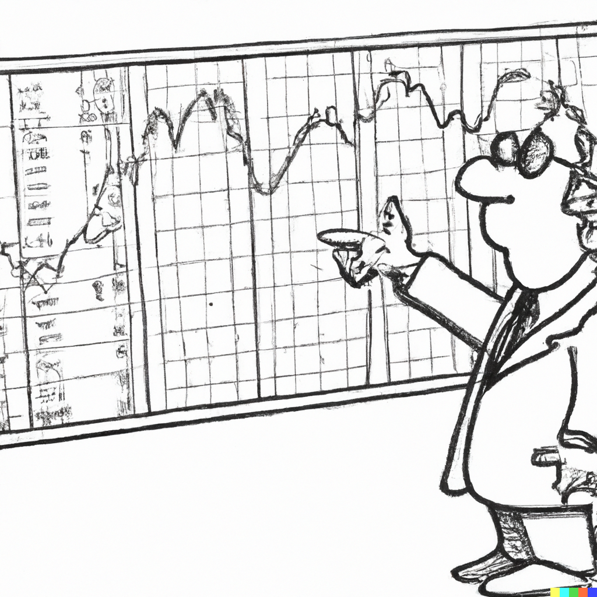

```{r setup, include=FALSE}
knitr::opts_chunk$set(echo = FALSE, fig.width = 11, fig.height = 7)
```


```{r echo=FALSE, include=FALSE, message=FALSE}
library(ggplot2)
library(data.table)
library(Quandl)
```


# Stochastic process and time series

.pull-left[

]

.pull-right[
Time series are realizations of chronologically stored sequence of random variables. This sequence of random variables is referred to as the *stochastic process*. 

A time series is a realization of the stochastic process. 

We index the observed time periods as $1,2,\ldots,T$, and denote the set of observations as $\{y_1,y_2,\ldots,y_T\}$. 

Thus, a time series is a finite sample from an underlying doubly-infinite sequence: $\{\ldots,y_{-1},y_{0},y_1,\ldots,y_{T-1},y_{T},y_{T+1},\ldots\}$.
]

---


# White noise process

.right-column[
A simplest kind of the time series is the realisation of a stochastic process that is comprised of independent and identically distributed random variables with zero mean and constant variance: $Y_t \sim iid\left(0,\sigma^2\right)$. 

This is referred to as a *white noise* process. 

A stochastic process, $\{Y_t: t=1,\ldots,T\}$, is white noise if: 
\begin{align*}
& E(Y_t) = 0,\;~\forall~t\\
& Var(Y_t) = \sigma^2,\;~\forall~t\\
& Cov(Y_t,Y_{t-k}) = 0,\;~\forall~k \ne 0
\end{align*}
]

---


# White noise process

.right-column[
```{r echo=FALSE, message=FALSE}
n <- 120

set.seed(n)
e <- rnorm(n)

df <- data.frame(t=c(1:n),y=e)

ggplot(df,aes(x=t,y=y))+
  geom_line(size=1,col="coral")+
  labs(y=expression(paste(e[t],sep="")))+
  coord_cartesian(xlim=c(0,130))+
  theme_classic()+
  theme(axis.title = element_text(size=22),axis.text = element_text(size=18))
```
]


---


# Stationarity

.right-column[
Because in a white noise sequence observations are drawn from the same distribution, it is a *stationary* process. Indeed, a special type of stationary process insofar as it has time-invariant mean, variance, and covariance. 

For a stochastic process to be stationary, neither its mean needs to be equal to zero, it only needs to be constant over time, nor its covariances need to be equal to zero, they only need to be constant over time, though they may vary with $k$. 

Thus, a time series is a realization of the stationary process (or, to be more specific, weakly stationary process) if the mean and variance are independent of $t$, and the autocovariances are independent of $t$ for all $k$.
]

---


# Stationarity

.right-column[
Stationarity is an important feature, and the assumption, on which the time series econometrics heavily relies. Broadly defined, stationarity implies statistical stability of the series. 

Some time series are stationary as is. Others are not. Indeed, most economic time series are nonstationary. A nonstationary series can be transformed to a stationary series, however.
]

---


# Sometimes we need to transform data

.right-column[
Usual forms of transformation involve first-differencing, taking natural logarithm (log-transforming), or first differencing the log-transformed series (log-differencing), which are done to work with a suitable variable for the desired econometric analysis. 

The first-difference operator is denoted by $\Delta$, so that $\Delta y_t = y_t-y_{t-1}$. First-differencing helps remove a trend from the time series.
]

---


# Transformations can resolve issues

.right-column[
If an economic time series is characterized by an apparent exponential growth, by taking natural logarithms the time series 'flatten' and the fluctuations become proportional, which is one of the requirements for stationarity. The other requirement is constant mean (or no trend) which is achieved by first-differencing the log-transformed series. 

Thus, if a time series $\{y_t\}$ appear to be trending exponentially, the transformed series $\{\Delta\ln y_t\}$ should be stationary.
]

---


# Dow Jones Index

.pull-left[
The Dow Jones Index exhibits a general upward trend.
]

.pull-right[
```{r echo=FALSE, message=FALSE}
dt <- data.table(Quandl("BCB/UDJIAD1",collapse = "monthly",start_date="1980-01-01"))

ggplot(dt,aes(x=Date,y=Value))+
  geom_line(color="coral",size=.8)+
  labs(x="Year",y="Dow Jones Industrial Average")+
  theme_classic()+
  theme(axis.title = element_text(size=22),axis.text = element_text(size=18))
```
]

---


# Dow Jones Index: Absolute change

.pull-left[
The magnitude of changes in the Dow Jones Index is much larger after late 1990s.
]

.pull-right[
```{r echo=FALSE, message=FALSE, warning=FALSE}
dt[,`:=`(lValue=shift(Value,1))]
dt[,`:=`(dValue=Value-lValue)]

ggplot(dt,aes(x=Date,y=dValue))+
  geom_line(color="coral",size=.8)+
  labs(x="Year",y="Change in Dow Jones Industrial Average")+
  theme_classic()+
  theme(axis.title = element_text(size=22),axis.text = element_text(size=18))
```
]

---


# Dow Jones Index: Relative change

.pull-left[
Relative changes in the Dow Jones Index has been more or less the same, on average, over the considered historical segment.
]

.pull-right[
```{r echo=FALSE, message=FALSE, warning=FALSE}
dt[,`:=`(lnValue=log(Value))]
dt[,`:=`(llnValue=shift(lnValue,1))]
dt[,`:=`(dlnValue=lnValue-llnValue)]

ggplot(dt,aes(x=Date,y=dlnValue))+
  geom_line(color="coral",size=.8)+
  labs(x="Year",y="Growth in Dow Jones Industrial Average")+
  theme_classic()+
  theme(axis.title = element_text(size=22),axis.text = element_text(size=18))
```
]

---


# Autocorrelation

.right-column[
White noise process assumes no correlation between $Y_t$ and $Y_{t-k}$ for any $k\neq0$. However, it is more of a norm than an exception, for a time series to be correlated, which is often the case in economic data.

Indeed, we often observe dependence among the temporally adjacent time series. In other words, $Y_t$ and $Y_{t-k}$ tend to be correlated for reasonably small values of $k$. 

Such correlations are referred to as *autocorrelations*, and are given by: $$\rho_k \equiv Corr(Y_t,Y_{t-k}) = \frac{Cov(Y_t,Y_{t-k})}{Var(Y_t)},\;~~k=1,2,\ldots$$ 
]

---


# Autocorrelation

.right-column[
We can illustrate the time series autocorrelations using *autocorrelogram*, which plots the sequence of autocorrelation coefficients against the lags at which these coefficients are obtained. 

Under the null of independence, the estimated autocorrelations, $\hat{\rho}_k$, are asymptotically standard normally distributed, $\sqrt{T}\hat{\rho}_k\xrightarrow{d}N(0,1)$, and thus: $\hat{\rho}_k \sim N(0,T^{-1})$

The approximate $(1-\alpha)$% confidence interval is bounded by $-z_{\alpha/2}T^{-1/2}\;\text{and}\;z_{\alpha/2}T^{-1/2}$
]

---


# Autocorrelogram

.right-column[
```{r echo=FALSE, message=FALSE}
set.seed(1)
n <- 144
y <- rnorm(n)
for(i in 2:n){
  y[i] <- .7*y[i-1]+y[i]
}
maxlag <- 12
df <- data.frame(k=c(1:maxlag),rho=c(acf(y,plot=F)[1:maxlag]$acf))

ggplot(df,aes(x=k,y=rho))+
  geom_segment(aes(xend=k,yend=0))+
  geom_hline(yintercept=0,size=.8)+
  geom_hline(yintercept=c(-1.96/sqrt(n),1.96/sqrt(n)),size=.5,linetype=5,col="coral")+
  scale_x_continuous(breaks=c(1:maxlag),labels=c(1:maxlag))+
  labs(x="k",y=expression(rho[k]))+
  coord_cartesian(ylim=c(-1,1))+
  theme_classic()+
  theme(axis.title = element_text(size=22),axis.text = element_text(size=18))
```
]

---


# Persistence indicates nonstationarity

.right-column[
```{r echo=FALSE, message=FALSE}
set.seed(1)
n <- 144
y <- rnorm(n)
for(i in 2:n){
  y[i] <- 1*y[i-1]+y[i]
}
maxlag <- 12
df <- data.frame(k=c(1:maxlag),rho=c(acf(y,plot=F)[1:maxlag]$acf))

ggplot(df,aes(x=k,y=rho))+
  geom_segment(aes(xend=k,yend=0))+
  geom_hline(yintercept=0,size=.8)+
  geom_hline(yintercept=c(-1.96/sqrt(n),1.96/sqrt(n)),size=.5,linetype=5,col="coral")+
  scale_x_continuous(breaks=c(1:maxlag),labels=c(1:maxlag))+
  labs(x="k",y=expression(rho[k]))+
  coord_cartesian(ylim=c(-1,1))+
  theme_classic()+
  theme(axis.title = element_text(size=22),axis.text = element_text(size=18))
```
]

---


# First-differencing resolves the issue

.right-column[
```{r echo=FALSE, message=FALSE}
y <- diff(y)
maxlag <- 12
df <- data.frame(k=c(1:maxlag),rho=c(acf(y,plot=F)[1:maxlag]$acf))

ggplot(df,aes(x=k,y=rho))+
  geom_segment(aes(xend=k,yend=0))+
  geom_hline(yintercept=0,size=.8)+
  geom_hline(yintercept=c(-1.96/sqrt(n),1.96/sqrt(n)),size=.5,linetype=5,col="coral")+
  scale_x_continuous(breaks=c(1:maxlag),labels=c(1:maxlag))+
  labs(x="k",y=expression(rho[k]))+
  coord_cartesian(ylim=c(-1,1))+
  theme_classic()+
  theme(axis.title = element_text(size=22),axis.text = element_text(size=18))
```
]

---


# Beware of overdifferencing

.right-column[
```{r echo=FALSE, message=FALSE}
y <- diff(y)
maxlag <- 12
df <- data.frame(k=c(1:maxlag),rho=c(acf(y,plot=F)[1:maxlag]$acf))

ggplot(df,aes(x=k,y=rho))+
  geom_segment(aes(xend=k,yend=0))+
  geom_hline(yintercept=0,size=.8)+
  geom_hline(yintercept=c(-1.96/sqrt(n),1.96/sqrt(n)),size=.5,linetype=5,col="coral")+
  scale_x_continuous(breaks=c(1:maxlag),labels=c(1:maxlag))+
  labs(x="k",y=expression(rho[k]))+
  coord_cartesian(ylim=c(-1,1))+
  theme_classic()+
  theme(axis.title = element_text(size=22),axis.text = element_text(size=18))
```
]

---


# Readings

.pull-left[

]

.pull-right[
Ubilava, [Chapter 2](https://davidubilava.com/forecasting/docs/features-of-time-series-data.html)

Gonzalez-Rivera, Chapter 3

Hyndman & Athanasopoulos, [2.8](https://otexts.com/fpp3/acf.html), [2.9](https://otexts.com/fpp3/wn.html), [3.1](https://otexts.com/fpp3/transformations.html)
]


