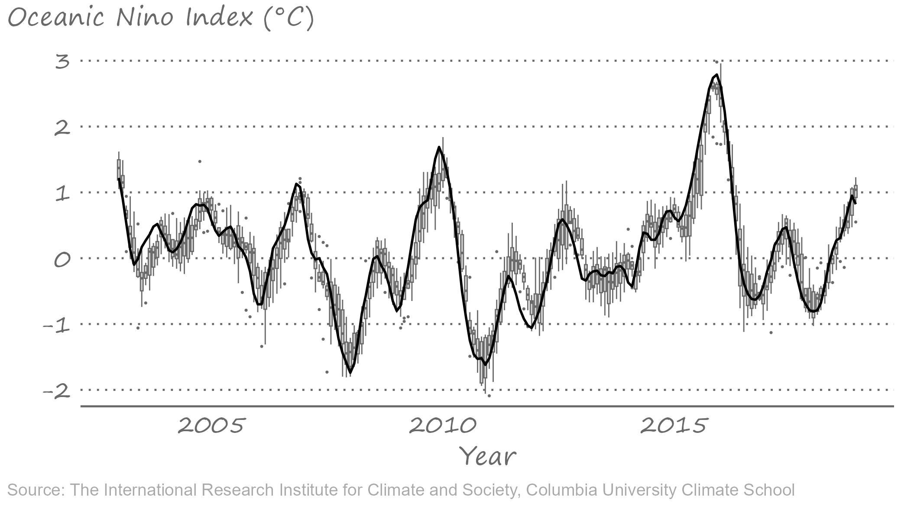
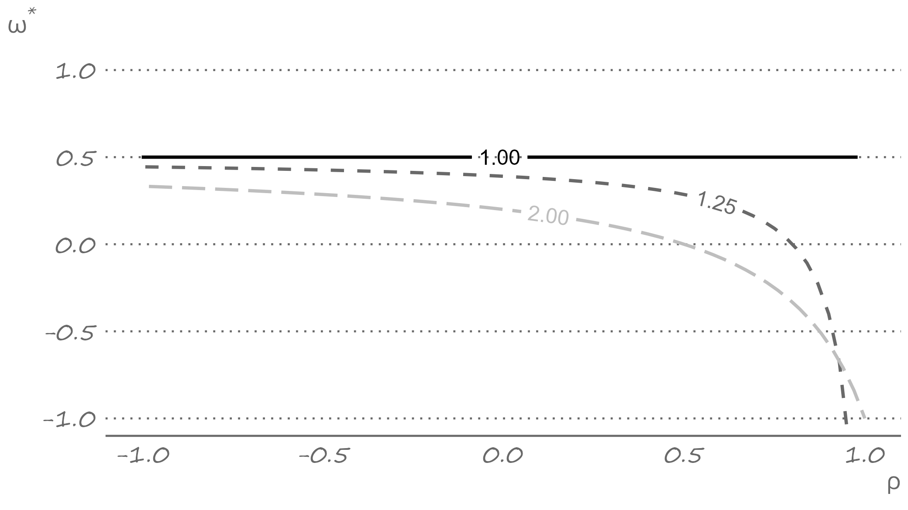
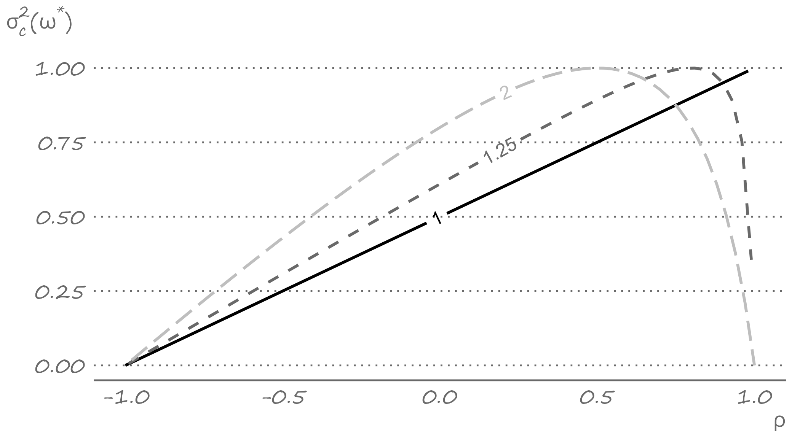

```{r setup, include=FALSE}
knitr::opts_chunk$set(echo = FALSE, fig.width = 11, fig.height = 7)
```


```{r echo=FALSE, include=FALSE, message=FALSE}
library(ggplot2)
library(data.table)
library(lmtest)
library(sandwich)
```

# Comparing forecasts using in-sample measures

.pull-left[

]

.pull-right[
We often have several forecasts, each generated from a specific model or using a specific method.

The obvious aim, at that point, is to select the model or method that generates the most accurate forecasts.

One way of doing it is by selecting the model that best fits the data; that is, using in-sample goodness of fit measures. 
]

---

# R-squared and adjusted R-squared

.right-column[
Recall the most frequently used (and often abused) R-squared: $$R^2 = 1-\frac{\sum_{t=1}^{T}\hat{e}_t^2}{\sum_{t=1}^{T}(y_t - \bar{y})^2}$$

Adjusted R-squared accounts for the loss in degrees of freedom: $$\bar{R}^2 = 1-\frac{\sum_{t=1}^{T}\hat{e}_t^2}{\sum_{t=1}^{T}(y_t - \bar{y})^2}\left(\frac{T-1}{T-k}\right),$$ where $k$ denotes the number of estimated parameters.
]

---


# Information criteria

.right-column[
The adjustment made to the R-squared might not be 'enough' so select a 'good' forecasting model, however.

Information criteria penalize for the loss in degrees of freedom more 'harshly' than the adjusted R-squared:
$$\begin{aligned}
AIC & = \ln{\left(\sum_{t=1}^{T}{\hat{e}_t^2}\right)} + 2\frac{k}{T} \\
SIC & = \ln{\left(\sum_{t=1}^{T}{\hat{e}_t^2}\right)} + \ln{T}\frac{k}{T}
\end{aligned}$$
]

---


# Information criteria are relative measures

.right-column[
Things to remember about the information criteria:
- Less is better.
- Relative (not absolute) values of the criteria matter.
- SIC selects a more parsimonious model than AIC.
- The measures are used to compare fit, so long as the dependent variable is the same across the models.
]

---


# Comparing forecasts using out-of-sample measures

.right-column[
Another way of doing it, which may be viewed as being more sensible, at least from a forecaster's perspective, is by evaluating forecasts in an out-of-sample environment.

Recall that models with the best in-sample fit are not guaranteed to necessarily produce the most accurate forecasts. 
]

---

# A snapshot of multi-step-ahead El Nino forecasts

.pull-right[

[](https://iri.columbia.edu/our-expertise/climate/forecasts/enso/2023-August-quick-look/?enso_tab=enso-sst_table)

]

---

# Historical data of one-step-ahead El Nino forecasts

.right-column[



]

---


# Selecting based on a forecast accuracy measure

.right-column[
Thus far we have implied the following "algorithm" for selecting the most accurate among available forecasts:

- Decide on a loss function (e.g., quadratic loss).
- Obtain forecasts, the forecast errors, and the corresponding sample expected loss (e.g., root mean squared forecast error) for each model or method in consideration.
- Rank the models according to their sample expected loss values.
- Select the model with the lowest sample expected loss.
]

---

# Ranking of the models of El Nino forecasts

.right-column[
```{r ranking-enso, echo=FALSE, message=FALSE, warnings=FALSE, results='asis'}
tabl <- "
| Model     | MAFE  | RMSFE |
|-----------|:-----:|:-----:|
| ECMWF     | 0.193 | 0.249 |
| JMA       | 0.271 | 0.326 |
| CPC MRKOV | 0.297 | 0.362 |
| KMA SNU   | 0.314 | 0.376 |
| CPC CA    | 0.300 | 0.377 |
| CSU CLIPR | 0.311 | 0.392 |
| LDEO      | 0.310 | 0.395 |
| AUS/POAMA | 0.321 | 0.417 |
"
cat(tabl)
```
]

---


# Are they statistically significantly different?

.right-column[
But the loss function is a function of a random variable, and in practice we deal with sample information, so sampling variation needs to be taken into the account.

Statistical methods of evaluation are, therefore, desirable.
]

---


# Forecast errors from two competing models

.right-column[
Consider a time series of length $T$. 

Suppose $h$-step-ahead forecasts for periods $R+h$ through $T$ have been generated from two competing models denoted by $i$ and $j$ and yielding $\hat{y}_{i,t+h|t}$ and $\hat{y}_{j,t+h|t}$, for all $t=R,\ldots,T-h$, with corresponding forecast errors: $\hat{e}_{i,t+h|t}$ and $\hat{e}_{j,t+h|t}$.
]

---


# Loss differential

.right-column[
The null hypothesis of equal predictive ability can be given in terms of the unconditional expectation of the loss differential: $$H_0: \mathbb{E}\left[d(\hat{e}_{t+h|t})\right] = 0,$$ where, assuming quadratic loss, $$d(\hat{e}_{t+h|t}) = \hat{e}_{i,t+h|t}^2-\hat{e}_{j,t+h|t}^2.$$
]

---

# Diebold-Mariano test

.right-column[
The Diebold-Mariano (DM) test relaxes the aforementioned requirements on the forecast errors. 

The DM test statistic is: $$DM=\frac{\bar{d}}{\sqrt{\sigma_d^2/P}} \sim N(0,1),$$ where $\bar{d}=P^{-1}\sum_{t=1}^{P}d(\hat{e}_{t+h|t})$, and where $P=T-h-R+1$ is the total number of forecasts. 
]
		
---


# Modified Diebold-Mariano test

.right-column[
A modified version of the DM statistic, due to Harvey, Leybourne, and Newbold (1998), addresses the finite sample properties of the test, so that: $$\sqrt{\frac{P+1-2h+P^{-1}h(h-1)}{P}}DM\sim t_{P-1},$$ where $t_{P-1}$ is a Student t distribution with $P-1$ degrees of freedom.
]

---


# A regression-based Diebold-Mariano test

.right-column[
In practice, the test of equal predictive ability can be applied within the framework of a regression model: $$d(\hat{e}_{t+h|t}) = \delta + \upsilon_{t+h} \hspace{.5in} t = R,\ldots,T-h.$$

The null of equal predictive ability is equivalent of testing $H_0: \delta = 0$.

Because $d(\hat{e}_{t+h|t})$ may be serially correlated, an autocorrelation consistent standard errors should be used for inference.
]

---

# Predictive accuracy of El Nino forecasts

.right-column[
Are the forecasts from ECMWF statistically significantly more accurate than those from JMA (the next best model)?

As it turns out, the DM statistic is $-2.930$. Which means, we reject the null hypothesis of equal predictive accuracy.

So, yes, ECMWF forecasts are more accurate than those of JMA.
]

---


# Combining forecasts

.right-column[
By choosing the most accurate of the forecasts, we discard all others.

But other forecasts may not be completely useless. They could potentially contain information that is absent in the most accurate forecast.

Thus, merely selecting the best model may be a sub-optimal strategy.

An optimal strategy may be using some information from all forecasts, i.e., *forecast combination*.
]

---


# Why might we combine?
	
.right-column[
Several factors support the idea of forecast combination:

- The concept is intuitively appealing;
- The method is computationally simple;
- The outcome is surprisingly good.
]

---


# How can we combine?

.right-column[
Consider two forecasting methods (or models), $i$ and $j$, each respectively yielding $h$-step-ahead forecasts $\hat{y}_{i,t+h|t}$ and $\hat{y}_{j,t+h|t}$, and the associated forecast errors $\hat{e}_{i,t+h|t} = y_{t+h}-\hat{y}_{i,t+h|t}$ and $\hat{e}_{j,t+h|t} = y_{t+h}-\hat{y}_{j,t+h|t}$.

A combined forecast, $\hat{y}_{c,t+h|t}$, is expressed as: $$\hat{y}_{c,t+h|t} = (1-w)\hat{y}_{i,t+h|t} + w\hat{y}_{j,t+h|t},$$ where $0 \leq w \leq 1$ is a weight. Thus, a combined forecast is the weighted average of the two individual forecasts.
]

---


# Mean of a combined forecast error

.right-column[
Likewise, a combined forecast error is the weighted average of the two individual forecast errors: $$\hat{e}_{c,t+h|t} = (1-w)\hat{e}_{i,t+h|t} + w\hat{e}_{j,t+h|t}$$

The mean of a combined forecast error (under the assumption of forecast error unbiasedness) is zero: $$\mathbb{E}\left(e_{c,t+h}\right) = \mathbb{E}\left[(1-w)\hat{e}_{i,t+h|t} + w\hat{e}_{j,t+h|t}\right] = 0$$
]

---


# Variance of a combined forecast error

.right-column[
The variance of a combined forecast error is: $$\mathbb{V}\left(\hat{e}_{c,t+h|t}\right) = (1-w)^2 \sigma_i^2 + w^2  \sigma_j^2 + 2w(1-w)\rho\sigma_i\sigma_j,$$ where $\sigma_i$ and $\sigma_j$ are the standard deviations of the forecast errors from models $i$ and $j$, and $\rho$ is a correlation between these two forecast errors.
]

---


# The optimal weight

.right-column[
We can obtain an optimal weight, i.e., a weight that minimizes the variance of the combined forecast error, by taking the derivative of the variance of a combined forecast error, and equating it to zero. Solving this first order condition for $w$ yields the optimal weight: $$w^* = \frac{\sigma_i^2-\rho\sigma_i\sigma_j}{\sigma_i^2+\sigma_j^2-2\rho\sigma_i\sigma_j}$$
]

---

# The optimal weight for different $\rho$ and $\sigma_j/\sigma_i$

.right-figure[

]

---


# The optimal weight for different $\rho$ and $\sigma_j/\sigma_i$

.right-column[
When the two forecasts are equally accurate (or inaccurate), the optimal weight is $0.5$, regardless of the correlation between the forecasts. 

The less accurate is a forecast, the smaller is the weight attached to it.

When the forecasts are highly correlated, the negative optimal weight may be attached to the less accurate forecast. This happens when $\rho>\sigma_i/\sigma_j$.

When the forecasts are uncorrelated, the weights attached to the forecasts are inversely proportional to the variances of these forecasts: $$w^* = \frac{\sigma_i^2}{\sigma_i^2+\sigma_j^2} = \frac{\sigma_j^{-2}}{\sigma_i^{-2}+\sigma_j^{-2}}$$
]

---


# Variance of the optimally combined forecast error

.right-column[
Substitute $w^*$ in place of $w$ in the formula for variance to obtain: $$\mathbb{V}\left[\hat{e}_{c,t+1|t}(w^*)\right] = \sigma_c^2(w^*) = \frac{\sigma_i^2\sigma_j^2(1-\rho^2)}{\sigma_i^2+\sigma_j^2-2\rho\sigma_i\sigma_j}$$


As it turns out: $\sigma_c^2(w^*) \leq \min\{\sigma_i^2,\sigma_j^2\}$. That is, by combining forecasts we are not making things worse (so long as we use *optimal* weights).
]

---


# Variance for different $\rho$ and $\sigma_j/\sigma_i$

.right-figure[

]

---


# Variance for different $\rho$ and $\sigma_j/\sigma_i$

.right-column[
Generally, the less correlated (or, especially the more negatively correlated) are the forecasts, the more accurate is the combined forecast.

When the forecasts are equally accurate (or inaccurate), the equal-weight combination of the forecasts will almost always make things better (and never make things worse): $$\sigma_c^2(w^*) = \frac{\sigma^2(1+\rho)}{2} \leq \sigma^2$$ 
]

---


# Predictive accuracy of combined El Nino forecasts

.right-column[
Are the combined forecasts statistically significantly more accurate than those from ECMWF (the best model)?

When applying "equal weights", the DM statistic is $1.543$. Which means, we fail to reject the null hypothesis of equal predictive accuracy.

When applying "inversely proportional weights", the DM statistic is $2.062$. Which means, we reject the null hypothesis of equal predictive accuracy in favor of the combined forecast.
]

---


# The optimal weight in a regression setting

.right-column[
The optimal weight has a direct interpretation in a regression setting. 

Consider the combined forecast equation as: $$y_{t+h} = (1-w)\hat{y}_{i,t+h|t} + w\hat{y}_{j,t+h|t} + \varepsilon_{t+h},$$ where $\varepsilon_{t+h}\equiv\hat{e}_{c,t+h|t}$. 
]

---


# The optimal weight in a regression setting

.right-column[
We can re-arrange the equation so that: $$\hat{e}_{i,t+h|t} = w (\hat{y}_{j,t+h|t}-\hat{y}_{i,t+h|t}) + \varepsilon_{t+h},$$ or that: $$\hat{e}_{i,t+h|t} = w\left(\hat{e}_{i,t+h|t}-\hat{e}_{j,t+h|t}\right)+\varepsilon_{t+h},\;~~t=R,\ldots,T-h$$ where $w$ is obtained by estimating a linear regression with an intercept restricted to zero.
]

---

# The optimal weight in a regression setting

.right-column[
We can also estimate a variant of the combined forecast equation: $$y_{t+h} = \alpha+\beta_i\hat{y}_{i,t+h|t} + \beta_j\hat{y}_{j,t+h|t} + \varepsilon_{t+h},$$ which relaxes the assumption of forecast unbiasedness, as well as of weights adding up to one or, indeed, of non-negative weights.
]

---


# Forecast encompassing

.right-column[
A special case of forecast combination is when $w=0$. Such an outcome (of the optimal weights) is known as forecast encompassing.

It is said that $\hat{y}_{i,t+h|t}$ encompasses $\hat{y}_{j,t+h|t}$, when given that the former is available, the latter provides no additional useful information.
]

---


# Forecast encompassing in a regression setting

.right-column[
We can test for the forecast encompassing by regressing the realized value on individual forecasts: $$y_{t+h} = \alpha + \beta_1\hat{y}_{i,t+h|t} + \beta_2\hat{y}_{j,t+h|t} + \varepsilon_{t+h},$$ and testing the null hypothesis that $\beta_2=0$, given that $\beta_1=1$. 
]

---


# Key takeaways

.pull-left[

]

.pull-right[
- All forecasts are wrong, but some are less wrong than others. We can compare and select the more accurate of the available forecasts using the Diebold-Mariano test.
- Less accurate forecasts may still be useful. We can combine several forecasts to achieve improved accuracy.
- Not all forecasts can be useful. Forecast encompassing test allows us to "weed out" the "useless" forecasts.
]
