```{r setup, include=FALSE}
knitr::opts_chunk$set(echo = FALSE, fig.width = 11, fig.height = 7)
```


```{r echo=FALSE, include=FALSE, message=FALSE}
library(ggplot2)
library(data.table)
library(Quandl)
```


# Stochastic process

.pull-left[

]

.pull-right[
Time series is a realization of chronologically stored sequence of random variables. 

This sequence of random variables is referred to as the *stochastic process*. 

We don't observe the stochastic process. We only observe the times series. That is, we only observe one realization of each random variable comprising the stochastic process.

]

---

# Time series

.right-column[

We use subscript $1$ to denote the first element of the time series, subscript $2$ to denote the second element of the time series, and so on, until the last observed element of the time series, for which we use subscript $T$.

So, a time series, $y_t,\;~t=1,\ldots,T$, is given by: $\{y_1,y_2,\ldots,y_T\}$. 

More generally, a time series is a finite sample from an underlying doubly-infinite sequence: $\{\ldots,y_{-1},y_{0},y_1,\ldots,y_{T-1},y_{T},y_{T+1},\ldots\}$.

]

---


# Observed time series

.right-figure[

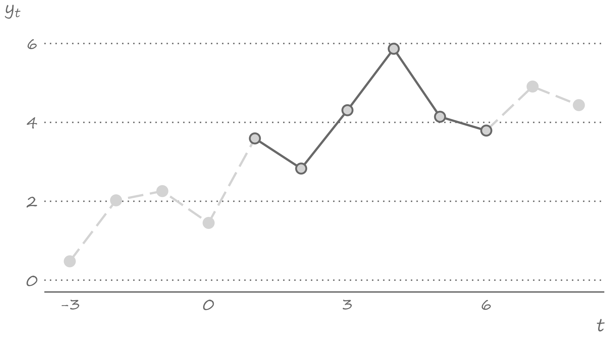

]

---

# We only observe a segment of the history

.right-column[
We certainly have no access to the future. So, an observed time series can only run as far as the present time. 

We tend to have limited access to the past. For example, we don't have the actual measurements of temperature from times when the thermometer was yet to be invented. We also cannot have data on Soviet-era unemployment rates because tHeRe wAS nO uNeMpLoYmEnt in the USSR.
]

---


# What we see is just one realization

.right-figure[

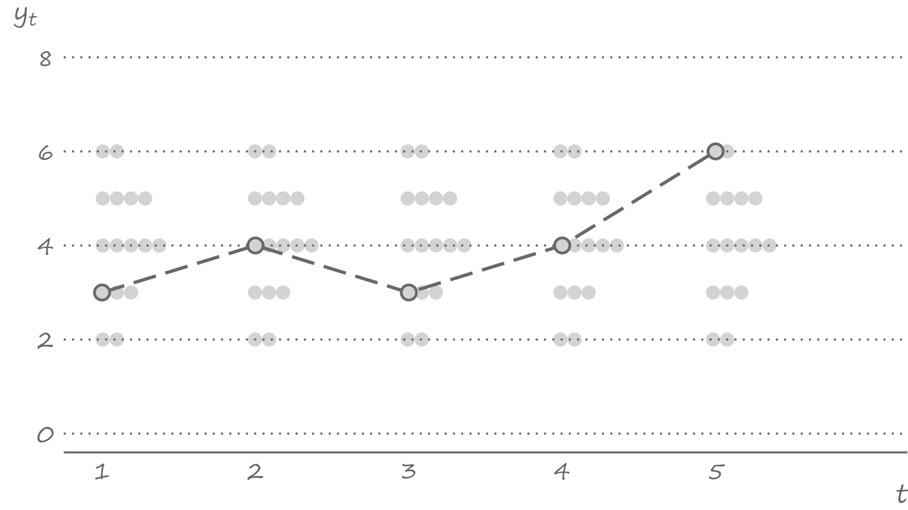

]

---

# History is an unique outcome of all possible outcomes

.right-column[
The November 2022 the U.S. unemployment rate was $3.4$ percent.

In a parallel universe - e.g., if we could re-run the sequence of macroeconomic events that led to this realization - the unemployment rate may have been higher or lower. 

But we don't get to re-write histories. The unemployment rate of $3.4$ percent is the only value that will ever be known for this period. 

The same is true for all the preceding and succeeding periods. In other words, out of infinite possible time series runs that we could have observed, we only observe one such run.
]

---


# Stationarity

.right-column[
The random variables that comprise the stochastic process may or may not have the same distributions. 

When they have the same distributions, the stochastic process is *stationary*. Otherwise, the stochastic process is *nonstationary*. 

Intuitively, a stochastic process is (strictly) stationary if its statistical properties do not change with time. 

More formally, stationary implies that the joint density of $Y_r,\ldots,Y_{r+k}$ is the same as that of $Y_s,\ldots,Y_{s+k}$, for any integers $r \ne s$ and $k$. 
]

---


# Stationarity

.right-column[
Stationarity is an important feature and the assumption on which the time series econometrics heavily relies. Broadly defined, stationarity implies statistical stability of the series. 

Some time series are stationary as given. Others are not. Indeed, most economic time series are nonstationary.
]

---


# Stationarity

.right-column[
To get an idea of whether a stochastic process is stationary or nonstationary, we would need to compare the distributions, or joint distributions, of the random variables comprising the stochastic process.

It seems like a straightforward exercise. Except, it is not a feasible one.

This is because we never observe the distribution of $Y_t$. Rather, in each period, we only observe its one realization, $y_t$. 

When we observe a time series, we can not be too sure whether these are realizations of a stationary stochastic process or a nonstationary stochastic process.
]

---


# We obsere the time series, not the stochastic process

.right-figure[

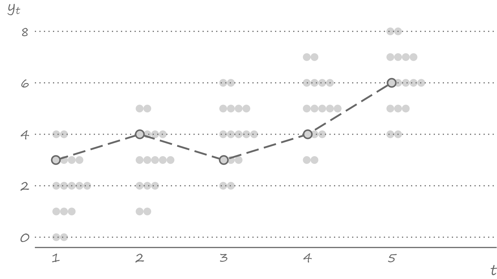

]

---


# With long (enough) time series we can get the idea

.right-column[
That the same observed time series may be a manifestation of a stationary process or a nonstationary process may seem problematic, which it would have been had we only observed a very short time series with only a handful of observations. 

But in practice, luckily, we usually work with at least several dozen observations, often hundreds or thousands of observations. 

A long enough time series allows us to infer a lot more from the single realizations of random variables than what would seem to be plausible.
]


---

# Ergodicity

.right-column[
This is where *ergodicity*, in conjunction with stationarity, kicks in.

Intuitively, ergodicity implies independence of random variables that are sufficiently far apart from each other in the stochastic process.

An important practical benefit of it is that when the process is stationary and ergodic, the moments of the time series converge to the moments of the stochastic process as the sample size increases. 
]


---

# Ergodicity

.right-column[
So, the mean of the time series will be equal to the mean of the random variables comprising the stochastic process, the variance of the time series will be equal to the variance of the random variables comprising the stochastic process, etc. 

Ergodicity has the effect of the law of large numbers in time series analysis, in the sense that the distribution of a long enough time series is representative of the distribution of the random variables comprising the underlying stationary stochastic process. 
]

---


# White noise

.right-column[
A simplest kind of the time series is the realisation of a stochastic process that is comprised of independent and identically distributed random variables with zero mean and constant variance: $Y_t \sim iid~\text{N}\!\left(0,\sigma^2\right)$. This is referred to as a *white noise* process. 

A stochastic process is a white noise process if: 
$$\begin{aligned}
		& \mathbb{E}(Y_t) = 0,\;~\forall~t\\
    & \mathbb{V}(Y_t) = \sigma^2,\;~\forall~t\\
    & Cov(Y_t,Y_{t-k}) = 0,\;~\forall~k \ne 0
	\end{aligned}$$

]

---


# White noise: An illustration

.right-figure[

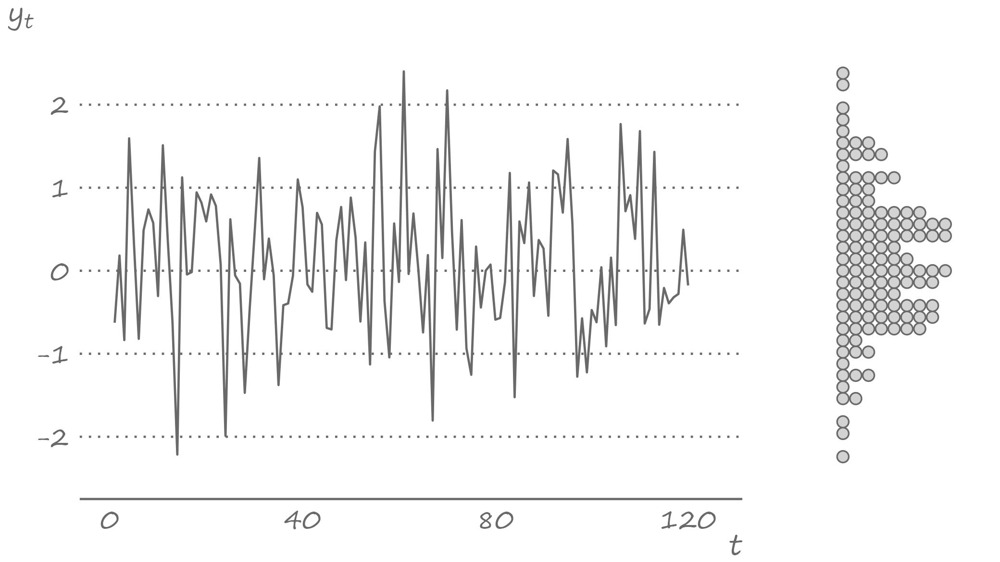

]

---


# White noise is a stationary process

.right-column[
Because each observation is drawn from the same distribution, white noise is a stationary process. 

It is a special type of the stationary process insofar as its mean, variance, and covariances are all time-invariant. 

Such process is referred to as covariance-stationarity or *weakly* stationary. 

A time series is a realization of the weakly stationary process if its mean and variance are independent of $t$, and the autocovariances are independent of $t$ for all $k$.
]

---


# Temporal dependence

.right-column[
It's hardly the norm for a time series to be not serially correlated. Most economic (and not only) time series are characterized by temporal dependence, which is observed most prominently among observations that are at a temporal proximity from one another.

Having observed the November 2022 U.S. unemployment rate of $3.4$ percent, it is unlikely for the December 2022 rate to be much different (lo and behold, it was $3.3$). This is because the macroeconomic fundamentals that lead to the observed levels of unemployment do not just change overnight, or over a period of several weeks. 
]

---

# Temporal dependence

.right-column[
Depending on a time series, this correlation can be strong or weak.

In general, because of the sequential nature of the stochastic process, we are likely to observe, or at least expect to observe, some dependence among the temporally adjacent random variables. 

That is, $Y_t$ and $Y_{t-k}$ can be correlated for a reasonably small integer $k$. Such correlation, referred to as the *autocorrelation*, or more specifically, the $k^{th}$ order autocorrelation (or the lag $k$ autocorrelation), is given by: $$\rho_k=Cor(Y_{t},Y_{t-k}) = \frac{Cov(Y_{t},Y_{t-k})}{\sqrt{\mathbb{V}(Y_{t})}\sqrt{\mathbb{V}(Y_{t-k})}},\;~~k=1,2,\ldots$$ 
]

---


# Variance

.right-column[
Recall, stationarity implies that the random variables comprising the stochastic process have the same distribution. 

So, the variances of any two random variables in the stochastic process, $Y_{t}$ and $Y_{t-k}$ in this instance, are equal to each other. We denote variance by $\gamma_0$. So, $$\mathbb{V}(Y_{t})=\mathbb{V}(Y_{t-k})=\gamma_0.$$
]

---


# Autocovariance

.right-column[
Stationarity also implies similar joint densities of the sets of temporally separated random variables. 

So, the covariance between the two random variables comprising the same stochastic process, the *autocovariance*, depends on a temporal distance between these two variables but not on time. 

We will denote the lag $k$ autocovariance - i.e., the covariance between  $Y_{t}$ and $Y_{t-k}$ - by $\gamma_k$. So, $$Cov(Y_{t},Y_{t-k})=Cov(Y_{t+k},Y_{t})=\gamma_k.$$
]

---


# Autocorrelation

.right-column[
The lag $k$ autocorrelation then can be expressed as: $$\rho_k= \frac{\gamma_k}{\gamma_0},$$ where the denominator is the product of two standard deviations that are equal to each other, and thus constitute the variance of the random variable comprising the stochastic process.
]

---


# U.S. unemployment rate: Time series

.right-figure[
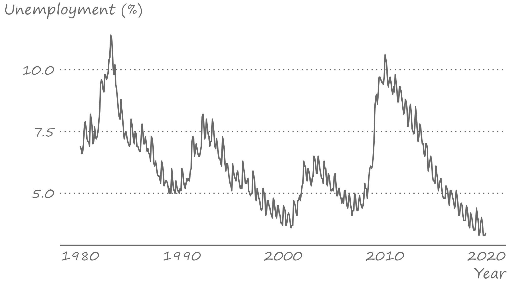
]

---

# U.S. unemployment rate: Autocorrelations

.right-figure[
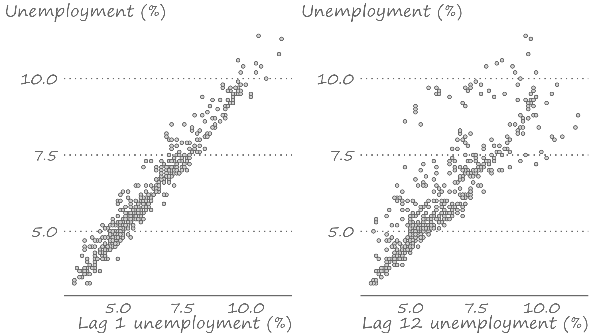
]

---


# Autocorrelogram

.right-column[
Autocorrelogram consolidates autocorrelation coefficients by plotting them in an ascending order of the lags at which these coefficients are obtained. 

We can use this to illustrate how strongly a variable is related with its near and more distant past self. For example, when none of the autocorrelation coefficients are (statistically) different from zero, we have the case of a white noise process (assuming the mean of the series is zero).
]

---


# Autocorrelogram: White noise

.right-figure[
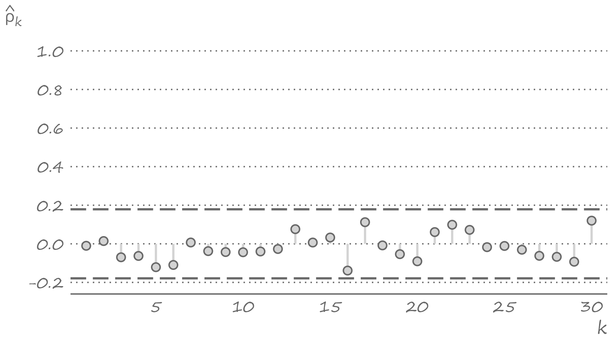
]

---

# Random walk process

.right-column[
Alternatively, when all the autocorrelation coefficients are positive and very close to one, and they hardly decay as the lag length grows, we have a case of a nonstationary process.

Specifically, such a time series likely represent the random walk process.

Stock prices, and more recently cryptocurrency prices, are best characterized by a random walk process. 
]

---


# Bitcoin prices

.right-figure[
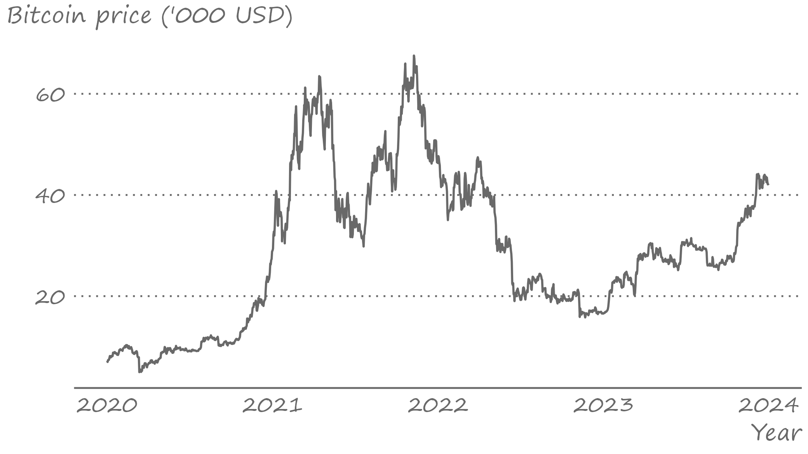
]

---


# Autocorrelogram: Bitcoin prices

.right-figure[
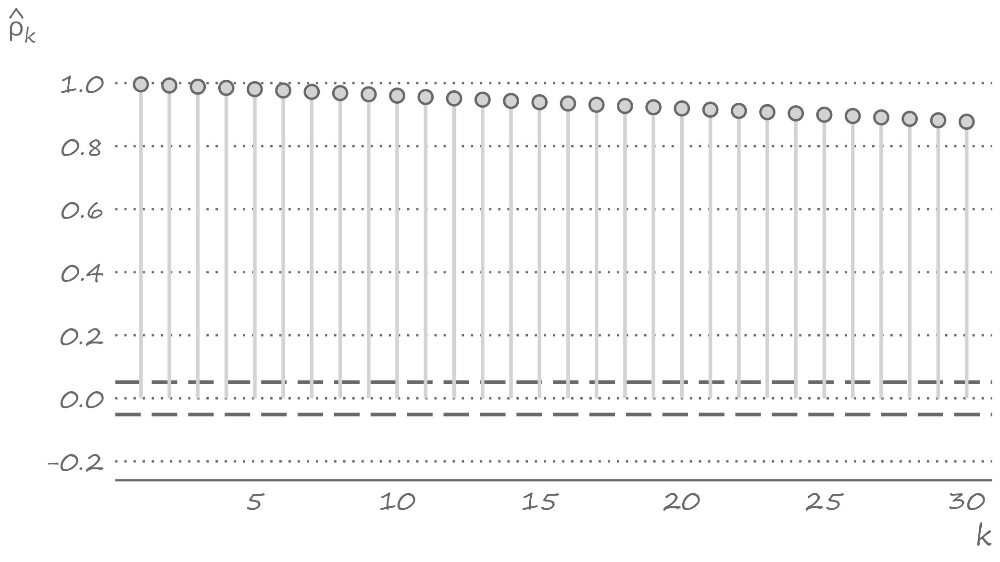
]

---


# Partial autocorrelation

.right-column[
Does the presence of a correlations between current observation and the relatively distant past observations mean that the prices in those previous periods can help explain the price in the current period? 

An autocorrelogram cannot answer this question. For example, we may observe the lag 2 autocorrelation for two reasons: 
  * because there is an actual linkage between the current price and the price two periods ago, or 
  * because of the transitivity of the first order autocorrelations between the successive observations.
]

---

# Partial autocorrelation

.right-column[
If $Y_t$ is correlated with $Y_{t-1}$ and, therefore, $Y_{t-1}$ is correlated with $Y_{t-2}$, we can observe a correlation between $Y_t$ and $Y_{t-2}$ regardless whether there is linkage between the two. 

We need to control for $Y_{t-1}$, which in this instance plays the role of a potential mediator between $Y_t$ and $Y_{t-2}$. 

So, we need to find out whether there is any remaining linkage between $Y_t$ and $Y_{t-2}$ once we account for the existing linkages between $Y_t$ and $Y_{t-1}$, and $Y_{t-1}$ and $Y_{t-2}$.
]

---


# Partial autocorrelation

.right-column[
The foregoing alludes to the concept of *partial* autocorrelation, which is a correlation between $Y_t$ and $Y_{t-k}$ net of any correlations between $Y_t$ and $Y_{t-k+j}$, for all $j=1,\ldots,k-1$. 

Similar to autocorrelations, we can use an autocorrelogram to present partial autocorrelations.
]

---


# Partial autocorrelogram: Bitcoin prices

.right-figure[
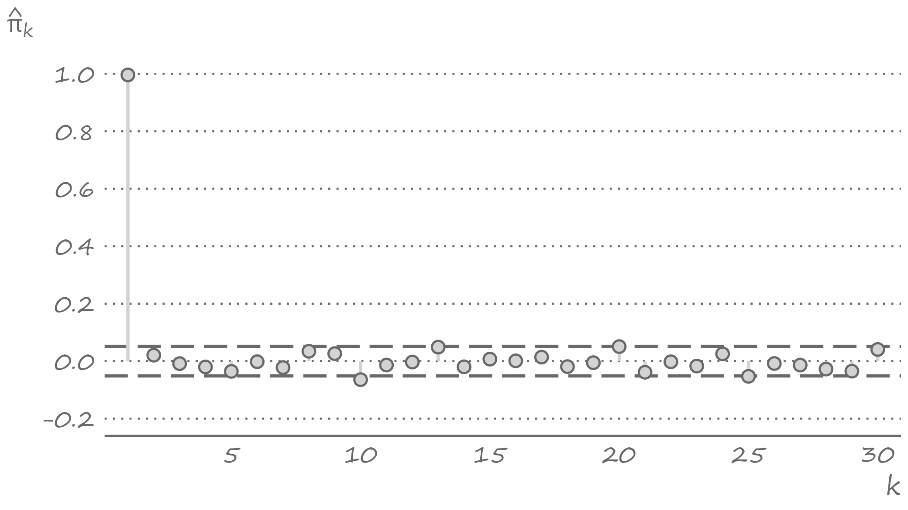
]

---


# Sometimes we need to transform data

.right-column[
Transformation usually involves taking logarithms (if possible), first-differencing, or first-differencing the already log-transformed series. 

Such transformations are done not only to address some underlying data issues (e.g., nonstationarity), but also to work with a suitable variable for the desired econometric analysis (e.g., we might be interested in forecasting the rate of price inflation rates). 
]

---

# Change in Bitcoin prices

.right-column[
To examine the effect of transformation, let's revisit the Bitcoin prices. As we saw, the series is nonstationary in levels. Could we resolve the issue by first-differencing the series?

The first-difference operator is denoted by $\Delta$, so that $\Delta y_t = y_t-y_{t-1}$. First-differencing helps removing a trend from the time series.
]

---

# Change in Bitcoin prices

.right-figure[
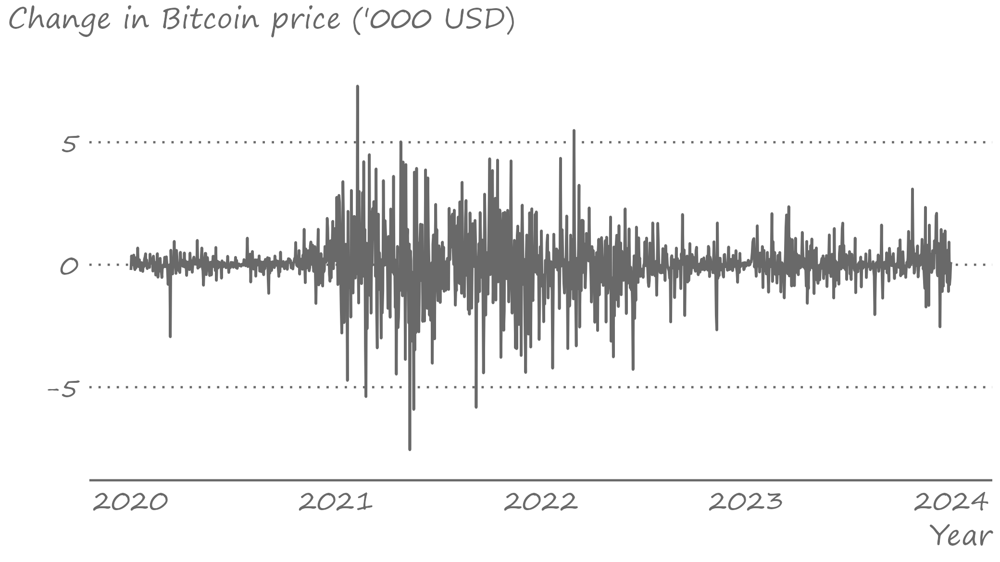
]

---


# Bitcoin returns

.right-column[
What if we were to first-difference the log-transformed series? Such transformation, in the context of prices, has a concrete meaning. 

When we log-transform a series, the difference in observations from two  periods is no longer measured in absolute terms, rather it is measured in relative terms. When we then first-difference the log-transformed series, we obtain a measure of the rate of change of the original series. 

When the original series is prices, the rate of change is the return.
]

---

# Bitcoin returns

.right-figure[
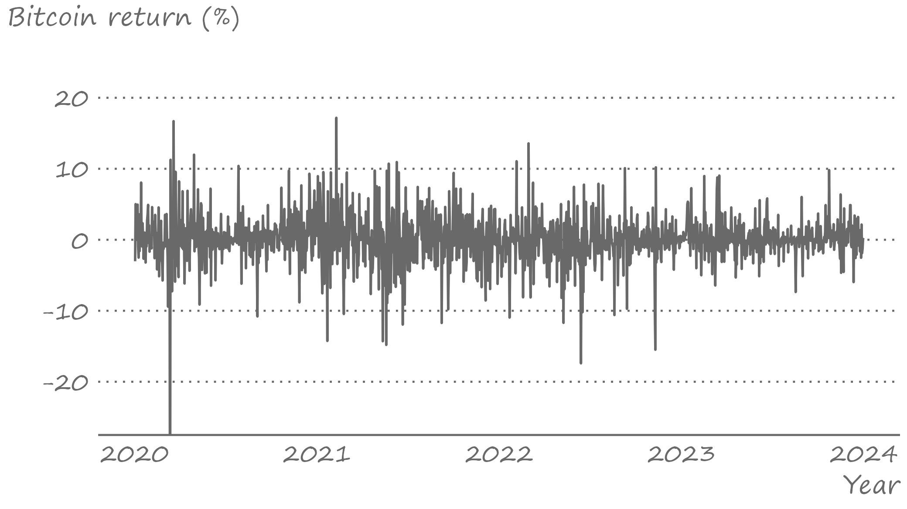
]

---


# First-differencing to achieve stationarity

.right-column[
We usually refer to variables as integrated of order $d$, which we denote by $I(d)$. The order of integration tells us the number of times the series need to be first-differenced to make it stationary.

So, when the series is $I(0)$ no such transformation is required. A stationary time series is integrated of order zero. When the series is $I(1)$, a first-differencing will result in a stationary series. 

Many time series, and certainly the vast majority economic time series, are at most $I(2)$, usually $I(1)$ or $I(0)$.
]

---


# To difference or not to difference?

.right-column[
We can get an idea whether a time series are stationary (or not) by observing the data and, especially, their autocorrelations. 

But there are better, more formal ways of testing whether the series is integrated. 
]

---

# Testing for unit roots

.right-column[

The test, proposed by Dickey and Fuller (1979), involves regressing the first-differenced values of the series on the lagged values of the series. That is: $$\Delta y_t = \alpha + \phi y_{t-1}+\varepsilon_t$$

The null hypothesis of nonstationarity, i.e., if the series is characterized by a unit root process, is equivalent to testing $H_0:\gamma=0$ vs. the one-sided alternative that $H_1:\gamma < 1$. 
]

---


# Testing for unit roots

.right-column[
In practice, it is common to apply the *augmented* Dickey-fuller (ADF) test, which involves including the lagged values $\Delta y_t$ on the right-hand side of the equation: $$\Delta y_t = \alpha + \gamma y_{t-1}+\Delta y_{t-1}+\ldots+\Delta y_{t-k}+\varepsilon_t,$$ where $k$ is some positive integer.

One caveat is that the distribution of the **t** statistic is not standard, instead it has what is known as the Dickey-Fuller distribution. 

So, once we obtain the test statistic, we need to compare it to the critical values from the Dickey-Fuller distribution.
]

---


# Key takeaways

.pull-left[

]

.pull-right[
- A time series is a realization of a stochastic process, which is a sequence of random variables. A stochastic process may or may not be stationary.
- We can formally test the stationarity hypothesis in a time series. 
- Most time series typically exhibit some form of temporal dependence. We can get an idea about the strength and extent of temporal dependence by observing autocorrelations and partial autocorrelations at different lags. 
]


