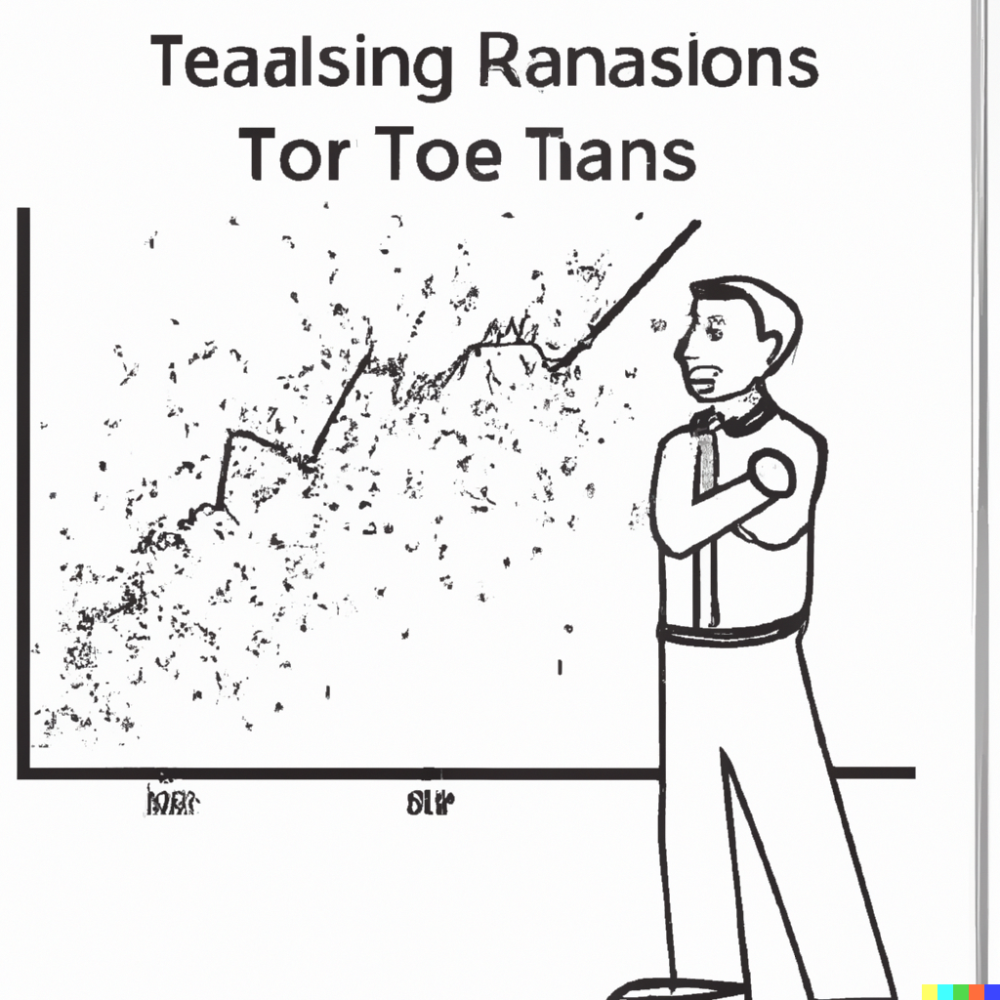

```{r setup, include=FALSE}
knitr::opts_chunk$set(echo = FALSE, fig.width = 11, fig.height = 7)
```


```{r echo=FALSE, include=FALSE, message=FALSE}
library(data.table)
library(ggplot2)
library(fastDummies)
```

# Time series components

.pull-left[

]

.pull-right[
General features of the economic time series can be classified within three broad categories:

- Trends
- Seasonality
- Cycles

A time series can exhibit one or several of these features. These features can be deterministic or stochastic, though it is often the case that trends and seasonality are modeled as deterministic and cycles as stochastic processes. 
]

---


# Trending series

.right-column[
Trend is a smooth, typically unidirectional pattern in the data that arises from the accumulation of information over time.

Economic (and non-economic) series often tend to be trending (usually upward). The underlying cause of it may or may not be common, but in either case, care is needed to avoid "spurious" findings when regressing one variable on another.
]

---


# Spurious relationship: Deterministic trends

.right-column[
To illustrate a spurious relationship, consider two trending variables: $$y_t = \gamma t + \nu_t,\;~~\nu\sim iid N(0,\sigma_{\nu}^2),$$ and $$x_t = \delta t + \upsilon_t,\;~~\upsilon\sim iid N(0,\sigma_{\upsilon}^2),$$ where $Cov(\nu_t,\upsilon_t) = 0$. 

To keep things simple, suppose $\sigma_{\nu}^2=\sigma_{\upsilon}^2=1$. And, also, suppose $y$ and $x$ are trending in the same direction, i.e., $\gamma$ and $\delta$ are some positive scalars, say, $0.3$ and $0.5$, respectively.
]

---


# Spurious relationship: Deterministic trends

.right-column[
```{r echo=FALSE, message=FALSE, cache=TRUE}
r <- 1000
n <- 120
tr <- 1:n

set.seed(1)
y <- 0.3*tr+rnorm(n)
set.seed(n)
x <- 0.5*tr+rnorm(n)

dt <- data.table(tr=tr,x=x,y=y)
dl <- melt(dt,id.vars="tr")

ggplot(dl,aes(x=tr,y=value,color=variable,linetype=variable)) +
  geom_line(size=1) +
  scale_color_manual(values=c("powderblue","coral"))+
  scale_linetype_manual(values=c(1,5))+
  labs(x="t",y=expression(paste(y[t],", ",x[t],sep=""))) +
  theme_classic()+
  theme(axis.title = element_text(size=22),axis.text = element_text(size=18),legend.position = c(.1,.9),legend.title=element_blank(),legend.text=element_text(size=22))
```
]

---

# Spurious relationship: Deterministic trends

.right-column[
These two series are not related, we know. But if we were to regress $y$ on $x$, we are likely to find the (statistically significant) relationship between the two. This would be a spurious relationship stemming from the presence of (deterministic) trends in the two series.

One can think of a trend as an omitted variable. If so, then the 'fix' to the issue is to include a trend as another variable in the regression.

Indeed, if we regress $y$ on $x$ and $t$, where $t=1,\ldots,T$, the previously detected spurious relationship between the two series will vanish.
]

---


# Spurious relationship: Stochastic trends

.right-column[
A time series may also follow a *stochastic trend*. A random walk process, $y_t=y_{t-1}+\zeta_t$, represents a stochastic trend. 

The issue of a spurious relationship is relevant to stochastic trend processes as well. 

Consider the aforementioned random walk process, and another random walk process, $x_t=x_{t-1}+\xi_t$. 

Suppose $\zeta\sim N(0,1)$ and $\xi\sim N(0,1)$, and $Cov(\zeta_t,\xi_t)=0$.
]

---


# Spurious relationship: Stochastic trends

.right-column[
```{r echo=FALSE, message=FALSE, cache=TRUE}
set.seed(1)
y <- cumsum(rnorm(n))
set.seed(n)
x <- cumsum(rnorm(n))

dt <- data.table(tr=tr,x=x,y=y)
dl <- melt(dt,id.vars="tr")

ggplot(dl,aes(x=tr,y=value,color=variable,linetype=variable)) +
  geom_line(size=1) +
  scale_color_manual(values=c("powderblue","coral"))+
  scale_linetype_manual(values=c(1,5))+
  labs(x="t",y=expression(paste(y[t],", ",x[t],sep=""))) +
  theme_classic()+
  theme(axis.title = element_text(size=22),axis.text = element_text(size=18),legend.position = c(.1,.9),legend.title=element_blank(),legend.text=element_text(size=22))
```
]

---


# Spurious relationship: Stochastic trends

.right-column[
The two variables are not related. But if we regress one on another, we are likely to reject the null more frequently than we should.

The previous 'fix', which involved adding a trend in the regression, doesn't quite work here.

Luckily, we have just the right 'fix' to the issue. It involves first-differencing both series and regressing $\Delta y_t$ on $\Delta x_t$. In effect, we are removing stochastic trends prior to running a regression.
]

---


# Deterinistic trends can take different forms

.right-column[
The foregoing example illustrates a simplest (and perhaps most frequently considered) specification - *linear* trend.

Other trend specifications are *polynomial* (e.g. quadratic, cubic, etc.), *exponential*, and *shifting* (or *switching*) trend models, respectively:
$$\begin{aligned}
	y_t &= \alpha + \beta_1 t + \beta_2 t^2 + \ldots + \beta_p t^p \\
	y_t &= e^{\alpha + \beta t}\;~~\mbox{or}\;~~\ln{y_t} = \alpha + \beta t \\
	y_t &= \alpha + \beta_1 t + \beta_2 (t-\tau)I(t>\tau),\;~~\tau\in\mathsf{T}	
	\end{aligned}$$
]

---


# Modeling trends

.right-column[
Trend models are (relatively) easy to fit and forecast.

Caution is needed with (higher order) polynomial trends, as they may fit well in-sample, but cause major problems out-of-sample.

Exponential trends are suitable when a time series is believed to be characterized with a stable relative variation over time. 
]

---


# Exponential trend

.right-column[
An exponential trend is equivalent to a linear trend fitted to a natural logarithm of the series. 

Logarithmic transformation can have several benefits:  

- log-transformed series are easier to interpret (relative change, usually expressed in percentages).
- the transformation homogenizes the variance of the time series. 
- an improved forecasting accuracy can be achieved.

]

---


# Exponential trend

.right-column[
Suppose, $w_t = \ln{y_t}$, where $\{y_t: t=1,\ldots,T\}$ is a strictly positive time series (which, most of the economic variables are).

One can fit a liner trend to $w_t$. The fitted trend can be reverse-transformed to fit the original series: $$\hat{y}_{t} = e^{\hat{w}_{t}+\hat{\sigma}_{\varepsilon}^2/2}$$
The second term in the exponential function comes from the implied assumption that the error term in the log-transformed model is normally distributed.
]

---


<!-- # Fitting and Forecasting Trends -->

<!-- Consider a generic representation of a trend model with an additive error term: $$y_t = g\big(t;\theta\big) + \varepsilon_t$$ We estimate parameters, $\theta$, by fitting the trend model to a time series using the least-squares regression: $$\hat{\theta} = \operatorname*{argmin}_{\theta} \sum_{t=1}^{T}\big(y_t - g(t;\theta)\big)^2.$$ Fitted values are then given by: $$\hat{y}_t = g\big(t;\hat{\theta}\big)$$ -->

<!-- --- -->


# Fitting a trend to U.S. mortgage rates

.right-column[
```{r echo=FALSE, message=FALSE, cache=TRUE}
load("../../Books/forecasting/data/interest_rates.RData")

interest_rates[,`:=`(w=log(y),t=1:nrow(interest_rates))]
interest_rates[,`:=`(haty=fitted(lm(y~t)))]
interest_rates[,`:=`(hatw=fitted(lm(w~t)))]
interest_rates[,`:=`(hatz=exp(hatw+summary(lm(w~t))$sigma^2/2))]

ggplot(interest_rates,aes(x=date,y=y))+
  geom_line(color="powderblue",size=.8)+
  geom_line(aes(y=haty),color="coral",size=.8,linetype=5)+
  labs(x="Year",y="Interest Rate (%)",caption="retrieved from FRED, Federal Reserve Bank of St. Louis\nhttps://fred.stlouisfed.org/series/MORTGAGE30US")+
  theme_classic()+
  theme(axis.title = element_text(size=22),axis.text = element_text(size=18))
```
]

---


# Forecasting linear trend

.right-column[
Suppose we assume a time series follow a linear trend model: $$y_t = \alpha + \beta t + \varepsilon_t,$$ where we also assume $\varepsilon_t\sim iid~\text{N}(0,\sigma^2)$.

Any future realization of the random variable is also assumed to follow a linear trend model: $$y_{t+h} = \alpha + \beta (t+h) + \varepsilon_{t+h}.$$ 
]

---


# Point forecast

.right-column[
Point forecast of $y_{t+h}$ is a conditional expectation at a given horizon: $$\hat{y}_{t+h|t} = E(y_{t+h}|\Omega_t;\hat{\theta}) = \hat{\alpha} + \hat{\beta} (t+h).$$ 

We are going to ignore the parameter uncertainty for now. That is, we are going to assume that $\hat{y}_{t+h|t}\equiv y_{t+h|t}$

Forecast error, then, will be: $$e_{t+h|t} = y_{t+h} - y_{t+h|t} = \varepsilon_{t+h}$$ 
]

---


# Interval forecast

.right-column[
Forecast variance is a conditional expectation of the forecast error: $$\sigma_{t+h|t}^2 = E(e_{t+h|t}^2) =  E(\varepsilon_{t+h}^2) = \sigma^2,\;~~\forall\;h$$
Note, the variance is the same for any forecast horizon.

From this, we can obtain lower and upper intervals of the forecast, given by: $$\hat{y}_{t+h|t}\pm 1.96\sigma_{t+h|t}$$

]

---


# Forecasting U.S. mortgage rates

.right-column[
```{r echo=FALSE, message=FALSE, cache=TRUE}
est <- lm(y~t,data=interest_rates[date<=as.Date("2010-12-31")])
interest_rates[,`:=`(f=est$coefficients[1]+est$coefficients[2]*t)]

interest_rates[date<=as.Date("2010-12-31")]$f <- NA

interest_rates[,`:=`(l=f-1.96*summary(est)$sigma,u=f+1.96*summary(est)$sigma)]

ggplot(interest_rates,aes(x=date,y=y))+
  geom_ribbon(aes(ymin=l,ymax=u),fill="coral",alpha=.2)+
  geom_line(color="powderblue",size=.8)+
  geom_line(data=interest_rates[date>as.Date("2010-12-31")],color="gray",size=.8)+
  geom_line(aes(y=f),color="coral",size=.8,linetype=5,na.rm=T)+
  labs(x="Year",y="Interest Rate (%)",caption="retrieved from FRED, Federal Reserve Bank of St. Louis\nhttps://fred.stlouisfed.org/series/MORTGAGE30US")+
  theme_classic()+
  theme(axis.title = element_text(size=22),axis.text = element_text(size=18))
```
]

---


# Pitfalls of linear trend forecasting

.right-column[
A few features of trend forecasts to note:
- they tend to understate uncertainty (at long horizons).
- short-term trend forecasts can perform poorly; long-term trend forecasts typically perform poorly.
- sometimes it may be beneficial to forecast growth rates, and reconstruct level forecasts from growth.
]

---


# Seasonality

.right-column[
Seasonality is a fluctuating pattern *within a year* that arise from links of technologies, preferences, and institutions to the calendar.

Seasonality is typically modeled as monthly or quarterly pattern, but can also be modeled as a higher frequency pattern (e.g. weekly or daily). Examples of time series with apparent seasonal patterns are:

- Agricultural prices.
- Energy sales.
- Airfare.
]

---


# Seasonality

.right-column[
A way to deal with the seasonality in data is to remove it prior to use of the series (seasonally adjusted time series). Indeed, some economic time series are only/also available in a seasonally-adjusted form.

Otherwise, and more interestingly, we can directly account for seasonality in a regression setting by incorporating the seasonal component into the model. 
]

---


# Modeling seasonality using dummy variables

.right-column[
A seasonal model is given by: $$y_t = \sum_{i=1}^{s}\gamma_i d_{it} + \varepsilon_t,$$
where $s$ denotes the frequency of the data, and $d_{it}$ takes the value of 1 repeatedly after every $s$ periods, and such that $\sum_{i} d_{it} = 1$, $\forall t$.
]

---


# Modeling seasonality using dummy variables

.left-column[
Note, there is no intercept in this specification.
]

.right-column[
The same as before only this time in matrix notation (easier to visualize): 
$$\begin{bmatrix}
y_{1}\\
y_{2}\\
\vdots \\
y_{T}
\end{bmatrix} = 
\begin{bmatrix}
1 & 0 & \cdots & 0 \\
0 & 1 & \cdots & 0 \\
\vdots & \vdots & \ddots &\vdots \\
0 & 0 & \cdots & 1
\end{bmatrix}
\begin{bmatrix}
\gamma_{1}\\
\gamma_{2}\\
\vdots \\
\gamma_{s}
\end{bmatrix}+
\begin{bmatrix}
\varepsilon_{1}\\
\varepsilon_{2}\\
\vdots \\
\varepsilon_{T}
\end{bmatrix}$$
]

---


# Modeling seasonality using dummy variables

.right-column[
Alternatively, we can rewrite the seasonal model as follows: $$y_t = \alpha + \sum_{i=1}^{s-1}\delta_i d_{it} + \varepsilon_t,$$ in which case $\alpha$ is an intercept of an omitted season, and $\delta_i$ represents a deviation from it during the $i^{th}$ season.

The two models are equivalent. Assuming the dummy variable associated with the season $s$, $d_{s}$, was dropped, $\alpha=\gamma_s$, and $\alpha+\delta_i=\gamma_i\;~\forall~i\ne s$.

]

---


# Modeling seasonality using harmonic variables

.right-column[
When dealing with weekly or daily data, the dummy variable approach of modeling seasonality may not be practical, nor efficient. 

A way to model seasonality without giving up too many degrees of freedom is by using the so-called seasonal harmonic variables, which are terms from a Fourier series.

]

---


# Modeling seasonality using harmonic variables

.right-column[

Suppose, we are working with weekly time series. There are 52.143 weeks in the year. A model with Fourier terms will have the following form: $$y_t = \alpha+\sum_{k=1}^{K}\left[\beta_{1k}\sin\left(\frac{2\pi kt}{52.143}\right)+\beta_{2k}\cos\left(\frac{2\pi kt}{52.143}\right)\right]+\varepsilon_t,$$ where the value of $K$ can be determined using an information criterion (e.g., AIC or SIC). 

]

---


# Fitting seasonality to U.S. vehicle miles traveled

.right-column[
```{r echo=FALSE, message=FALSE, cache=TRUE}
load("../../Books/forecasting/data/miles.RData")

miles$month <- month(miles$date)
miles_dum <- dummy_cols(miles$month,remove_selected_columns=T)
colnames(miles_dum) <- paste0("d",c(1:12))

miles <- cbind(miles,miles_dum)

est <- lm(y~d1+d2+d3+d4+d5+d6+d7+d8+d9+d10+d11,data=miles)

miles$haty <- fitted(est)

ggplot(miles,aes(x=date,y=y/1000))+
  geom_line(color="powderblue",size=.8)+
  geom_line(aes(y=haty/1000),color="coral",size=.8,linetype=5)+
  labs(x="Year",y="Vehicle Miles Traveled (bil)",caption="retrieved from FRED, Federal Reserve Bank of St. Louis\nhttps://fred.stlouisfed.org/series/MORTGAGE30US")+
  theme_classic()+
  theme(axis.title = element_text(size=22),axis.text = element_text(size=18))
```
]

---


# Forecasting seasonality

.right-column[
Any future realization of a random variable that is assumed to follow a seasonal model is: $$y_{t+h} = \alpha + \sum_{i=1}^{s-1}\delta_i d_{i,t+h} + \varepsilon_{t+h}.$$ 
]

---


# Point forecast

.right-column[
Point forecast of $y_{t+h}$ is given by: $$y_{t+h|t} = E(y_{t+h}|\Omega_t) = \alpha + \sum_{i=1}^{s-1}\delta_i d_{i,t+h}$$ Here, again, we assume the estimated parameters of the model are equal to its true parameters.

The forecast error is given by: $$e_{t+h|t} = y_{t+h} - y_{t+h|t} = \varepsilon_{t+h}$$
]

---

# Interval forecast

.right-column[
The forecast variance is given by: $$\sigma_{t+h|t}^2 = E(e_{t+h|t}^2) =  E(\varepsilon_{t+h}^2) = \sigma^2_{\varepsilon},\;~~\forall\;h$$

Assuming normal distribution the interval forecast is given by:
$$\hat{y}_{t+h|t}\pm 1.96\sigma_{t+h|t}$$
]

---


# Forecasting seasonality of vehicle miles traveled

.right-column[
```{r echo=FALSE, message=FALSE, cache=TRUE}
est <- lm(y~d1+d2+d3+d4+d5+d6+d7+d8+d9+d10+d11,data=miles[date<=as.Date("2010-12-31")])
miles[,`:=`(f=est$coefficients[1]+as.matrix(miles[,.(d1,d2,d3,d4,d5,d6,d7,d8,d9,d10,d11)])%*%as.matrix(est$coefficients[-1]))]

miles[date<=as.Date("2010-12-31")]$f <- NA

miles[,`:=`(l=f-1.96*summary(est)$sigma,u=f+1.96*summary(est)$sigma)]

ggplot(miles,aes(x=date,y=y/1000))+
  geom_ribbon(aes(ymin=l/1000,ymax=u/1000),fill="coral",alpha=.2)+
  geom_line(color="powderblue",size=.8)+
  geom_line(data=miles[date>as.Date("2010-12-31")],color="gray",size=.8)+
  geom_line(aes(y=f/1000),color="coral",size=.8,linetype=5,na.rm=T)+
  labs(x="Year",y="Vehicle Miles Traveled (bil)",caption="retrieved from FRED, Federal Reserve Bank of St. Louis\nhttps://fred.stlouisfed.org/series/MORTGAGE30US")+
  theme_classic()+
  theme(axis.title = element_text(size=22),axis.text = element_text(size=18))
```
]

---


# Using R-squared for model selection

.right-column[
Recall the most frequently used (and often abused) R-squared: $$R^2 = 1-\frac{\sum_{t=1}^{T}\hat{e}_t^2}{\sum_{t=1}^{T}(y_t - \bar{y})^2}$$

Adjusted R-squared accounts for the loss in degrees of freedom: $$\bar{R}^2 = 1-\frac{\sum_{t=1}^{T}\hat{e}_t^2}{\sum_{t=1}^{T}(y_t - \bar{y})^2}\left(\frac{T-1}{T-k}\right),$$ where $k$ denotes the number of estimated parameters.
]

---


# Using information criteria for model selection

.right-column[
The adjustment made to the R-squared might not be 'enough' so select a 'good' forecasting model, however.

Information criteria penalize for the loss in degrees of freedom more 'harshly' than the adjusted R-squared:
$$\begin{aligned}
AIC & = \ln{\left(\sum_{t=1}^{T}{\hat{e}_t^2}\right)} + 2\frac{k}{T} \\
SIC & = \ln{\left(\sum_{t=1}^{T}{\hat{e}_t^2}\right)} + \ln{T}\frac{k}{T}
\end{aligned}$$
]

---


# Model Selection

.right-column[
Things to remember about the information criteria:
- Less is better.
- Relative (not absolute) values of the criteria matter.
- SIC selects a more parsimonious model than AIC.
- The measures are used to compare fit across different models, given that the same data are used in those models.
- Asymptotically, minimizing AIC is equivalent to minimizing the one-step-ahead out-of-sample mean square forecast error.
- Even so, models selected using SIC may perform better.
]

---


# Readings

.pull-left[

]

.pull-right[
Ubilava, [Chapter 4](https://davidubilava.com/forecasting/docs/trends.html) and [Chapter 5](https://davidubilava.com/forecasting/docs/seasonality.html)

Gonzalez-Rivera, Chapter 10

Hyndman & Athanasopoulos, [3.2](https://otexts.com/fpp3/components.html), [13.1](https://otexts.com/fpp3/weekly.html)
]

