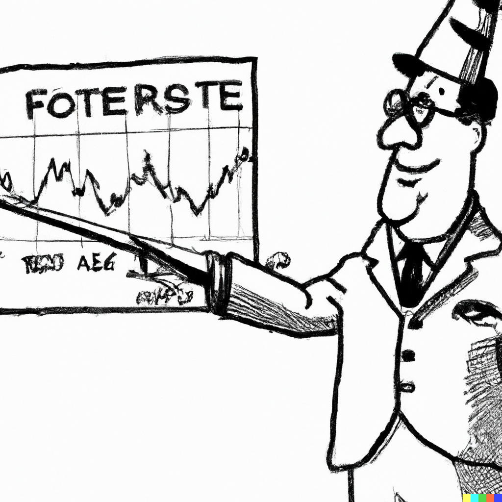

```{r setup, include=FALSE}
knitr::opts_chunk$set(echo = FALSE, fig.width = 11, fig.height = 7)
```

<style>
  .myTable td {
    padding: 5px 20px 5px 20px;
  }
</style>


```{r echo=FALSE, include=FALSE, message=FALSE}
library(data.table)
library(ggplot2)
library(forecast)
```

# Cycles

.pull-left[

]

.pull-right[
A cycle, in a time series, is a pattern of periodic fluctuations. Unlike seasonality, cycles are not contained within a calendar year.

Cycles can be *deterministic* or *stochastic*. 

Deterministic cycles can be modeled in a fashion similar to seasonality (e.g., using terms from a Fourier series). However, economic time series are better characterized by stochastic cycles.
]

---


# Autoregressive stochastic cycle

.right-column[
A cycle is stochastic when it is generated by random variables. Consider a process given by:
$$Y_t = f(Y_{t-1},Y_{t-2},\ldots)$$

This is an autoregressive stochastic cycle, or an autoregressive process since a random variable is a function of random variables from the same stochastic process.
]

---


# Autoregressive model

.right-column[
An autoregressive model of order $p$, referred as $AR(p)$, has the following functional form:
$$y_t = \alpha + \beta_1 y_{t-1}+\beta_2 y_{t-2}+ \cdots + \beta_p y_{t-p}+\varepsilon_t$$

The sum of the autoregressive parameters, $\beta_1,\ldots,\beta_p$, depicts the persistence of the series. The larger is the persistence (i.e., closer it is to one), the longer it takes for the effect of a shock to dissolve.
]

---


# First-order autoregression

.right-column[
Consider the first-order autoregression: $$y_t = \alpha + \beta_1 y_{t-1} + \varepsilon_t,$$ where $\alpha$ is a constant term; $\beta_1$ is the *persistence* parameter; and $\varepsilon_t$ is a white noise process.

A necessary and sufficient condition for an $AR(1)$ process to be covariance stationary is that $|\beta_1| < 1$.
]

---


# First-order autoregression

.right-column[
Substitute recursively lagged dependent variables:
$$
\begin{align}
y_t &= \alpha + \beta_1 y_{t-1} + \varepsilon_t \notag \\
y_t &= \alpha + \beta_1 (\alpha + \beta_1 y_{t-2} + \varepsilon_{t-1}) + \varepsilon_t \notag \\
&= \alpha(1+\beta_1) + \beta_1^2 (\alpha + \beta_1 y_{t-3} + \varepsilon_{t-2}) + \beta_1\varepsilon_{t-1} + \varepsilon_t \notag \\
&\vdots  \notag \\
&= \alpha\sum_{i=0}^{k-1}\beta_1^i + \beta_1^k y_{t-k} + \sum_{i=0}^{k-1}\beta_1^i\varepsilon_{t-i}
\end{align}
$$
]

---


# First-order autoregression

.right-column[
The end-result is a general linear process with geometrically declining coefficients. The $|\beta_1| < 1$ is required for convergence.

Then, as $k \to \infty$: $$y_t = \frac{\alpha}{1-\beta_1} + \sum_{i=0}^{\infty}\beta_1^i\varepsilon_{t-i}$$
]

---


# Mean and variance of AR(1)

.right-column[
*Unconditional mean*: $$\mu = E\left(y_t\right) = E\left(\frac{\alpha}{1-\beta_1} + \sum_{i=0}^{\infty}\beta_1^i\varepsilon_{t-i}\right) = \frac{\alpha}{1-\beta_1}$$

*Unconditional variance*: $$\gamma_0 = Var\left(y_t\right) = Var\left(\frac{\alpha}{1-\beta_1} + \sum_{i=0}^{\infty}\beta_1^i\varepsilon_{t-i}\right) = \frac{\sigma_{\varepsilon}^2}{1-\beta_1^2}$$
]

---


# Autocovariance of AR(1)

.right-column[
*Autocovariance*: $$\gamma_k = Cov(y_t,y_{t-k}) = E[(y_t - \mu)(y_{t-k} - \mu)] = E(y_t y_{t-k}) - \mu^2$$

Multiply both sides of $AR(1)$ with $y_{t-k}$ and take the expectation: $$E(y_t y_{t-k}) = \alpha \mu + \beta_1 E(y_{t-1}y_{t-k})$$

Substitute in expressions of $E(y_t y_{t-k})$ and $E(y_{t-1} y_{t-k})\equiv E(y_{t} y_{t-k+1})$ from above, to obtain: $$\gamma_k = \beta_1\gamma_{k-1}$$
]

---


# Autocorrelations of AR(1)

.right-column[
*Autocorrelation* (recall, $\rho_k = \gamma_k/\gamma_0$): $\rho_{k} = \beta_1\rho_{k-1}$

It then follows that:
$$\begin{align}
\rho_1 &= \beta_1\rho_0 = \beta_1 \notag \\
\rho_2 &= \beta_1\rho_1 = \beta_1^2 \notag \\
&\vdots \notag \\
\rho_k &= \beta_1\rho_{k-1} = \beta_1^k
\end{align}$$
]

---


# Autocorrelations of AR(1)

.right-column[
The autocorrelation, $\rho$, and partial autocorrelation, $\pi$, functions of the AR(1) process have three distinctive features:

- $\rho_1 = \pi_1 = \beta_1$. That is, the persistence parameter is also the autocorrelation and the partial autocorrelation coefficient.
- The autocorrelation function decreases exponentially toward zero, and the decay is faster when the persistence parameter is smaller.
- The partial autocorrelation function is characterized by only one spike $\pi_1 \neq 0$, and the remaining $\pi_k = 0$, $\forall k > 1$.
]

---


# Autocorrelations of AR(p)

.right-column[
Generally, the autocorrelation and partial autocorrelation functions of the covariance-stationary $AR(p)$ process have the following features:

- $\rho_1 = \pi_1$, and $\pi_p = \beta_p$.
- The autocorrelation function decreases toward zero, but in different fashion depending on the values of $\beta_1,\ldots,\beta_p$. Nonetheless, the decay is faster when the persistence measure is smaller.
- The partial autocorrelation function is characterized by the first $p$ spikes $\pi_1 \neq 0,\ldots,\pi_p \neq 0$, and the remaining $\pi_k = 0$, $\forall k > p$.
]

---

# Random walk with drift

.right-column[
Random walk is a special case of the AR(1) process (which, in turn, is a special case of the AR(p) process) in which $\alpha=0$ and $\beta_1=1$; when $\alpha\ne 0$ it is referred to as random walk with drift.

When $\beta_1=1$, the process is non-stationary. Indeed, testing $\beta_1=1$ is equivalent to testing the null hypothesis of non-stationarity of the series. The test is also referred to as autoregressive unit root test.
]

---

# Unit root test

.right-column[
We cannot directly test the null of non-stationarity in an autoregression. That is, we cannot just estimate: $$y_t = \alpha+\beta_1 y_{t-1}+\varepsilon_t$$ and test whether $\hat{\beta}_1$ is statistically significantly less than unity.
]

---

# Unit root test

.right-column[
Instead, we rewrite the model by subtracting $y_{t-1}$ from both sides. That is, we estimate : $$\Delta y_t = \alpha+\phi y_{t-1}+\varepsilon_t,$$ where $\phi=\beta_1-1$, and test whether $\hat{\phi}$ is statistically significantly less than zero. This test is known as the Dickey-Fuller (DF) test.

In practice, we apply the augmented Dickey-Fuller (ADF) test, which is the same test as above, except the lags of the dependent variable, $\Delta y_t$, are added to the regression to ensure that $\varepsilon_t$ is white noise.
]

---


# Order selection in autoregression

.right-column[
In effect, the ADF allows us to test the presence of unit roots in an autoregression with a lag order greater than one. 

Partial autocorrelations can give a hint about the lag order of the autoregression.

More formally, an information crioterion (AIC or SIC) can be applied to select the order of autoregression.

To illustrate the foregoing, consider a time series of US Dollar to Euro exchange rates.
]

---


# Time series of USD/EUR exchange rates

.right-column[
```{r echo=FALSE, message=FALSE, cache=TRUE}
load("../../Books/forecasting/data/exchange_rates.RData")

ggplot(exchange_rates,aes(x=date,y=y))+
  geom_line(color="powderblue",size=.8)+
  labs(x="Year",y="Exchange Rate (USD/EUR)",caption="retrieved from FRED, Federal Reserve Bank of St. Louis\nhttps://fred.stlouisfed.org/series/EXUSEU")+
  theme_classic()+
  theme(axis.title = element_text(size=22),axis.text = element_text(size=18))
```
]

---


# ACF of USD/EUR exchange rates

.pull-left[
Autocorrelations decrease gradually, which may be suggestive of an AR(1) process.
]

.pull-right[
```{r echo=FALSE, message=FALSE, cache=TRUE}
maxlag <- 12
dt <- data.table(k=c(1:maxlag),rho=c(acf(exchange_rates$y,plot=F)[1:maxlag]$acf))

ggplot(dt,aes(x=k,y=rho))+
  geom_segment(aes(xend=k,yend=0),color="powderblue",size=1.2)+
  geom_hline(yintercept=0,size=.8)+
  geom_hline(yintercept=c(-1.96/sqrt(nrow(exchange_rates)),1.96/sqrt(nrow(exchange_rates))),size=.5,linetype=5,col="coral")+
  scale_x_continuous(breaks=c(1:maxlag),labels=c(1:maxlag))+
  labs(x="k",y=expression(rho[k]))+
  coord_cartesian(ylim=c(-1,1))+
  theme_classic()+
  theme(axis.title = element_text(size=22),axis.text = element_text(size=18))
```
]

---


# PACF of USD/EUR exchange rates

.pull-left[
Partial autocorrelations suggest the order of autoregression to be one or, at most, two.
]

.pull-right[
```{r echo=FALSE, message=FALSE, cache=TRUE}
maxlag <- 12
dt <- data.table(k=c(1:maxlag),rho=c(pacf(exchange_rates$y,plot=F)[1:maxlag]$acf))

ggplot(dt,aes(x=k,y=rho))+
  geom_segment(aes(xend=k,yend=0),color="powderblue",size=1.2)+
  geom_hline(yintercept=0,size=.8)+
  geom_hline(yintercept=c(-1.96/sqrt(nrow(exchange_rates)),1.96/sqrt(nrow(exchange_rates))),size=.5,linetype=5,col="coral")+
  scale_x_continuous(breaks=c(1:maxlag),labels=c(1:maxlag))+
  labs(x="k",y=expression(rho[k]))+
  coord_cartesian(ylim=c(-1,1))+
  theme_classic()+
  theme(axis.title = element_text(size=22),axis.text = element_text(size=18))
```
]

---


# Order selection using information criteria

.pull-left[
```{r echo=FALSE, message=FALSE, cache=TRUE}
exchange_rates[,`:=`(y1=shift(y,1),y2=shift(y,2),y3=shift(y,3))]
exchange_rates <- exchange_rates[complete.cases(exchange_rates)]

dt <- data.table(p=1:3,AIC=NA,SIC=NA)

ar1 <- lm(y~y1,data=exchange_rates)
ar2 <- lm(y~y1+y2,data=exchange_rates)
ar3 <- lm(y~y1+y2+y3,data=exchange_rates)

dt$AIC[1] <- log(crossprod(ar1$resid))+2*length(ar1$coef)/length(ar1$resid)
dt$AIC[2] <- log(crossprod(ar2$resid))+2*length(ar2$coef)/length(ar2$resid)
dt$AIC[3] <- log(crossprod(ar3$resid))+2*length(ar3$coef)/length(ar3$resid)

dt$SIC[1] <- log(crossprod(ar1$resid))+log(length(ar1$resid))*length(ar1$coef)/length(ar1$resid)
dt$SIC[2] <- log(crossprod(ar2$resid))+log(length(ar1$resid))*length(ar2$coef)/length(ar2$resid)
dt$SIC[3] <- log(crossprod(ar3$resid))+log(length(ar1$resid))*length(ar3$coef)/length(ar3$resid)

knitr::kable(dt,format='html',digits=3,align="l", table.attr='class="myTable"')
```
]

.pull-right[
Both information criteria suggest second order autoregression.

So we need to regress $y_t$ on $y_{t-1}$ and $y_{t-2}$ to estimate the AR(2) model.
]

---


# One-step-ahead point forecast

.right-column[
One-step-ahead point forecast (ignoring parameter uncertainty): $$y_{t+1|t} = E(y_{t+1}|\Omega_t) = \alpha + \beta_1 y_{t} + \cdots  + \beta_p y_{t-p+1}$$

One-step-ahead forecast error: $$e_{t+1|t} = y_{t+1} - y_{t+1|t} = \varepsilon_{t+1}$$
]

---


# One-step-ahead interval forecast

.right-column[
One-step-ahead forecast variance: $$\sigma_{t+1|t}^2 = E(e_{t+1|t}^2) = E(\varepsilon_{t+1}^2) = \sigma_{\varepsilon}^2$$

One-step-ahead (95%) interval forecast: $$y_{t+1|t} \pm 1.96\sigma_{\varepsilon}$$
]

---


# Multi-step-ahead point forecast

.right-column[
h-step-ahead point forecast: $$y_{t+h|t} = E(y_{t+h}|\Omega_t) = \alpha + \beta_1 y_{t+h-1|t} + \cdots + \beta_p y_{t+h-p|t},$$ where each $y_{t+h-j|t}$, $j<h$, is sequentially generated. That is, to generate a forecast for horizon $h$, forecasts for horizons $1$ through $h-1$ need to be generated first. This is known as the *iterative* method of multi-step-ahead forecasting. 

h-step-ahead forecast error: $$e_{t+h|t} = \varepsilon_{t+h} + \beta_1 e_{t+h-1|t} + \cdots + \beta_p e_{t+h-p|t}$$
]

---


# Multi-step-ahead interval forecast

.right-column[
h-step-ahead forecast variance: 
$$\sigma_{t+h|t}^2 = \sigma_{\varepsilon}^2 + \sum_{i=1}^{p}\beta_i^2 Var(e_{t+h-i|t}) + 2\sum_{i \neq j}\beta_i\beta_j Cov(e_{t+h-i|t},e_{t+h-j|t})$$
These variance and covariances are some functions of the in-sample error variance and model parameters.

h-step-ahead (95%) interval forecast: $$y_{t+h|t} \pm 1.96\sigma_{t+h|t}$$
]

---

# Forecasting USD/EUR exchange rates

.right-column[
```{r echo=FALSE, message=FALSE, cache=TRUE}
y <- exchange_rates[date<=as.Date("2010-12-31")]$y
ar2 <- ar(y,order.max=2,demean=F,intercept=T,method="ols")

ar2f <- forecast(ar2,h=length(exchange_rates[date>as.Date("2010-12-31")]$y),level=95)

exchange_rates$f <- c(rep(NA,length(exchange_rates[date<=as.Date("2010-12-31")]$y)),as.matrix(ar2f$mean))
exchange_rates$l <- c(rep(NA,length(exchange_rates[date<=as.Date("2010-12-31")]$y)),as.matrix(ar2f$lower))
exchange_rates$u <- c(rep(NA,length(exchange_rates[date<=as.Date("2010-12-31")]$y)),as.matrix(ar2f$upper))

ggplot(exchange_rates,aes(x=date,y=y))+
  geom_ribbon(aes(ymin=l,ymax=u),fill="coral",alpha=.2)+
  geom_line(color="powderblue",size=.8)+
  geom_line(data=exchange_rates[date>as.Date("2010-12-31")],color="gray",size=.8)+
  geom_line(aes(y=f),color="coral",size=.8,linetype=5,na.rm=T)+
  labs(x="Year",y="Exchange Rate (USD/EUR)",caption="retrieved from FRED, Federal Reserve Bank of St. Louis\nhttps://fred.stlouisfed.org/series/EXUSEU")+
  theme_classic()+
  theme(axis.title = element_text(size=22),axis.text = element_text(size=18))
```
]

---


# Direct multi-step-ahead forecasts

.right-column[
We can, also, directly obtain multi-step-ahead forecasts. To illustrate, consider a first-order autoregression: $y_t=\alpha+\beta_1 y_{t-1}+\varepsilon_t.$ 

One-step-ahead point forecast is readily given by: $$y_{t+1|t}=\alpha+\beta_1 y_{t}.$$

Using the *iterative* method, two-step-ahead point forecast is: $$y_{t+2|t}=\alpha+\beta_1 y_{t+1|t}.$$
]

---


# Direct multi-step-ahead forecasts

.right-column[
Alternatively, we can substitute $y_{t-1}=\alpha+\beta_1 y_{t-2}+\varepsilon_{t-1}$ into the original equation to obtain:
$$y_t=\alpha(1+\beta_1)+\beta_1^2y_{t-2} + \varepsilon_t + \beta_1\varepsilon_{t-1} = \tilde{\alpha} + \tilde{\beta}_1 y_{t-2} + u_t,$$ where $\tilde{\alpha}=\alpha(1+\beta_1)$ and $\tilde{\beta}_1=\beta_1^2$, and $u_t=\varepsilon_t + \beta_1\varepsilon_{t-1}.$

Thus, a way to obtain two-step-ahead forecast is if we regress $y_t$ on $y_{t-2}$, and then directly forecast $y_{t+2}$ from $y_{t}$. 

This is the *direct* method of multi-step-ahead forecasting, which can be extended to higher order autoregression, and any forecast horizon.
]

---


# Direct multi-step-ahead interval forecast

.right-column[
In the direct method of multistep forecasting, error terms are serially correlated (by construction). For example, in the direct two-step-ahead forecast from a re-specified AR(1) model: $$u_t = \varepsilon_t+\beta_1\varepsilon_{t-1}.$$

It then follows that: $\sigma^2_u = E\left[(\varepsilon_t+\beta_1\varepsilon_{t-1})^2\right] = \sigma^2_{\varepsilon}(1+\beta_1^2).$ 

Thus, when applying the direct method of forecasting, interval forecasts for a given horizon are obtained 'directly,' based on the standard deviation of the residuals.
]

---


# Direct and iterative multi-step-ahead forecasts

.right-column[
In summary, an $h$-step-ahead forecast from an AR(p) model, using:

- the iterative method: $$y_{t+h|t,i} = \alpha + \sum_{j=1}^{p}\beta_j y_{t+h-j|t,i},$$ where $y_{t+h-j|t,i}=y_{t+h-j}$ when $h-j\le 0.$
- the direct method is: $$y_{t+h|t,d} = \tilde{\alpha} + \sum_{j=1}^{p}\tilde{\beta}_j y_{t+1-j}.$$
]

---


# Direct vs iterative multi-step-ahead forecasts

.right-column[
The relative performance of the two forecasts, $y_{t+h|t,i}$ and $y_{t+h|t,d}$, in terms of bias and efficiency depends on the bias and efficiency of the estimators of each method. 

In the case of correctly specified models, both estimators are consistent, but the one-step-ahead model (which leads to the iterative method) is more efficient. Thus, in large samples, the iterative forecast can be expected to perform better than the direct forecast.

In the case of mis-specified models, the ranking may very well change.
]

---


# Readings

.pull-left[

]

.pull-right[
Ubilava, [Chapter 6](https://davidubilava.com/forecasting/docs/autoregression.html)

Gonzalez-Rivera, Chapter 7

Hyndman & Athanasopoulos, [9.3](https://otexts.com/fpp3/AR.html)
]


