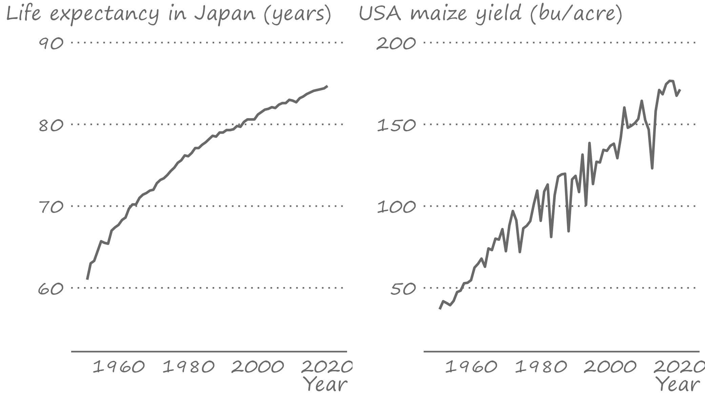
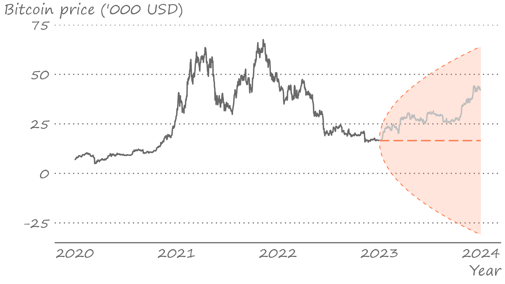
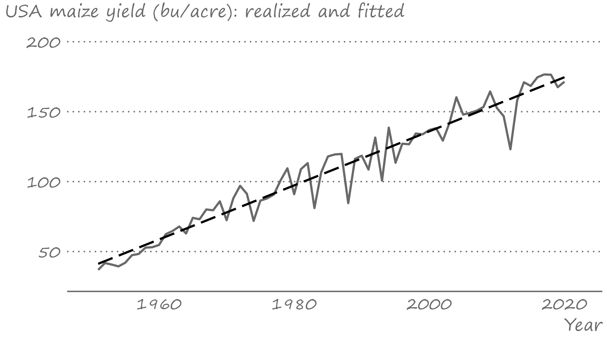
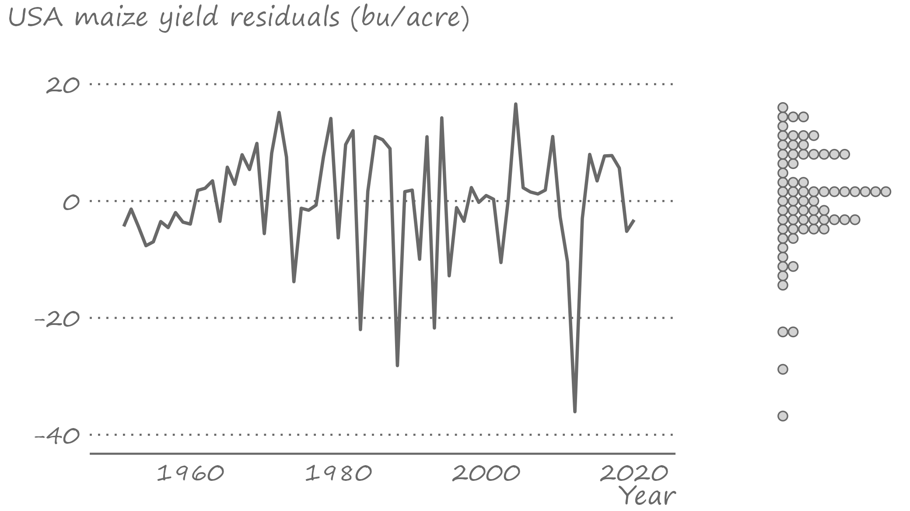
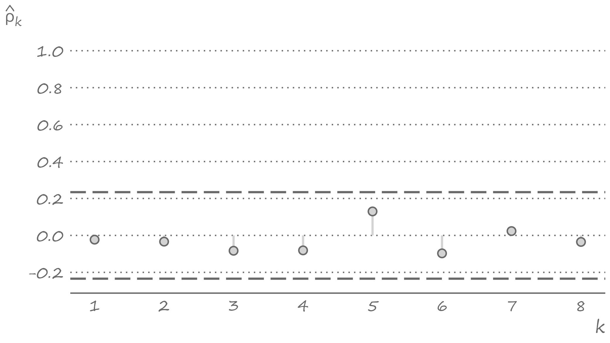
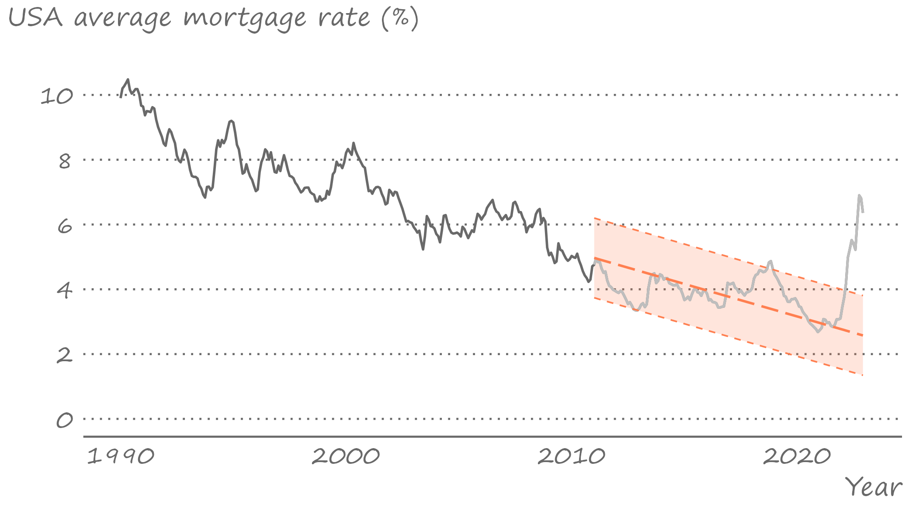
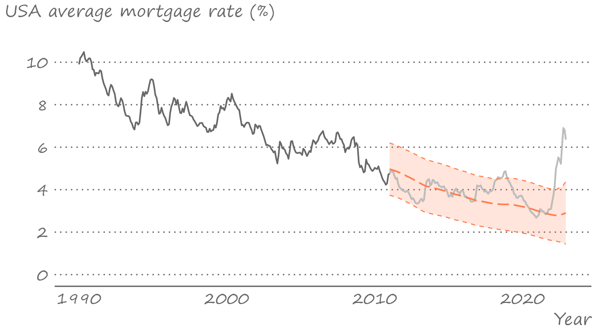
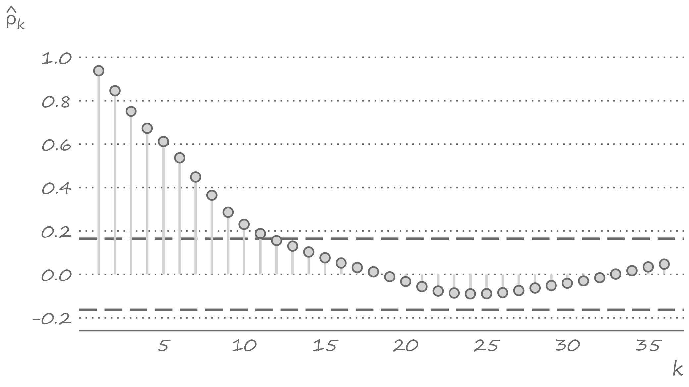
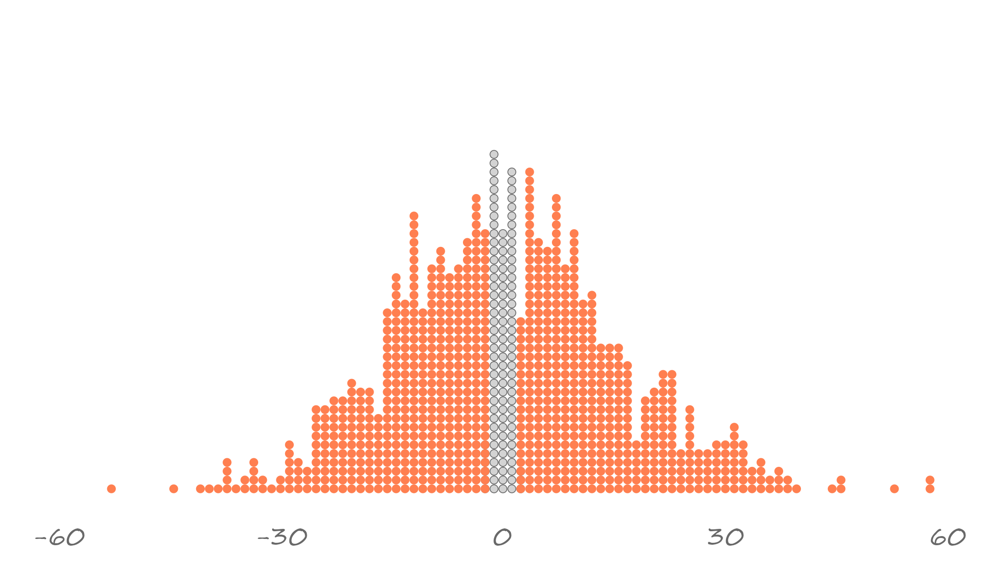
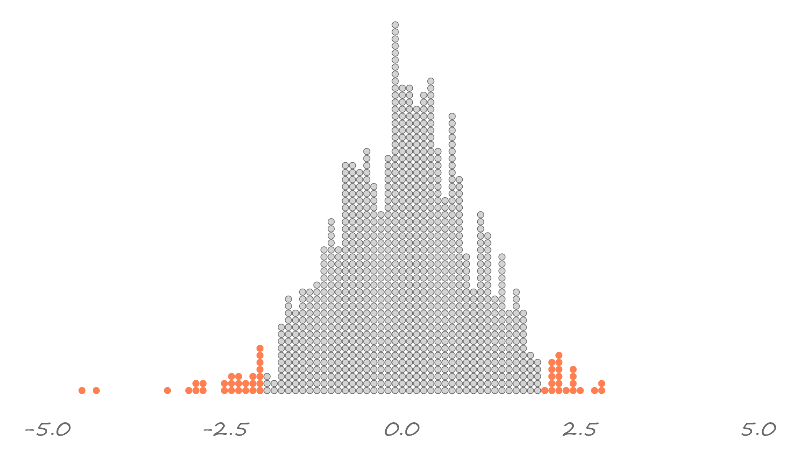

```{r setup, include=FALSE}
knitr::opts_chunk$set(echo=FALSE,fig.width=16,fig.height=9)
```


```{r echo=FALSE, include=FALSE, message=FALSE}
library(data.table)
library(ggplot2)
library(fastDummies)
```

# Trending series

.pull-left[

]

.pull-right[
Most time series, more often than not, follow some specific patterns. 

One such pattern is when over time the average level of a time series increases or decreases. 

Such a time series is said to be trending (upward or downward). 
]

---


# Trending series

.right-column[
Trends are among the most commonly observed and, indeed, talked-about features of time series. A positive trend, in particular, is often present in many time series. 

Observed over an extended period of time, gross domestic product, agricultural yields, prices of most commodities, and more recently, global temperatures, all increase, on average.
]

---


# Flavours of trends

.right-column[
Trends do not need to be unidirectional, or monotonic. It is possible for the sign of a trend to change over time. 
- The sales of cigarettes per adult in the U.S. were increasing through much of the 20th century, but then the trend reversed. 

It is also possible for the rate of the change to alter. 
- The life expectancy at birth in Japan has increased at a decreasing rate, meaning that the positive trend has become flatter over time. 
- However, the slope of the U.S. maize yields have remained constant.
]

---

# Flavours of trends

.right-figure[



]

---


# Why series trend

.right-column[
A trend in a time series typically manifest a stock of some process. 
- Agricultural yields increase because the technology and our understanding of best cropping practices improve with time. 
- Global temperatures increase because the emitted greenhouse gasses create a blanket of sorts in the atmosphere which traps the heat within, thus warming the earth.
- Commodity prices&mdash;which are points of intersection of the demand and supply curves observed over an extended period of time&mdash;trend upward, e.g., as a result of outward shifts in demand (changing dietary preferences) and a relatively steady supply.
]

---


# Stochastic trend: Random walk process

.right-column[
Trending series is a realization of a nonstationary stochastic process. 

Random walk is a nonstationary process that has a *stochastic trend*.

It is given by: $$y_t=y_{t-1}+\varepsilon_t,\;~~\varepsilon_t\sim iid\left(0,\sigma^2\right)$$
]

---


# Stochastic trend: Random walk process

.right-column[
By backward iteration we can show that: $$y_t=y_{0}+\sum_{i=1}^{t}\varepsilon_i,$$ where $y_0$ is the realization of $y$ in period $0$, which we do not observe. To keep things simple&mdash;and this doesn't alter the conclusion we are about to make&mdash;we can assume $y_0=0$ (more generally, we can think of $y_0$ as some constant). 
]

---

# Time-varying variance and covariances

.right-column[
So, at any point in time, a realization of the random walk process can be given as the sum of the iid random variables. It then follows that:
$$\begin{aligned}
		& \mathbb{E}\left(y_t\right)=\mathbb{E}\left(\sum_{i=1}^{t}\varepsilon_i\right) = 0\\
    & \mathbb{V}\left(y_t\right) = \mathbb{V}\left(\sum_{i=1}^{t}\varepsilon_i\right)=t\sigma^2\\
    & Cov\left(y_t,y_{t-k}\right) = Cov\left(\sum_{i=1}^{t}\varepsilon_i,\sum_{i=1}^{t-k}\varepsilon_i\right)=(t-k)\sigma^2
  \end{aligned}$$

]

---


# Point forecast from a random walk model

.right-column[
Suppose we would like to obtain an $h$-step-ahead optimal point forecast of a time series that follows random walk, that is, $y_{t+h|t}$.

But we know that the only difference between $y_t$ and $y_{t+h}$ is the sum of mean-zero stochastic shocks: $\sum_{i=t+1}^{t+h}\varepsilon_i$. So, $$y_{t+h|t}=\mathbb{E}\left(y_{t+h}|\Omega_t\right)=\mathbb{E}\left(y_t+\sum_{i=t+1}^{t+h}\varepsilon_i\right)=y_t.$$

So, the optimal point forecast, at any horizon, is the most recent realization of the random walk process.
]

---

# Interval forecast from a random walk model

.right-column[
The forecast error, for a given $h$, is $\sum_{i=t+1}^{t+h}\varepsilon_i$.

It then follows that the forecast error variance changes with the horizon. Specifically,
$$\sigma_{t+h|t}^2=Var\left(y_{t+h}|\Omega_t\right)=\mathbb{V}\left(\sum_{i=t+1}^{t+h}\varepsilon_i\right)=h\sigma^2$$

From this, we can obtain lower and upper intervals of the forecast:: $$y_{t+h|t}\pm 1.96\sigma_{t+h|t}$$


]

---

# Forecasting Bitcoin prices (assuming random walk)

.right-figure[


]

---


# Deterministic trend

.right-column[
Another trend type is *deterministic*.

To keep things simple, suppose the stochastic process is comprised of independent and identically distributed normal random variables with shifting mean. That is, $$Y_t\sim iid~\text{N}\left(\mu_t,\sigma^2\right)\;~~\forall~t.$$ 

Thus, for $t=1,2,\ldots$, the sequence of the means are $\left\{\mu_1,\mu_2,\ldots\right\}$.  
]

---


# Linear trend model

.right-column[
This sequence may take any pattern, which we can approximate by imposing some functional form on to it. 

The simplest of the functional forms is linear. We can model a linearly trending time series as follows: $$y_t = \delta_0+\delta_1 t + \varepsilon_t,\;~~t=1,2,\ldots,T,$$ where $T$ is the total number of observations in the time series, and, suppose, $\varepsilon_t\sim iid~\text{N}\left(0,\sigma_{\varepsilon}^2\right)$.
]

---


# Linear trend model

.right-column[
The error term is a Gaussian white noise process, which is stationary. 

And $\delta_0$ is just a constant, which is time-invariant.

Nonstationarity thus comes from the trend component given by $\delta_1 t$. 
]

---

# Linear trend model

.right-column[
Indeed, the expectation of the time series is: $$\mathbb{E}\left(y_t\right) = \delta_0+\delta_1 t,$$ which changes with $t$ (so long as $\delta_1 \ne 0$). 

The time series is expected to change by $\delta_1$ with each increment of time.

We can easily show that, for example, $$\mathbb{E}\left(y_{t+1}-y_t\right) = \mathbb{E}\left(y_{t+1}\right)-\mathbb{E}\left(y_t\right)=\delta_1$$
]

---


# Linear trend model

.right-column[
Generally, a deterministic trend assumes that the realizations of a stochastic process are a fixed function of time plus the error component. 

Under such an assumption, the expectation of a time series is a function of constants. 

In our foregoing example, these are $\delta_0$ and $\delta_1$, and time, $t$.
]

---


# Detrending a deterministically trending series

.right-column[
If we subtract the deterministic component, which is $\delta_0 + \delta_1 t$, from both sides of equation, we will have: $$\tilde{y}_t = \varepsilon_t,\;~~t=1,2,\ldots,$$ where $\tilde{y}_t=y_t-\delta_0-\delta_1 t$. 

Here, $\tilde{y}_t$ is referred to as the *detrended* series (technically, the detrended and mean-centred series, as we also subtracted $\delta_0$). 
]

---


# Trend-stationarity

.right-column[
Thus, assuming the original time series has a deterministic trend&mdash;a linear trend, for example&mdash;the appropriately detrended time series will resemble the realizations of a stationary stochastic process.

In such an instance, the original series is a realization of what is referred to as a *trend-stationary* process.
]

---


# Fitting trends

.right-column[
Modeling a time series with a deterministic trend is a straightforward exercise... so long as we know that the trend is deterministic, and have a good idea about its functional form. 

While hardly trivial, sometimes it is easy to argue a presence of a deterministic trend.]

---


# Fitting trends

.right-column[
Consider cereal grain yields, for example. The likely key drivers of the average yield over time are (gradual) changes in technology and climate. 

The main source of year-to-year variation in yields is the weather. 

Thus, year-to-year deviations in yields relative to the average yield are largely driven by year-to-year deviations in weather given the technology and climate. 

To that end, cereal grain yields likely is a realization of a trend-stationary process. And, modeling it as a deterministically trending series would seem to be a reasonable approach.
]

---


# Fitting trends

.right-column[
If we were to fit a linear trend to the time series of U.S. maize yields (measured in bu/acre) ranging from 1961 to 2020, the estimated coefficients for the intercept and slope, respectively, would be $61.87$ and $1.85$ (both statistically significantly different from zero).

Thus, our expectation of U.S. maize yield in 1960 would have been $61.87$, and with each successive period, this expectation would increase by $1.85$. 

There are a total of 60 periods in the sample. So, for example, the expectation of U.S. maize yield in 2020 would be $61.87 + 1.85 \times 60 = 172.87$. 
]

---

# Linear trend explains the long-run pattern

.right-figure[


]

---


# Fitting trends

.right-column[
A couple of things become apparent from the figure. 
- First, the linear tend, as anticipated, well approximates the average change of the time series over time. 
- Second, the deviations from the trend&mdash;the residuals of the fitted regression&mdash;might not be symmetrically distributed: It appears that the negative deviations are of larger size than the positive deviations. 
]

---


# Fitting trends

.right-column[
That the residuals of the fitted regression are not normally distributed is not an issue. 

At least, it is not an issue for estimating the parameters of the model. 

And specifically, it doesn't suggest the model is not correctly specified.   
]

---


# Fitting trends

.right-column[
A correctly specified model may yield residuals that are not normally distributed. 

However, a correctly specified model should not yield residuals that are serially correlated. 

The serial correlation of the residuals typically suggests that the model is misspecified. Specifically, it suggest that the applied model doesn't adequately capture all available information in the data. 
]

---


# Residuals from the linear trend model

.right-figure[


]

---


# The autocorrelogram of the residuals

.right-figure[


]

---


# Forecasting linear trend

.right-column[
Suppose we assume a time series follow a linear trend model: $$y_t = \alpha + \beta t + \varepsilon_t,$$ where we also assume $\varepsilon_t\sim iid~\text{N}(0,\sigma^2)$.

Under the same assumption, any future realization of the process will also follow a linear trend model. That is, $$y_{t+h} = \alpha + \beta (t+h) + \varepsilon_{t+h}.$$ 
]

---


# Point forecast from a linear trend model

.right-column[
Point forecast of $y_{t+h}$ is a conditional expectation at a given horizon: $$\hat{y}_{t+h|t} = \mathbb{E}(y_{t+h}|\Omega_t;\hat{\theta}) = \hat{\alpha} + \hat{\beta} (t+h).$$ 

We are going to ignore the parameter uncertainty. That is, we are going to assume that $\hat{y}_{t+h|t}\equiv y_{t+h|t}$
]

---


# Interval forecast from a linear trend model

.right-column[
Forecast error, then, will be: $$e_{t+h} = y_{t+h} - y_{t+h|t} = \varepsilon_{t+h}$$ 

Forecast variance is: $$\sigma_{t+h|t}^2 = \mathbb{V}\left(y_{t+h}|\Omega_t\right)=\mathbb{V}\left(\varepsilon_{t+h}\right) = \sigma^2,\;~~\forall\;h$$
Note, the forecast variance does not change with the horizon.

We can obtain lower and upper intervals of the forecast: $$\hat{y}_{t+h|t}\pm 1.96\sigma_{t+h|t}$$

]

---


# U.S. Mortgage Rates: Multi-step-ahead forecasts

.right-figure[



]

---


# U.S. Mortgage Rates: One-step-ahead forecasts

.right-figure[



]

---


# U.S. Mortgage Rates: Forecast errors

.right-figure[



]

---


# Pitfalls of linear trend forecasting

.right-column[
A few features of trend forecasts to note:
- they tend to understate uncertainty (at long horizons).
- short-term trend forecasts can perform poorly.
- sometimes it may be beneficial to forecast growth rates, and reconstruct level forecasts from growth.
]

---


# Different functional forms of a deterministic trend

.right-column[
A linear trend is one of many types of deterministic trends. It assumes that the time series change only in one direction (i.e., increase or decrease) and, that the rate of change is constant. 

Such a setting may very well suit some time series, as we saw in the case of U.S. maize yields, but can be overly restrictive on other occasions. 

Linear trend, indeed, is a special case of some other, less parsimonious types of trends.
]

---


# Different functional forms of a deterministic trend

.right-column[
Other trend specifications are *polynomial* (e.g. quadratic, cubic, etc.), *exponential*, and *shifting* (or *switching*) trend models. 

The expectations of polynomial and exponential trends are respectively given by:
$$\begin{aligned}
	\mathbb{E}\left(y_t\right) &= \delta_0 + \delta_1 t + \delta_2 t^2 + \ldots + \delta_p t^p, \\
	\mathbb{E}\left(y_t\right) &= e^{\alpha_0 + \alpha_1 t}\;~~\mbox{or}\;~~\mathbb{E}\left(\ln{y_t}\right) = \alpha_0 + \alpha_1 t.
	\end{aligned}$$
]

---


# Polynomial trend

.right-column[
A polynomial trend model can be viewed as an extension of a linear trend model. It shares the general characteristics of a linear trend model and adds some of its own. 

Specifically, a polynomial trend model is capable of capturing dramatic changes in time series, such as turning points, for example. 

Polynomial trends are about as easy to model as the linear trend. Caution is needed with higher order polynomials, as they may fit the data exceedingly well, but generate remarkably inaccurate forecasts.
]

---


# Exponential trend

.right-column[
An exponential trend model, from the standpoint of modeling and forecasting, is largely equivalent to a linear trend model fitted to the natural logarithm of a series. 

For a time series $\{y_t: t=1,\ldots,T\}$, the natural logarithm is: $w_t = \ln{y_t}$. 

Some of the benefits of such a transformation are: 
- the easier interpretation and comparison between different time series (e.g., GDP growth across different countries); 
- homogenized (over time) variability of a time series; and 
- the possibly improved forecasting accuracy of the original series. 
]

---


# Exponential trend

.right-column[
One can fit a liner trend to $w_t$. The fitted trend can be reverse-transformed to fit the original series: $$\hat{y}_{t} = e^{\hat{w}_{t}+\hat{\sigma}_{\varepsilon}^2/2}$$
The second term in the exponential function comes from the implied assumption that the error term in the log-transformed model is normally distributed.
]

---


# Spurious relationships

.right-column[
While many time series tend to be trending (usually upward), the underlying causes for this may or may not be common. 

In any case, a care is needed to avoid "spurious" findings when analyzing relationships between trending series.

If we are careless, we may conclude that there is a relationship between the series when, in fact, there is none.

We may encounter the issue of spurious relationship in both deterministic and stochastic trend types.
]

---


# Spurious relationship: Deterministic trends

.right-column[
Does the change in U.S. maize yields cause the change in life expectancy in Japan? 

An obvious and sensible answer to this question is a "No." 

So, if we were to regress life expectancy on maize yields, the coefficient associated with the regressor should be indistinguishable from zero, right? 
]

---


# Spurious relationship: Deterministic trends

.right-column[
Indeed, it should. But it is not. As it turns out, the estimated coefficient is $0.15$ and the associated standard error is $0.01$, so the coefficient is highly statistically significant.

This is because we are picking up a spurious relationship stemming from the presence of (deterministic) trends in the two series.
]

---

# Spurious relationship: Deterministic trends

.right-column[
We can think of a trend as an omitted variable, in this instance. 

If so, then there is an easy 'fix' to the issue. We just need to include trend as an additional variable in the regression.

Indeed, when we regress life expectancy on maize yields and trend, the previously detected (statistically significant but, as we know, spurious) effect vanishes. The estimated coefficient becomes $0.03$ with the associated standard error $0.02$

]

---


# Spurious relationship: Stochastic trends

.right-column[
Consider two unrelated random walk processes: Bitcoin prices, which we denote by $y_t$, and some $$x_t=x_{t-1}+\upsilon_t$$, where $\upsilon\sim\text{N}(0,1)$.

So, if we were to regress $y_t$ on $x_t$, the coefficient associated with the regressor should be indistinguishable from zero (most of the time), right? 
]

---

# Spurious relationship: Stochastic trends

.right-column[
Yes, it should. Indeed, if we assess the estimated coefficient at $\alpha=0.05$ significance level, then we should be rejecting the null hypothesis of no effect only five percent of the time. 

To illustrate the point, let's generate a large set of regressors, $x_{i,t}$, where $i=1,\ldots,M$, and where $M$ is some large number (e.g., $1000$); regress $y_t$ on $x_{it}$ for each $i$,and collect the t statistic associated with the regressor.
]

---


# Spurious relationship: Stochastic trends

.right-figure[



]

---


# Spurious relationship: Stochastic trends

.right-column[
The two variables are not related. But if we regress one on another, we are likely to reject the null more frequently than we should.

Luckily, we can 'fix' the issue. We can do so by first-differencing both series and regressing $\Delta y_t$ on $\Delta x_t$. In so doing, we are removing a stochastic trend from each series prior to running a regression.
]

---


# Spurious relationship: Stochastic trends

.right-figure[



]

---


# Key takeaways

.pull-left[

]

.pull-right[
- Time series can have stochastic or deterministic trends. Such time series are non-stationary.
- Random walk is an example of a stochastic trend. Its point forecast, at any horizon, is the realization in the most recent period. Its interval forecast increases with horizon.
- Linear trend model is an example of a deterministic trend. Its forecast is a continuation of the fitted regression line. Its interval forecast is the same at any horizon. 
]

