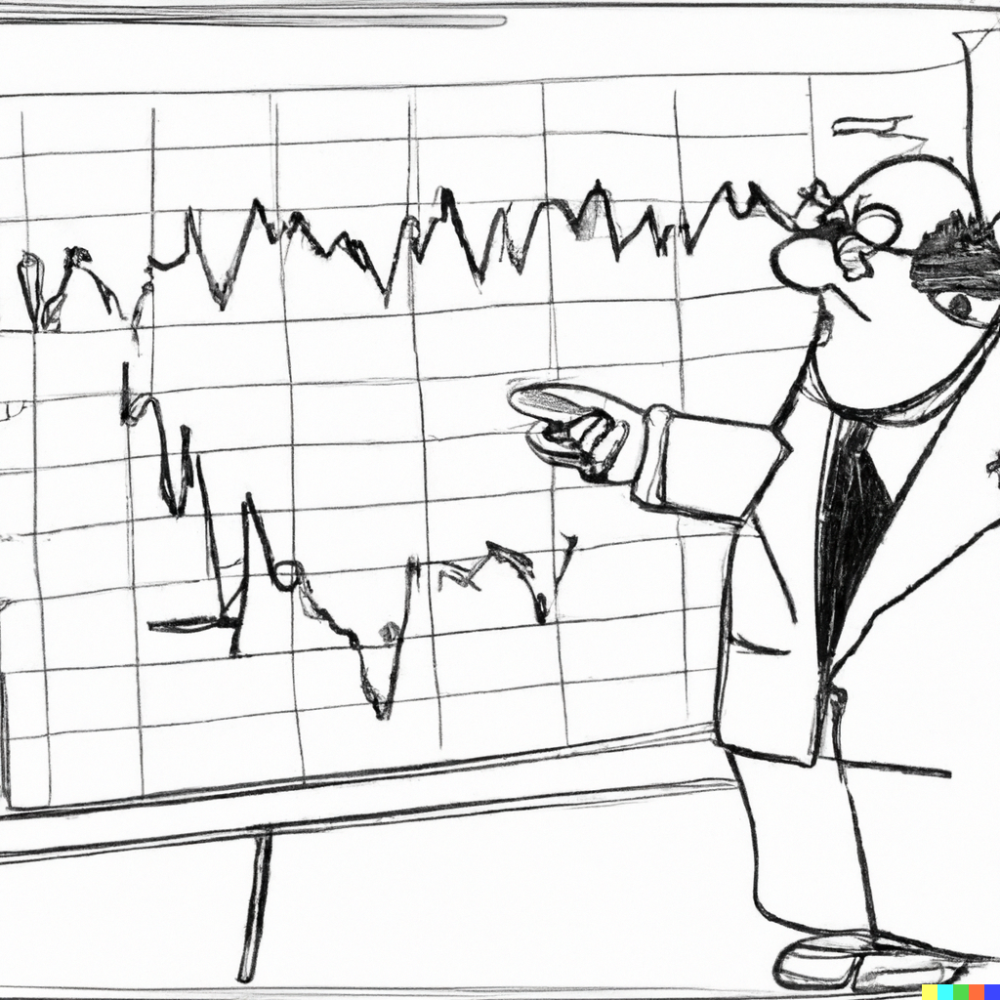

```{r setup, include=FALSE}
knitr::opts_chunk$set(echo = FALSE, fig.width = 11, fig.height = 7)
```


```{r echo=FALSE, include=FALSE, message=FALSE}
library(ggplot2)
library(data.table)
library(cowplot)
library(forecast)
```

# Wold Decomposition

.pull-left[

]

.pull-right[
It is possible to decompose any covariance stationary autoregression into a weighted sum of its error terms (plus a constant).

For example, using recursive substitution we can represent an $AR(1)$ process as:
$$y_t = \alpha + \beta y_{t-1} + \varepsilon_t = \frac{\alpha}{1-\beta} + \sum_{i=0}^{\infty}\beta^i\varepsilon_{t-i}$$
This is known as the *Wold decomposition*.
]

---


# Wold Decomposition

.right-column[
Specifically, the *Wold Decomposition Theorem* states that if $\{Y_t\}$ is a covariance stationary process, and $\{\varepsilon_t\}$ is a white noise process, then there exists a unique linear representation as: $$Y_t = \mu + \sum_{i=0}^{\infty}\theta_i\varepsilon_{t-i}$$
where $\mu$ is the deterministic component, and the rest is the stochastic component with $\theta_0=1$, and $\sum_{i=0}^{\infty}\theta_i^2 < \infty$.

This is an infinite-order moving average process, denoted by $MA(\infty)$.
]

---


# First-order moving average

.right-column[
What does a time series of a moving average process looks like?

To develop an intuition, let's begin with a $MA(1)$: $$y_t = \mu + \varepsilon_t + \theta\varepsilon_{t-1},\;~~\varepsilon_t\sim iid~\text{N}\left(0,\sigma^2_{\varepsilon}\right)$$
Suppose $\mu = 5$, and $\sigma_{\varepsilon}=0.5$, and let's simulate time series by setting $\theta$ to $0.5$, $-1$, and $2$, respectively.
]

---


# First-order moving average

.pull-left[
```{r echo=FALSE, message=FALSE, cache=FALSE, fig.asp=1.05}
n=180
mu=5
set.seed(1)
e <- rnorm(n,0,.5)

theta=.5
y <- e
for(i in 2:n){
  y[i] <- mu+e[i]+theta*e[i-1]
}
y[1] <- mu+e[1]
dt <- data.table(t=1:n,y)

maxlag <- 12
acf_dt <- data.table(k=c(1:maxlag),rho=c(acf(y,plot=F)[1:maxlag]$acf),pi=c(pacf(y,plot=F)[1:maxlag]$acf))

gg1 <- ggplot(acf_dt,aes(x=k,y=rho))+
  geom_segment(aes(xend=k,yend=0),color="black",size=1.2)+
  geom_hline(yintercept=0,size=.6)+
  geom_hline(yintercept=c(-1.96/sqrt(n),1.96/sqrt(n)),size=.8,linetype=5,col="coral")+
  scale_x_continuous(breaks=c(1:maxlag),labels=c(1:maxlag))+
  labs(x="k",y=expression(rho[k]))+
  coord_cartesian(ylim=c(-1,1))+
  theme_classic()+
  theme(axis.title = element_text(size=28),axis.text = element_text(size=24))

gg2 <- ggplot(acf_dt,aes(x=k,y=pi))+
  geom_segment(aes(xend=k,yend=0),color="black",size=1.2)+
  geom_hline(yintercept=0,size=.6)+
  geom_hline(yintercept=c(-1.96/sqrt(n),1.96/sqrt(n)),size=.8,linetype=5,col="coral")+
  scale_x_continuous(breaks=c(1:maxlag),labels=c(1:maxlag))+
  labs(x="k",y=expression(pi[k]))+
  coord_cartesian(ylim=c(-1,1))+
  theme_classic()+
  theme(axis.title = element_text(size=28),axis.text = element_text(size=24))

plot_grid(gg1,gg2,ncol=1)
```
]

.pull-right[
```{r echo=FALSE, message=FALSE, cache=FALSE}
ggplot(dt,aes(x=t,y=y))+
  geom_line(size=.8,color="coral")+
  labs(x="t",y=expression(y[t])) +
  theme_classic()+
  theme(axis.title = element_text(size=22),axis.text = element_text(size=18))
```
]

---


# First-order moving average

.pull-left[
```{r echo=FALSE, message=FALSE, cache=FALSE, fig.asp=1.05}
theta=-1

y <- e
for(i in 2:n){
  y[i] <- mu+e[i]+theta*e[i-1]
}
y[1] <- mu+e[1]
dt <- data.table(t=1:n,y)

maxlag <- 12
acf_dt <- data.table(k=c(1:maxlag),rho=c(acf(y,plot=F)[1:maxlag]$acf),pi=c(pacf(y,plot=F)[1:maxlag]$acf))

gg1 <- ggplot(acf_dt,aes(x=k,y=rho))+
  geom_segment(aes(xend=k,yend=0),color="black",size=1.2)+
  geom_hline(yintercept=0,size=.6)+
  geom_hline(yintercept=c(-1.96/sqrt(n),1.96/sqrt(n)),size=.8,linetype=5,col="coral")+
  scale_x_continuous(breaks=c(1:maxlag),labels=c(1:maxlag))+
  labs(x="k",y=expression(rho[k]))+
  coord_cartesian(ylim=c(-1,1))+
  theme_classic()+
  theme(axis.title = element_text(size=28),axis.text = element_text(size=24))

gg2 <- ggplot(acf_dt,aes(x=k,y=pi))+
  geom_segment(aes(xend=k,yend=0),color="black",size=1.2)+
  geom_hline(yintercept=0,size=.6)+
  geom_hline(yintercept=c(-1.96/sqrt(n),1.96/sqrt(n)),size=.8,linetype=5,col="coral")+
  scale_x_continuous(breaks=c(1:maxlag),labels=c(1:maxlag))+
  labs(x="k",y=expression(pi[k]))+
  coord_cartesian(ylim=c(-1,1))+
  theme_classic()+
  theme(axis.title = element_text(size=28),axis.text = element_text(size=24))

plot_grid(gg1,gg2,ncol=1)
```
]

.pull-right[
```{r echo=FALSE, message=FALSE, cache=FALSE}
ggplot(dt,aes(x=t,y=y))+
  geom_line(size=.8,color="coral")+
  labs(x="t",y=expression(y[t])) +
  theme_classic()+
  theme(axis.title = element_text(size=22),axis.text = element_text(size=18))
```
]

---


# First-order moving average

.pull-left[
```{r echo=FALSE, message=FALSE, cache=FALSE, fig.asp=1.05}
theta=2

y <- e
for(i in 2:n){
  y[i] <- mu+e[i]+theta*e[i-1]
}
y[1] <- mu+e[1]
dt <- data.table(t=1:n,y)

maxlag <- 12
acf_dt <- data.table(k=c(1:maxlag),rho=c(acf(y,plot=F)[1:maxlag]$acf),pi=c(pacf(y,plot=F)[1:maxlag]$acf))

gg1 <- ggplot(acf_dt,aes(x=k,y=rho))+
  geom_segment(aes(xend=k,yend=0),color="black",size=1.2)+
  geom_hline(yintercept=0,size=.6)+
  geom_hline(yintercept=c(-1.96/sqrt(n),1.96/sqrt(n)),size=.8,linetype=5,col="coral")+
  scale_x_continuous(breaks=c(1:maxlag),labels=c(1:maxlag))+
  labs(x="k",y=expression(rho[k]))+
  coord_cartesian(ylim=c(-1,1))+
  theme_classic()+
  theme(axis.title = element_text(size=28),axis.text = element_text(size=24))

gg2 <- ggplot(acf_dt,aes(x=k,y=pi))+
  geom_segment(aes(xend=k,yend=0),color="black",size=1.2)+
  geom_hline(yintercept=0,size=.6)+
  geom_hline(yintercept=c(-1.96/sqrt(n),1.96/sqrt(n)),size=.8,linetype=5,col="coral")+
  scale_x_continuous(breaks=c(1:maxlag),labels=c(1:maxlag))+
  labs(x="k",y=expression(pi[k]))+
  coord_cartesian(ylim=c(-1,1))+
  theme_classic()+
  theme(axis.title = element_text(size=28),axis.text = element_text(size=24))

plot_grid(gg1,gg2,ncol=1)
```
]

.pull-right[
```{r echo=FALSE, message=FALSE, cache=FALSE}
ggplot(dt,aes(x=t,y=y))+
  geom_line(size=.8,color="coral")+
  labs(x="t",y=expression(y[t])) +
  theme_classic()+
  theme(axis.title = element_text(size=22),axis.text = element_text(size=18))
```
]

---


# First-order moving average

.right-column[
Several features of interest are apparent:
- only one spike at the first lag (i.e., only $\rho_1 \neq 0$), the remaining autocorrelations are zero; 
- the size of the spike is directly proportional to the size of $\theta$, for $|\theta| < 1$; 
- the sign of the spike is the same as that of $\theta$.
]

---


# First-order moving average

.right-column[
The unconditional mean of the series is equal to its deterministic component, $\mu$. That is: $$E(y_t) = E(\mu + \varepsilon_t + \theta\varepsilon_{t-1}) = \mu$$
The unconditional variance is proportional to $\theta$. $$Var(y_t) = E(y_t - \mu)^2 = E(\varepsilon_t + \theta\varepsilon_{t-1})^2 = (1+\theta^2)\sigma^2_{\varepsilon}$$
<!-- - From the above, the mean and variance of the process are time-invariant. -->
]

---


# First-order moving average

.right-column[
The first-order autocovariance: $$\gamma_1 = E\left[(y_t - \mu)(y_{t-1} - \mu)\right] = E\left[(\varepsilon_t + \theta\varepsilon_{t-1})(\varepsilon_{t-1} + \theta\varepsilon_{t-2})\right] = \theta\sigma^2_{\varepsilon}$$

The first-order autocorrelation: $$\rho_1 = \frac{\gamma_1}{\gamma_0} = \frac{\theta}{1+\theta^2}$$

The time-invariant autocovariance, in conjunction with time-invariant mean and variance measures, suggest that MA(1) is a covariance stationary process.
]

---


# First-order moving average

.right-column[
Note that the two cases, $\theta=0.5$ and $\theta=2$ produce identical autocorrelation functions (and that $\theta=0.5$ is the inverse of $\theta=2$). 

This can be generalized to any $\theta$ and $1/\theta$. That is, two different MA processes can produce the same autocorrelation. But only that with the moving average parameter less than unity is *invertible*.

Invertability of a moving average process is a useful feature as it allows us to represent the unobserved error term as a function of past observations of the series.
]

---


# Second-order moving average

.right-column[
The foregoing analysis of a MA(1) process can be generalized to any MA(q) process. Let's focus on MA(2), for examle: $$y_t = \mu + \varepsilon_t+\theta_1\varepsilon_{t-1}+\theta_2\varepsilon_{t-2}$$

Suppose, as before, $\mu = 5$, and $\sigma_{\varepsilon}=0.5$, and let's simulate time series by setting $\{\theta_1,\theta_2\}$ to $\{0.5,0.5\}$, $\{-1,0.5\}$, and $\{2,-0.5\}$, respectively.

]

---


# Second-order moving average

.pull-left[
```{r echo=FALSE, message=FALSE, cache=FALSE, fig.asp=1.05}
theta1=0.5
theta2=0.5
y <- e
for(i in 3:n){
  y[i] <- mu+e[i]+theta1*e[i-1]+theta2*e[i-2]
}
y[1] <- mu+e[1]
y[2] <- mu+e[2]
dt <- data.table(t=1:n,y)

maxlag <- 12
acf_dt <- data.table(k=c(1:maxlag),rho=c(acf(y,plot=F)[1:maxlag]$acf),pi=c(pacf(y,plot=F)[1:maxlag]$acf))

gg1 <- ggplot(acf_dt,aes(x=k,y=rho))+
  geom_segment(aes(xend=k,yend=0),color="black",size=1.2)+
  geom_hline(yintercept=0,size=.6)+
  geom_hline(yintercept=c(-1.96/sqrt(n),1.96/sqrt(n)),size=.8,linetype=5,col="coral")+
  scale_x_continuous(breaks=c(1:maxlag),labels=c(1:maxlag))+
  labs(x="k",y=expression(rho[k]))+
  coord_cartesian(ylim=c(-1,1))+
  theme_classic()+
  theme(axis.title = element_text(size=28),axis.text = element_text(size=24))

gg2 <- ggplot(acf_dt,aes(x=k,y=pi))+
  geom_segment(aes(xend=k,yend=0),color="black",size=1.2)+
  geom_hline(yintercept=0,size=.6)+
  geom_hline(yintercept=c(-1.96/sqrt(n),1.96/sqrt(n)),size=.8,linetype=5,col="coral")+
  scale_x_continuous(breaks=c(1:maxlag),labels=c(1:maxlag))+
  labs(x="k",y=expression(pi[k]))+
  coord_cartesian(ylim=c(-1,1))+
  theme_classic()+
  theme(axis.title = element_text(size=28),axis.text = element_text(size=24))

plot_grid(gg1,gg2,ncol=1)
```
]

.pull-right[
```{r echo=FALSE, message=FALSE, cache=FALSE}
ggplot(dt,aes(x=t,y=y))+
  geom_line(size=.8,color="coral")+
  labs(x="t",y=expression(y[t])) +
  theme_classic()+
  theme(axis.title = element_text(size=22),axis.text = element_text(size=18))
```
]

---


# Second-order moving average

.pull-left[
```{r echo=FALSE, message=FALSE, cache=FALSE, fig.asp=1.05}
theta1=-1
theta2=0.5
y <- e
for(i in 3:n){
  y[i] <- mu+e[i]+theta1*e[i-1]+theta2*e[i-2]
}
y[1] <- mu+e[1]
y[2] <- mu+e[2]
dt <- data.table(t=1:n,y)

maxlag <- 12
acf_dt <- data.table(k=c(1:maxlag),rho=c(acf(y,plot=F)[1:maxlag]$acf),pi=c(pacf(y,plot=F)[1:maxlag]$acf))

gg1 <- ggplot(acf_dt,aes(x=k,y=rho))+
  geom_segment(aes(xend=k,yend=0),color="black",size=1.2)+
  geom_hline(yintercept=0,size=.6)+
  geom_hline(yintercept=c(-1.96/sqrt(n),1.96/sqrt(n)),size=.8,linetype=5,col="coral")+
  scale_x_continuous(breaks=c(1:maxlag),labels=c(1:maxlag))+
  labs(x="k",y=expression(rho[k]))+
  coord_cartesian(ylim=c(-1,1))+
  theme_classic()+
  theme(axis.title = element_text(size=28),axis.text = element_text(size=24))

gg2 <- ggplot(acf_dt,aes(x=k,y=pi))+
  geom_segment(aes(xend=k,yend=0),color="black",size=1.2)+
  geom_hline(yintercept=0,size=.6)+
  geom_hline(yintercept=c(-1.96/sqrt(n),1.96/sqrt(n)),size=.8,linetype=5,col="coral")+
  scale_x_continuous(breaks=c(1:maxlag),labels=c(1:maxlag))+
  labs(x="k",y=expression(pi[k]))+
  coord_cartesian(ylim=c(-1,1))+
  theme_classic()+
  theme(axis.title = element_text(size=28),axis.text = element_text(size=24))

plot_grid(gg1,gg2,ncol=1)
```
]

.pull-right[
```{r echo=FALSE, message=FALSE, cache=FALSE}
ggplot(dt,aes(x=t,y=y))+
  geom_line(size=.8,color="coral")+
  labs(x="t",y=expression(y[t])) +
  theme_classic()+
  theme(axis.title = element_text(size=22),axis.text = element_text(size=18))
```
]

---


# Second-order moving average

.pull-left[
```{r echo=FALSE, message=FALSE, cache=FALSE, fig.asp=1.05}
theta1=1
theta2=-0.5
y <- e
for(i in 3:n){
  y[i] <- mu+e[i]+theta1*e[i-1]+theta2*e[i-2]
}
y[1] <- mu+e[1]
y[2] <- mu+e[2]
dt <- data.table(t=1:n,y)

maxlag <- 12
acf_dt <- data.table(k=c(1:maxlag),rho=c(acf(y,plot=F)[1:maxlag]$acf),pi=c(pacf(y,plot=F)[1:maxlag]$acf))

gg1 <- ggplot(acf_dt,aes(x=k,y=rho))+
  geom_segment(aes(xend=k,yend=0),color="black",size=1.2)+
  geom_hline(yintercept=0,size=.6)+
  geom_hline(yintercept=c(-1.96/sqrt(n),1.96/sqrt(n)),size=.8,linetype=5,col="coral")+
  scale_x_continuous(breaks=c(1:maxlag),labels=c(1:maxlag))+
  labs(x="k",y=expression(rho[k]))+
  coord_cartesian(ylim=c(-1,1))+
  theme_classic()+
  theme(axis.title = element_text(size=28),axis.text = element_text(size=24))

gg2 <- ggplot(acf_dt,aes(x=k,y=pi))+
  geom_segment(aes(xend=k,yend=0),color="black",size=1.2)+
  geom_hline(yintercept=0,size=.6)+
  geom_hline(yintercept=c(-1.96/sqrt(n),1.96/sqrt(n)),size=.8,linetype=5,col="coral")+
  scale_x_continuous(breaks=c(1:maxlag),labels=c(1:maxlag))+
  labs(x="k",y=expression(pi[k]))+
  coord_cartesian(ylim=c(-1,1))+
  theme_classic()+
  theme(axis.title = element_text(size=28),axis.text = element_text(size=24))

plot_grid(gg1,gg2,ncol=1)
```
]

.pull-right[
```{r echo=FALSE, message=FALSE, cache=FALSE}
ggplot(dt,aes(x=t,y=y))+
  geom_line(size=.8,color="coral")+
  labs(x="t",y=expression(y[t])) +
  theme_classic()+
  theme(axis.title = element_text(size=22),axis.text = element_text(size=18))
```
]

---


# Second-order moving average

.right-column[
The unconditional mean and variance are: $$E(y_t) = E(\mu + \varepsilon_t+\theta_1\varepsilon_{t-1}+\theta_2\varepsilon_{t-2}) = \mu$$ and $$Var(y_t) = E(y_t-\mu)^2 = (1+\theta_1^2+\theta_2^2)\sigma_{\varepsilon}^2$$
]

---


# Second-order moving average

.right-column[
The autocovariance at the first lag is: $$\gamma_1 = E[(y_t-\mu)(y_{t-1}-\mu)] = (\theta_1+\theta_1\theta_2)\sigma_{\varepsilon}^2$$ and the corresponding autocorrelation is: $$\rho_1 = \frac{\gamma_1}{\gamma_0} = \frac{\theta_1+\theta_1\theta_2}{1+\theta_1^2+\theta_2^2}$$
]

---


# Second-order moving average

.right-column[
The autocovariance at the second lag is: $$\gamma_2 = E[(y_t-\mu)(y_{t-2}-\mu)] = \theta_2\sigma_{\varepsilon}^2$$ and the corresponding autocorrelation is: $$\rho_2 = \frac{\gamma_2}{\gamma_0} = \frac{\theta_2}{1+\theta_1^2+\theta_2^2}$$

The autocovariance and autocorrelation at higher lags are zero.

In general, for any $MA(q)$, $\rho_k=0,\;\;\forall\; k>q$.
]

---


# Bitcoin prices (avg. across major exchanges)

.right-column[
```{r echo=FALSE, message=FALSE, cache=FALSE}
load("../../Books/forecasting/data/bitcoin.RData")

ggplot(bitcoin,aes(x=date,y=y))+
  geom_line(color="powderblue",size=.8)+
  labs(x="Year",y="Bitcoin Price (USD)",caption="retrieved from Nasdaq Data Link\nhttps://data.nasdaq.com")+
  theme_classic()+
  theme(axis.title = element_text(size=22),axis.text = element_text(size=18))
```
]

---


# ACF of Bitcoin daily returns

.pull-left[
Autocorrelations at lags one and four appear statistically significant.
]

.pull-right[
```{r echo=FALSE, message=FALSE, cache=FALSE}
bitcoin[,`:=`(lny=log(y))]
bitcoin[,`:=`(llny=shift(lny,1))]
bitcoin[,`:=`(r=lny-llny)]
maxlag <- 12
dt <- data.table(k=c(1:maxlag),rho=c(acf(bitcoin$r[-1],plot=F)[1:maxlag]$acf))

ggplot(dt,aes(x=k,y=rho))+
  geom_segment(aes(xend=k,yend=0),color="black",size=1.2)+
  geom_hline(yintercept=0,size=.8)+
  geom_hline(yintercept=c(-1.96/sqrt(nrow(bitcoin)),1.96/sqrt(nrow(bitcoin))),size=.5,linetype=5,col="coral")+
  scale_x_continuous(breaks=c(1:maxlag),labels=c(1:maxlag))+
  labs(x="k",y=expression(rho[k]))+
  coord_cartesian(ylim=c(-.4,.4))+
  theme_classic()+
  theme(axis.title = element_text(size=22),axis.text = element_text(size=18))
```
]

---


# PACF of Bitcoin daily returns

.pull-left[
Partial autocorrelations, also, statistically significant at lags 1 and 4.
]

.pull-right[
```{r echo=FALSE, message=FALSE, cache=FALSE}
maxlag <- 12
dt <- data.table(k=c(1:maxlag),rho=c(pacf(bitcoin$r[-1],plot=F)[1:maxlag]$acf))

ggplot(dt,aes(x=k,y=rho))+
  geom_segment(aes(xend=k,yend=0),color="black",size=1.2)+
  geom_hline(yintercept=0,size=.8)+
  geom_hline(yintercept=c(-1.96/sqrt(nrow(bitcoin)),1.96/sqrt(nrow(bitcoin))),size=.5,linetype=5,col="coral")+
  scale_x_continuous(breaks=c(1:maxlag),labels=c(1:maxlag))+
  labs(x="k",y=expression(rho[k]))+
  coord_cartesian(ylim=c(-.4,.4))+
  theme_classic()+
  theme(axis.title = element_text(size=22),axis.text = element_text(size=18))
```
]

---


# Order selection using information criteria

.pull-left[
```{r echo=FALSE, message=FALSE, cache=FALSE}
dt <- data.table(q=1:7,AIC=NA,SIC=NA)

r <- bitcoin$r[-c(1:7)]
ma1 <- arima(r,order=c(0,0,1))
r <- bitcoin$r[-c(1:6)]
ma2 <- arima(r,order=c(0,0,2))
r <- bitcoin$r[-c(1:5)]
ma3 <- arima(r,order=c(0,0,3))
r <- bitcoin$r[-c(1:4)]
ma4 <- arima(r,order=c(0,0,4))
r <- bitcoin$r[-c(1:3)]
ma5 <- arima(r,order=c(0,0,5))
r <- bitcoin$r[-c(1:2)]
ma6 <- arima(r,order=c(0,0,6))
r <- bitcoin$r[-1]
ma7 <- arima(r,order=c(0,0,7))

dt$AIC[1] <- log(sum(ma1$resid^2,na.rm=T))+2*length(ma1$coef)/length(ma1$resid)
dt$AIC[2] <- log(sum(ma2$resid^2,na.rm=T))+2*length(ma2$coef)/length(ma2$resid)
dt$AIC[3] <- log(sum(ma3$resid^2,na.rm=T))+2*length(ma3$coef)/length(ma3$resid)
dt$AIC[4] <- log(sum(ma4$resid^2,na.rm=T))+2*length(ma4$coef)/length(ma4$resid)
dt$AIC[5] <- log(sum(ma5$resid^2,na.rm=T))+2*length(ma5$coef)/length(ma5$resid)
dt$AIC[6] <- log(sum(ma6$resid^2,na.rm=T))+2*length(ma6$coef)/length(ma6$resid)
dt$AIC[7] <- log(sum(ma7$resid^2,na.rm=T))+2*length(ma7$coef)/length(ma7$resid)

dt$SIC[1] <- log(sum(ma1$resid^2,na.rm=T))+log(length(ma1$resid))*length(ma1$coef)/length(ma1$resid)
dt$SIC[2] <- log(sum(ma2$resid^2,na.rm=T))+log(length(ma1$resid))*length(ma2$coef)/length(ma2$resid)
dt$SIC[3] <- log(sum(ma3$resid^2,na.rm=T))+log(length(ma1$resid))*length(ma3$coef)/length(ma3$resid)
dt$SIC[4] <- log(sum(ma4$resid^2,na.rm=T))+log(length(ma1$resid))*length(ma4$coef)/length(ma4$resid)
dt$SIC[5] <- log(sum(ma5$resid^2,na.rm=T))+log(length(ma1$resid))*length(ma5$coef)/length(ma5$resid)
dt$SIC[6] <- log(sum(ma6$resid^2,na.rm=T))+log(length(ma1$resid))*length(ma6$coef)/length(ma6$resid)
dt$SIC[7] <- log(sum(ma7$resid^2,na.rm=T))+log(length(ma1$resid))*length(ma7$coef)/length(ma7$resid)

knitr::kable(dt,digits=3,align="l", table.attr='class="myTable"')
```
]

.pull-right[
AIC suggests $MA(4)$ while SIC suggests $MA(1)$.

Going with MA(4), the estimated parameters and their standard errors are:

```{r echo=FALSE, message=FALSE, cache=FALSE}
out <- rbind(ma4$coef,sqrt(diag(ma4$var.coef)))[,c(5,1:4)]
rownames(out) <- c("estimate","s.e.")
knitr::kable(out,digits=3,align="c", table.attr='class="myTable"',row.names = T,col.names = c('$\\mu$',"$\\theta_1$","$\\theta_2$","$\\theta_3$","$\\theta_4$"),escape = FALSE)
```

]

---


# One-step-ahead point forecast

.right-column[
One-step-ahead point forecast: $$y_{t+1|t} = E(y_{t+1}|\Omega_t) = \mu + \theta_1 \varepsilon_{t}$$

One-step-ahead forecast error: $$e_{t+1|t} = y_{t+1} - y_{t+1|t} = \varepsilon_{t+1}$$
]

---


# One-step-ahead interval forecast

.right-column[
One-step-ahead forecast variance: $$\sigma_{t+1|t}^2 = E(e_{t+1|t}^2) = E(\varepsilon_{t+1}^2) = \sigma_{\varepsilon}^2$$

One-step-ahead (95%) interval forecast: $$y_{t+1|t} \pm 1.96\sigma_{\varepsilon}$$
]

---


# h-step-ahead point forecast (h>q)

.right-column[
h-step-ahead point forecast: $$y_{t+h|t} = E(\mu + \varepsilon_{t+h} + \theta_1 \varepsilon_{t+h-1} + \cdots + \theta_q \varepsilon_{t+h-q}) = \mu$$

h-step-ahead forecast error: $$e_{t+h|t} = y_{t+h} - y_{t+h|t} = \varepsilon_{t+h} + \theta_1 \varepsilon_{t+h-1} + \cdots + \theta_q \varepsilon_{t+h-q}$$
]

---


# h-step-ahead interval forecast (h>q)

.right-column[
h-step-ahead forecast variance: $$\sigma_{t+h|t}^2 = E(e_{t+h|t}^2) = \sigma_{\varepsilon}^2(1+\theta_1^2+\cdots+\theta_q^2)$$

h-step-ahead (95%) interval forecast: $$\mu \pm 1.96\sigma_{\varepsilon}(1+\theta_1^2+\cdots+\theta_q^2)$$
]

---


# Forecasting Bitcoin daily returns using MA(4)

.right-column[
```{r echo=FALSE, message=FALSE, cache=FALSE}
start_date <- as.Date("2021-06-01")
cutoff_date <- as.Date("2021-06-30")
end_date <- as.Date("2021-07-31")

r <- bitcoin[date<=cutoff_date]$r
ma1 <- arima(r,order=c(0,0,4))

ma1f <- forecast(ma1,h=length(bitcoin[date>cutoff_date]$r),level=95)

bitcoin$f <- c(rep(NA,length(bitcoin[date<=cutoff_date]$r)),as.matrix(ma1f$mean))
bitcoin$l <- c(rep(NA,length(bitcoin[date<=cutoff_date]$r)),as.matrix(ma1f$lower))
bitcoin$u <- c(rep(NA,length(bitcoin[date<=cutoff_date]$r)),as.matrix(ma1f$upper))

ggplot(bitcoin[date>=start_date & date<=end_date],aes(x=date,y=r))+
  geom_ribbon(aes(ymin=l,ymax=u),fill="coral",alpha=.2)+
  geom_line(color="powderblue",size=.8)+
  geom_line(data=bitcoin[date>cutoff_date & date<=end_date],color="gray",size=.8)+
  geom_line(aes(y=f),color="coral",size=.8,linetype=5,na.rm=T)+
  labs(x="2021",y="Bitcoin Returns",caption="retrieved from Nasdaq Data Link\nhttps://data.nasdaq.com")+
  theme_classic()+
  theme(axis.title = element_text(size=22),axis.text = element_text(size=18))

```
]

---


# Readings

.pull-left[

]

.pull-right[
Gonzalez-Rivera, Chapter 6

Hyndman & Athanasopoulos, [9.4](https://otexts.com/fpp3/MA.html)
]


