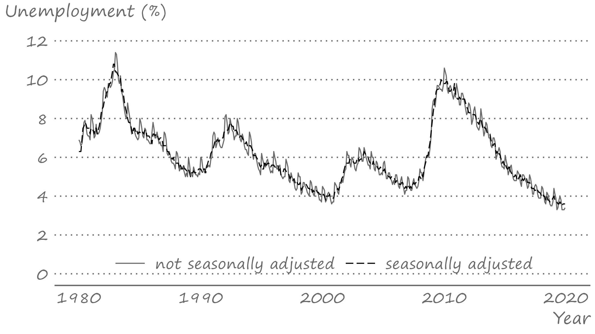
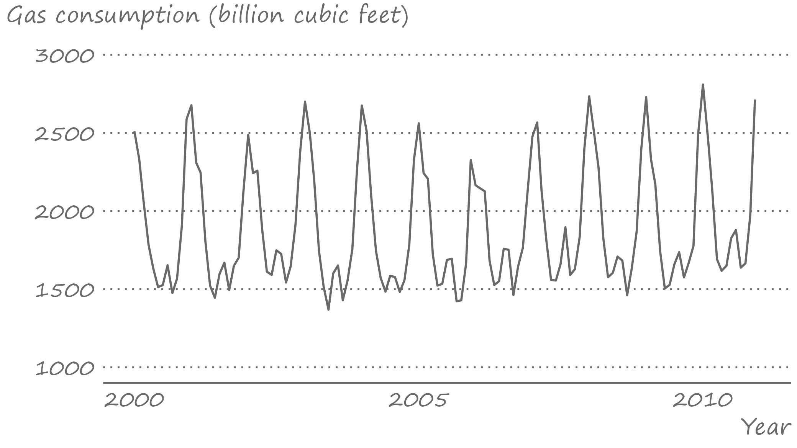
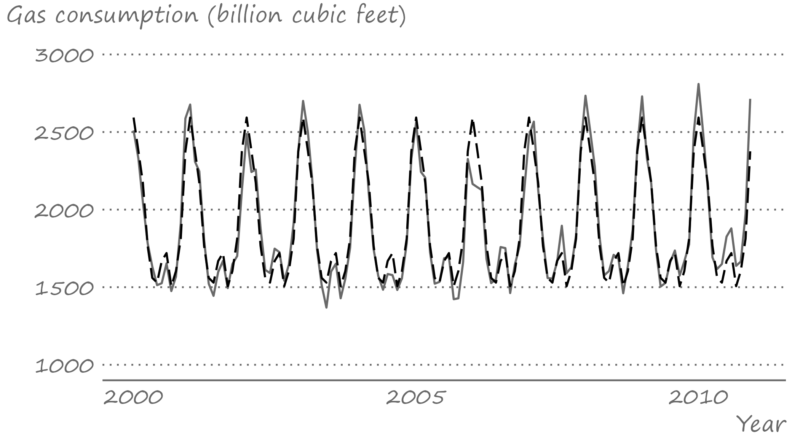
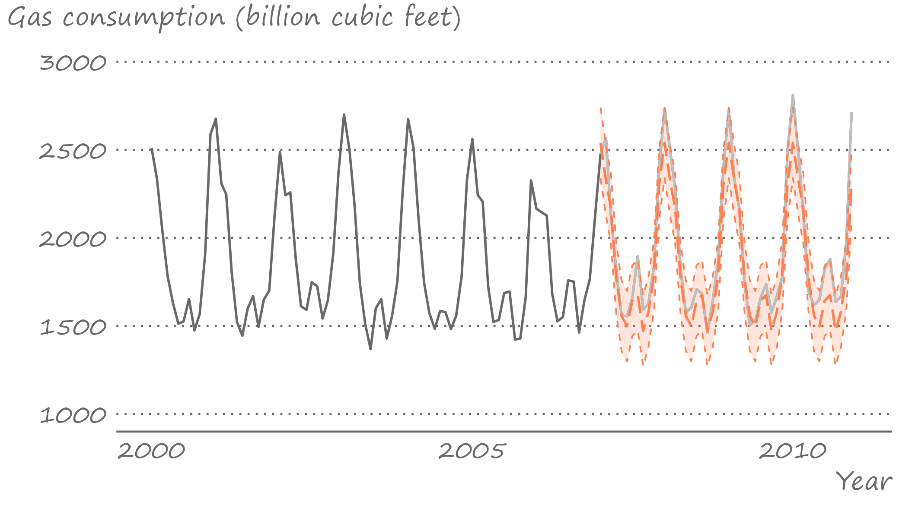

```{r setup, include=FALSE}
knitr::opts_chunk$set(echo = FALSE, fig.width = 11, fig.height = 7)
```


```{r echo=FALSE, include=FALSE, message=FALSE}
library(data.table)
library(ggplot2)
library(fastDummies)
```

# Sources of seasonality

.pull-left[

]

.pull-right[
Seasonality is a fluctuating pattern *within a year* that arise from links of technologies, preferences, and institutions to the calendar.

Typically applied to monthly or quarterly data, it may very well be applied to weekly or daily data. 

Agricultural prices, energy sales, airfare are some of the examples of time series with an apparent seasonal pattern.
]

---


# Seasonal adjustment

.right-column[
A way to deal with the seasonality in data is to remove it prior to use of the series (seasonally adjusted time series). 

Indeed, some economic time series are only/also available in a seasonally-adjusted form.
]

---


# Seasonally adjusted unemployment rates

.right-column[

]


---


# Modeling seasonality using dummy variables

.right-column[
Alternatively, and often preferably, we can just model seasonality.

A seasonal model is given by: $$y_t = \sum_{i=1}^{s}\gamma_i d_{it} + \varepsilon_t,\;~~\varepsilon_t\sim iid~\text{N}(0,\sigma^2)$$
where $s$ denotes the frequency of the data, and $d_{it}$ takes the value of 1 repeatedly after every $s$ periods, and such that $\sum_{i} d_{it} = 1$, $\forall t$.
]

---


# Modeling seasonality using dummy variables

.right-column[
The same as before only this time in matrix notation (easier to visualize what goes on): 
$$\begin{bmatrix}
y_{1}\\
y_{2}\\
\vdots \\
y_{T}
\end{bmatrix} = 
\begin{bmatrix}
1 & 0 & \cdots & 0 \\
0 & 1 & \cdots & 0 \\
\vdots & \vdots & \ddots &\vdots \\
0 & 0 & \cdots & 1
\end{bmatrix}
\begin{bmatrix}
\gamma_{1}\\
\gamma_{2}\\
\vdots \\
\gamma_{s}
\end{bmatrix}+
\begin{bmatrix}
\varepsilon_{1}\\
\varepsilon_{2}\\
\vdots \\
\varepsilon_{T}
\end{bmatrix}$$

(Note, there is no intercept in this specification)
]

---


# Modeling seasonality using dummy variables

.right-column[
Alternatively, we can rewrite the seasonal model as follows: $$y_t = \alpha + \sum_{i=1}^{s-1}\delta_i d_{it} + \varepsilon_t,$$ in which case $\alpha$ is an intercept of an omitted season, and $\delta_i$ represents a deviation from it during the $i^{th}$ season.

The two models are equivalent. Assuming the dummy variable associated with the season $s$, $d_{s}$, was dropped, $\alpha=\gamma_s$, and $\alpha+\delta_i=\gamma_i\;~\forall~i\ne s$.

]

---


# U.S. natural gas consumption: Observed series

.right-column[

]


---


# U.S. natural gas consumption: Fitted series

.right-column[

]


---


# Forecasting seasonality

.right-column[
Any future realization of a random variable that is assumed to have a deterministic seasonal component is: $$y_{t+h} = \sum_{i=1}^{s}\gamma_i d_{i,t+h} + \varepsilon_{t+h}.$$ 
]

---


# Point forecast

.right-column[
Point forecast of $y_{t+h}$ is given by: $$y_{t+h|t} = \mathbb{E}\left(y_{t+h}|\Omega_t\right) = \sum_{i=1}^{s}\hat{\gamma}_i d_{i,t+h}.$$ Here, again, we will assume the estimated parameters of the model are equal to its true parameters.
]

---

# Interval forecast

.right-column[
The forecast error is: $$e_{t+h} = y_{t+h} - y_{t+h|t} = \varepsilon_{t+h},\;~~\forall\;h$$
The forecast variance is: $$\sigma_{t+h}^2 = \mathbb{E}(e_{t+h|t}^2) =\mathbb{E}(\varepsilon_{t+h}^2) = \sigma^2,\;~~\forall\;h$$

The interval forecast is:
$$\hat{y}_{t+h|t}\pm 1.96\sigma_{t+h}$$
]

---


# U.S. natural gas consumption: Multistep forecasts

.right-column[

]


---


# Seasonal harmonic variables

.right-column[
When dealing with weekly or daily data, the dummy variable approach of modeling seasonality would be nether practical nor efficient. 

A way to model seasonality without giving up too many degrees of freedom is by using the so-called seasonal harmonic variables, which are terms from a Fourier series.

]

---


# Modeling seasonality using harmonic variables

.right-column[

The framework can be applied to quarterly or monthly data too. 

For example, a model with Fourier terms applied to monthly series will have the following form: $$y_t = \alpha+\sum_{k=1}^{K}\left[\beta_{1k}\sin\left(\frac{2\pi kt}{12}\right)+\beta_{2k}\cos\left(\frac{2\pi kt}{12}\right)\right]+\varepsilon_t,$$ where the value of $K$ can be determined using an information criterion (e.g., AIC or SIC). 

]

---


# Readings

.pull-left[

]

.pull-right[
Gonzalez-Rivera, Chapter 10

Hyndman & Athanasopoulos, [3.2](https://otexts.com/fpp3/components.html), [13.1](https://otexts.com/fpp3/weekly.html)
]

