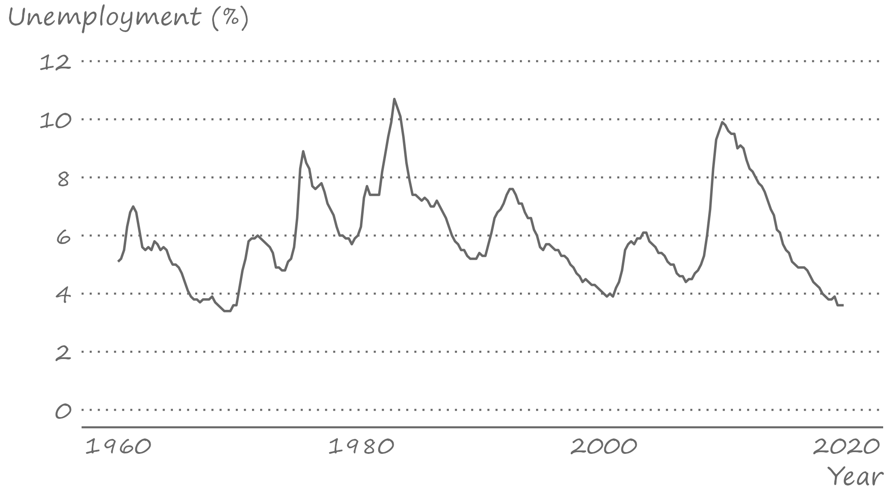
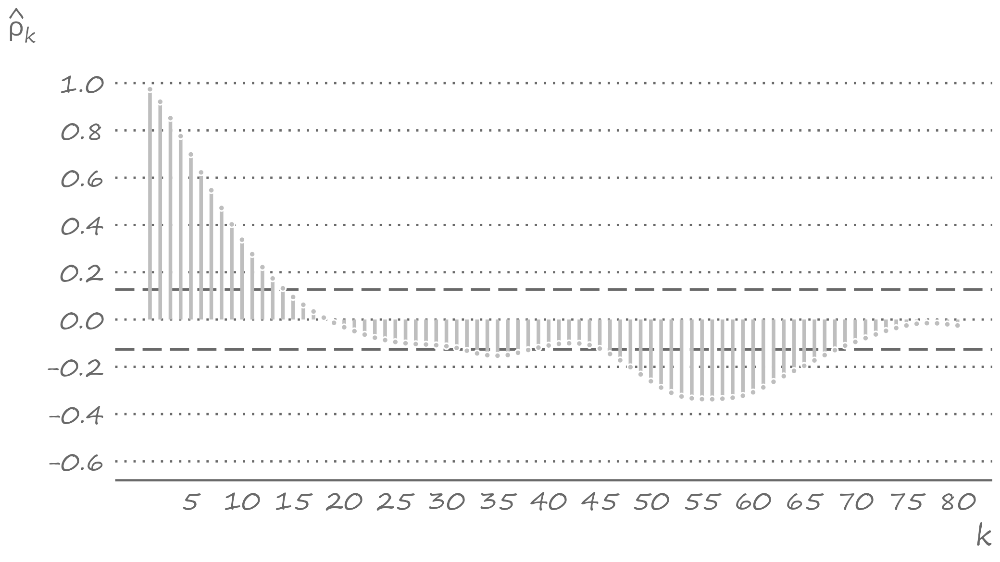
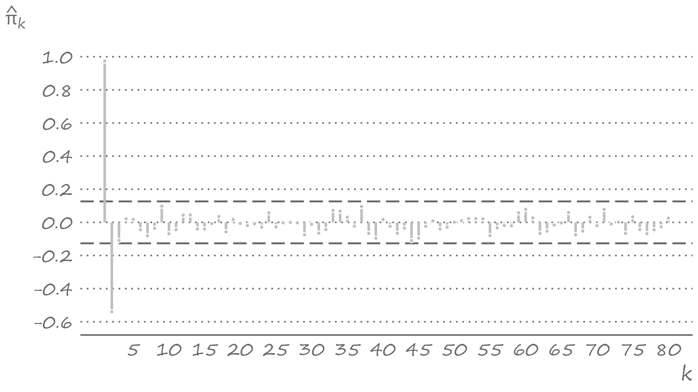

```{r setup, include=FALSE}
knitr::opts_chunk$set(echo = FALSE, fig.width = 11, fig.height = 7)
```

<style>
  .myTable td {
    padding: 5px 20px 5px 20px;
  }
</style>


```{r echo=FALSE, include=FALSE, message=FALSE}
library(data.table)
library(ggplot2)
library(forecast)
```

# Cycles

.pull-left[

]

.pull-right[
A time series that exhibit a pattern of periodic fluctuations can be a cyclical series. 

Cycles can be *deterministic* or *stochastic*. 

Deterministic cycles can be modeled in a fashion similar to seasonality (e.g., using terms from a Fourier series). However, many time series are better characterized by stochastic cycles.
]

---


# Cycles in (seasonally adjusted) unemployment rates

.right-figure[

]


---


# Autoregressive stochastic cycle

.right-column[
A cycle is stochastic when it is generated by random variables. 

Of particular interest is the case when these random variables belong to the same stochastic process and are temporally dependent.

Realized values from such a process form a time series that can be approximated by an *autoregressive model*.
]

---


# Autoregressive model

.right-column[
In general terms, an autoregressive model of order $p$, $AR(p)$, has the following functional form:
$$y_t = \alpha + \beta_1 y_{t-1}+\beta_2 y_{t-2}+ \cdots + \beta_p y_{t-p}+\varepsilon_t$$
In this model, $\alpha$ is a constant term, and $\beta_1,\ldots,\beta_p$ are autoregressive parameters.

The sum of the autoregressive parameters depicts the persistence of the series. The larger is the persistence (i.e., closer it is to one), the longer it takes for the effect of a shock to dissolve.
]

---


# Autoregressive model

.right-column[
In practice, we don't know the values of the autoregressive parameters. So, we estimate those.

For that, we also need to select the lag order of the autoregressive model. 
]

---


# Lag order selection using information criteria

.pull-left[
```{r autoregressions, echo=FALSE, message=FALSE, warnings=FALSE, results='asis'}
tabl <- "
| k | AIC   | SIC   |
|---|:-----:|:-----:|
|1  | 3.197 | 3.227 |
|2  | 2.621 | 2.665 |
|3  | 2.627 | 2.687 |
|4  | 2.635 | 2.710 |
"
cat(tabl)
```
]

.pull-right[
Suppose we suspect that the lag order of the unemployment rates series is at most four. So, we estimate AR(1) through AR(4) and obtain information criteria (AIC and SIC). 

In this instance, both information criteria suggest that AR(2) is the model that best approximates the dynamic properties of the time series.
]

---


# Unconditional mean of an AR(1)

.right-column[
Let $\mu$ be the mean of the time series. Under the assumption of covariance stationarity, $\mu\equiv\mathbb{E}\left(y_t\right),\;~~\forall~t.$

The expectation of the AR(1) is:
$$\mu = \alpha + \beta_1 \mu$$

We can solve this for $\mu$ to obtain:
$$\mu = \frac{\alpha}{1-\beta_1}$$

]

---


# Unconditional variance of an AR(1)

.right-column[
Let $\gamma_0$ be the variance of the time series. Under the assumption of covariance stationarity, $\gamma_0\equiv\mathbb{V}\left(y_t\right),\;~\forall~t.$

The variance of the AR(1) is:
$$\gamma_0 = \beta_1^2 \gamma_0+\sigma_{\varepsilon}^2$$

We can solve this for $\gamma_0$ to obtain:
$$\gamma_0 = \frac{\sigma_{\varepsilon}^2}{1-\beta_1^2}$$
]

---


# Autocovariance of AR(1)

.right-column[
Let $\gamma_k$ be the autocovariance of the time series. Under the assumption of covariance stationarity, $\gamma_k\equiv Cov\left(y_t,y_{t-k}\right)=\mathbb{E}(y_t y_{t-k}) - \mu^2,\;~\forall~t,k.$

To obtain the expression of $\mathbb{E}(y_t y_{t-k})$, multiply both sides of an $AR(1)$ with $y_{t-k}$ and take the expectation: $$\mathbb{E}(y_t y_{t-k}) = \alpha \mu + \beta_1 \mathbb{E}(y_{t-1}y_{t-k})$$

Substitute in $\gamma_k+\mu^2$ for $\mathbb{E}(y_t y_{t-k})$ and $\gamma_{k-1}+\mu^2$ for $\mathbb{E}(y_{t-1} y_{t-k})$, which is equivalent to $\mathbb{E}(y_{t} y_{t-(k-1)})$, to obtain: $$\gamma_k = \beta_1\gamma_{k-1}$$
]

---


# Autocorrelations of AR(1)

.right-column[
Divide both side of the equation by $\gamma_0$ to obtain  $\frac{\gamma_k}{\gamma_0}=\beta_1\frac{\gamma_{k-1}}{\gamma_0}$. Note that this is equivalent to $\rho_k=\beta_1\rho_{k-1}$.

It then follows that:
$$\begin{align}
\rho_1 &= \beta_1\rho_0 = \beta_1 \notag \\
\rho_2 &= \beta_1\rho_1 = \beta_1^2 \notag \\
&\vdots \notag \\
\rho_k &= \beta_1\rho_{k-1} = \beta_1^k
\end{align}$$
]

---


# Autocorrelations of AR(1)

.right-column[
The autocorrelation, $\rho$, and partial autocorrelation, $\pi$, functions of the AR(1) process have three distinctive features:

- $\rho_1 = \pi_1 = \beta_1$. That is, the persistence parameter is also the autocorrelation and the partial autocorrelation coefficient.
- The autocorrelation function decreases exponentially toward zero, and the decay is faster when the persistence parameter is smaller.
- The partial autocorrelation function is characterized by only one spike $\pi_1 \neq 0$, and the remaining $\pi_k = 0$, $\forall k > 1$.
]

---


# Autocorrelations of AR(p)

.right-column[
Generally, the autocorrelation and partial autocorrelation functions of the covariance-stationary $AR(p)$ process have the following features:

- $\rho_1 = \pi_1$, and $\pi_p = \beta_p$.
- The autocorrelation function decreases toward zero, but in different fashion depending on the values of $\beta_1,\ldots,\beta_p$. Nonetheless, the decay is faster when the persistence measure is smaller.
- The partial autocorrelation function is characterized by the first $p$ spikes $\pi_1 \neq 0,\ldots,\pi_p \neq 0$, and the remaining $\pi_k = 0$, $\forall k > p$.
]

---


# Autocorrelogram of the unemployment rates

.right-figure[

]


---


# Partial autocorrelogram of the unemployment rates

.right-figure[

]


---


# Point forecast from an autoregressive model

.right-column[
A one-step-ahead point forecast (assuming quadratic loss) is a conditional mean of the random variable in the next period: $$y_{t+1|t} = \mathbb{E}\left(y_{t+1}|\Omega_t;\mathbf{\theta}\right) = \alpha + \beta_1 y_{t} + \cdots + \beta_p y_{t-p+1}$$

So, one-step-ahead point forecast is a linear function of the most recent observations, all of which are available (to a forecaster) at the time when the forecast is made, and the parameters of the model. So, we can readily generate such a forecast.

]

---

# Point forecast from an autoregressive model

.right-column[
To be able to make a two-step-ahead forecast in period $t$, we need to have observed data up to period $t+1$. In other words, we need to have observed $y_{t+1}$, which we haven't. Instead, we can use our best guess about $y_{t+1}$, which is $y_{t+1|t}$

So, a two-step-ahead point forecast is a linear function of the one-step-ahead forecast, the most recent observations at the time when the forecast is made, and the parameter estimates.

]

---

# Point forecast from an autoregressive model

.right-column[
Generally, a h-step-ahead point forecast: $$y_{t+h|t} = \mathbb{E}\left(y_{t+h}|\Omega_t;\mathbf{\theta}\right) = \alpha + \beta_1 y_{t+h-1|t} + \cdots + \beta_p y_{t+h-p|t},$$ where each $y_{t+h-j|t}$, $j<h$, is sequentially generated. 

For any $j\ge h$, $y_{t+h-j|t}\equiv y_{t+h-j}$.

So, to generate a forecast for horizon $h$, forecasts for horizons $1$ through $h-1$ need to be generated first. This is known as the *iterated* method of multistep forecasting. 

]

---


# Forecast errors from an autoregressive model

.right-column[
A h-step-ahead forecast error is: $$e_{t+h|t} = y_{t+h} - y_{t+h|t} = \beta_1 e_{t+h-1|t} + \ldots + \beta_p e_{t+h-p|t} + \varepsilon_{t+h}$$

For any $j\ge h$, $e_{t+h-j|t}=0$. 

So, for example, a one-step-ahead forecast error: $e_{t+1|t} = \varepsilon_{t+1}$
]

---


# Interval forecast from an autoregressive model

.right-column[
A h-step-ahead forecast variance: 
$$
\begin{align}
\sigma_{h}^2 &= \sigma_{\varepsilon}^2 + \sum_{i=1}^{p}\beta_i^2 Var(e_{t+h-i|t}) \\ 
&+ 2\sum_{i \neq j}\beta_i\beta_j Cov(e_{t+h-i|t},e_{t+h-j|t})
\end{align}
$$

A h-step-ahead (95%) interval forecast: $y_{t+h|t} \pm 1.96\sigma_{h}$
]

---


# Iterated multistep forecasts of unemployment

.right-figure[

]


---

# Point forecast from an autoregressive model

.right-column[
We can, also, directly obtain multi-step-ahead point forecasts. 

Take an expression of a two-step-ahead point forecast, for example: $$y_{t+2|t} = \alpha + \beta_1 y_{t+1|t} + \beta_2 y_t + \cdots + \beta_p y_{t-p+2}.$$

Substitute in an expression for the $y_{t+1|t}$ and re-arrange terms to obtain:
$$y_{t+2|t}=\tilde{\alpha} + \tilde{\beta}_1 y_{t} + \cdots  + \tilde{\beta}_p y_{t-p+1},$$ where $\tilde{\alpha}=\alpha(1+\beta_1)$, and $\tilde{\beta}_j=\beta_1\beta_j$, for all $j=1,\ldots,p$. 
]

---


# Point forecast from an autoregressive model

.right-column[
So, a way to obtain two-step-ahead forecast for an AR(p) model is to regress $y_t$ on $y_{t-2},\ldots,y_{t-p-1}$, and then directly forecast $y_{t+2}$ based on $y_{t},\ldots,y_{t-p}$, and the parameter estimates. 

This is the *direct* method of multistep forecasting, which can be extended to any forecast horizon.
]

---

# Direct multistep interval forecast

.right-column[
In the direct method of multistep forecasting, forecast errors are serially correlated (by construction). For example,in the direct two-step-ahead forecast, the forecast error is $e_{t+2|t} = \varepsilon_{t+2}+\beta_1\varepsilon_{t+1}$. 

It then follows that: $$\sigma^2_{2} = \mathbb{E}\left[(\varepsilon_{t+2}+\beta_1\varepsilon_{t+1})^2\right] = \sigma^2_{\varepsilon}(1+\beta_1^2).$$ 

And the interval forecast is obtained 'directly' from the standard deviation of the residuals: $$y_{t+2|t} \pm 1.96\sigma_{2}$$
]

---


# Direct multistep forecasts of unemployment

.right-figure[

]


---


# Direct and iterated multistep forecasts

.right-column[
In summary, an $h$-step-ahead forecast from an AR(p) model, using:

- the iterated method is: $$y_{t+h|t,i} = \alpha + \sum_{j=1}^{p}\beta_j y_{t+h-j|t,i},$$ where $y_{t+h-j|t,i}=y_{t+h-j}$ when $h-j\le 0.$
- the direct method is: $$y_{t+h|t,d} = \tilde{\alpha} + \sum_{j=1}^{p}\tilde{\beta}_j y_{t+1-j}.$$
]

---


# Direct vs iterated multistep forecasts

.right-column[
The relative performance of the two forecasts, $y_{t+h|t,i}$ and $y_{t+h|t,d}$, in terms of bias and efficiency depends on the bias and efficiency of the estimators of each method. 

If the model is correctly specified, both estimators are consistent, but the one-step-ahead model (which leads to the iterative method) is more efficient. Thus, in large samples, the iterative forecast can be expected to perform better than the direct forecast.

In the model is mis-specified&mdash;hardly an unusual scenario&mdash;the ranking of the relative performance may very well change.
]

---


# Key takeaways

.pull-left[

]

.pull-right[

- We use autoregressive models to approximate dynamics of a stationary time series with stochastic cycles.
- We can apply iterated or direct methods to generate multi-step-ahead forecasts from an autoregressive model.
- At long horizons, point forecast converges to the unconditional mean, and the forecast variance converges to the unconditional variance of a time series (so, the interval forecast plateaus).

]


