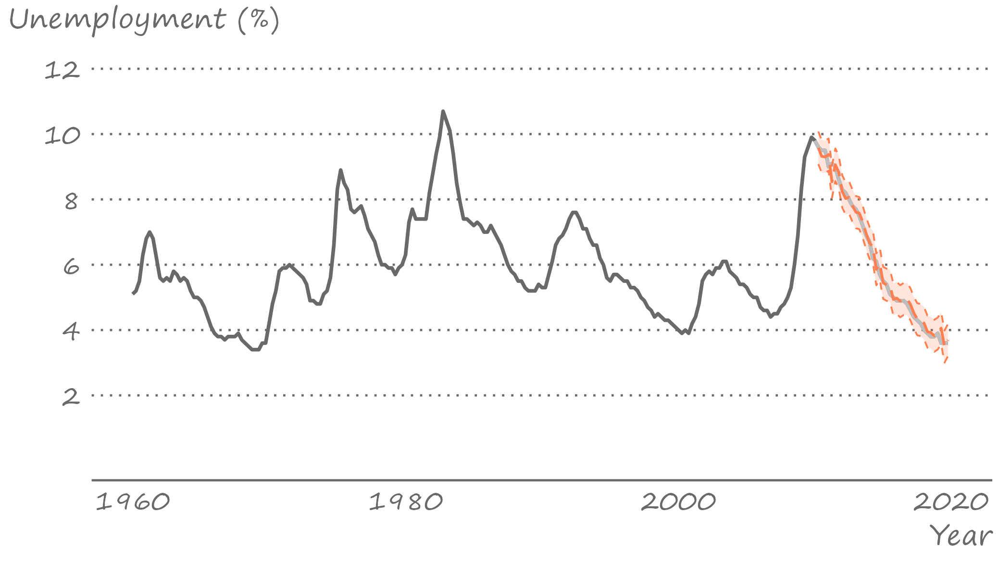
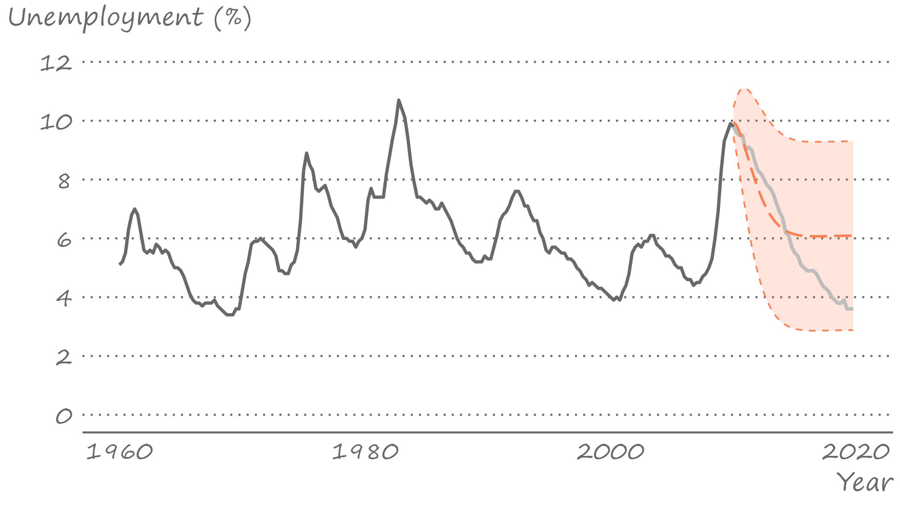

```{r setup, include=FALSE}
knitr::opts_chunk$set(echo = FALSE, fig.width = 11, fig.height = 7)
```

<style>
  .myTable td {
    padding: 5px 20px 5px 20px;
  }
</style>


```{r echo=FALSE, include=FALSE, message=FALSE}
library(data.table)
library(ggplot2)
library(forecast)
```

# Cycles

.pull-left[

]

.pull-right[
A time series that exhibit a pattern of periodic fluctuations is referred to as a cyclical series. 

Cycles can be *deterministic* or *stochastic*. 

Deterministic cycles can be modeled in a fashion similar to seasonality (e.g., using terms from a Fourier series). However, many time series, and especially economic time series, are better characterized by stochastic cycles.
]

---


# Cycles in seasonally adjusted unemployment rates

.right-figure[

]


---


# Autoregressive stochastic cycle

.right-column[
A cycle is stochastic when it is generated by random variables. 

Of particular interest is the case when these random variables belong to the same stochastic process, and are temporally dependent.

Such is a process that yields and autoregressive stochastic cycle:
$$Y_t = f(Y_{t-1},Y_{t-2},\ldots)$$

This is also referred to as an *autoregressive process*.
]

---


# Autoregressive model

.right-column[
We can apply an autoregresive model to approximate the relationship between the realizations of the random variables from previous periods and that from the current period.

In general terms, an autoregressive model of order $p$, $AR(p)$, has the following functional form:
$$y_t = \alpha + \beta_1 y_{t-1}+\beta_2 y_{t-2}+ \cdots + \beta_p y_{t-p}+\varepsilon_t$$

The sum of the autoregressive parameters, $\beta_1,\ldots,\beta_p$, depicts the persistence of the series. The larger is the persistence (i.e., closer it is to one), the longer it takes for the effect of a shock to dissolve.
]

---


# Unconditional mean

.right-column[
Let $\mu$ be the mean of the time series. Under the assumption of covariance stationarity, $\mu\equiv\mathbb{E}\left(y_t\right),\;~~\forall~t.$

If we take the expectation of the AR(p) and solve for $\mu$, we obtain:
$$\mu = \frac{\alpha}{1-\left(\beta_1+\ldots+\beta_p\right)}.$$

---

# Unconditional mean

Let $\gamma_0$ be the variance of the time series. Under the assumption of covariance stationarity, $\gamma_0\equiv\mathbb{V}\left(y_t\right),\;~~\forall~t.$

Recall that $$
$$\gamma_0 = Var\left(y_t\right) = Var\left(\frac{\alpha}{1-\beta_1} + \sum_{i=0}^{\infty}\beta_1^i\varepsilon_{t-i}\right) = \frac{\sigma_{\varepsilon}^2}{1-\beta_1^2}$$
]

---


# Autocovariance of AR(1)

.right-column[
*Autocovariance*: $$\gamma_k = Cov(y_t,y_{t-k}) = E[(y_t - \mu)(y_{t-k} - \mu)] = \mathbb{E}(y_t y_{t-k}) - \mu^2$$

Multiply both sides of $AR(1)$ with $y_{t-k}$ and take the expectation: $$\mathbb{E}(y_t y_{t-k}) = \alpha \mu + \beta_1 \mathbb{E}(y_{t-1}y_{t-k})$$

Substitute in expressions of $\mathbb{E}(y_t y_{t-k})$ and $\mathbb{E}(y_{t-1} y_{t-k})$, which is equivalent to $\mathbb{E}(y_{t} y_{t-k+1})$, to obtain: $$\gamma_k = \beta_1\gamma_{k-1}$$
]

---


# Autocorrelations of AR(1)

.right-column[
*Autocorrelation* (recall, $\rho_k = \gamma_k/\gamma_0$): $\rho_{k} = \beta_1\rho_{k-1}$

It then follows that:
$$\begin{align}
\rho_1 &= \beta_1\rho_0 = \beta_1 \notag \\
\rho_2 &= \beta_1\rho_1 = \beta_1^2 \notag \\
&\vdots \notag \\
\rho_k &= \beta_1\rho_{k-1} = \beta_1^k
\end{align}$$
]

---


# Autocorrelations of AR(1)

.right-column[
The autocorrelation, $\rho$, and partial autocorrelation, $\pi$, functions of the AR(1) process have three distinctive features:

- $\rho_1 = \pi_1 = \beta_1$. That is, the persistence parameter is also the autocorrelation and the partial autocorrelation coefficient.
- The autocorrelation function decreases exponentially toward zero, and the decay is faster when the persistence parameter is smaller.
- The partial autocorrelation function is characterized by only one spike $\pi_1 \neq 0$, and the remaining $\pi_k = 0$, $\forall k > 1$.
]

---


# Autoregression of order p&mdash;AR(p)

.right-column[
Most things about AR(1) can be generalized to any AR(p). 

AR(p) can be viewed as a bit more complex version of an AR(1). 
- For example, requirements on the parameters to ensure that an AR(p) is a covariance-stationary process become tedious as the order of autoregression increases (luckily, we don't need to worry too much about it).
]

---


# Autocorrelations of AR(p)

.right-column[
Generally, the autocorrelation and partial autocorrelation functions of the covariance-stationary $AR(p)$ process have the following features:

- $\rho_1 = \pi_1$, and $\pi_p = \beta_p$.
- The autocorrelation function decreases toward zero, but in different fashion depending on the values of $\beta_1,\ldots,\beta_p$. Nonetheless, the decay is faster when the persistence measure is smaller.
- The partial autocorrelation function is characterized by the first $p$ spikes $\pi_1 \neq 0,\ldots,\pi_p \neq 0$, and the remaining $\pi_k = 0$, $\forall k > p$.
]

---


# Autocorrelogram of the unemployment rates

.right-figure[

]


---


# Partial autocorrelogram of the unemployment rates

.right-figure[

]


---


# Order selection in autoregression

.right-column[
Partial autocorrelations can give a hint about the lag order of the autoregression.

More formally, we can apply an information criterion (AIC or SIC) to select the order of autoregression.
]

---

# Order selection using information criteria

.pull-left[
```{r autoregressions, echo=FALSE, message=FALSE, warnings=FALSE, results='asis'}
tabl <- "
| k | AIC   | SIC   |
|---|:-----:|:-----:|
|1  | 3.197 | 3.227 |
|2  | 2.621 | 2.665 |
|3  | 2.627 | 2.687 |
|4  | 2.635 | 2.710 |
"
cat(tabl)
```
]

.pull-right[
Both information criteria suggest second order autoregression.

So we need to regress $y_t$ on $y_{t-1}$ and $y_{t-2}$ to estimate the AR(2) model.
]

---


# Onestep point forecast

.right-column[
One-step-ahead point forecast (assuming quadratic loss) is a conditional mean of the random variable in the next period: $$y_{t+1|t} = \mathbb{E}(y_{t+1}|\Omega_t) = \alpha + \beta_1 y_{t} + \cdots  + \beta_p y_{t-p+1}$$

One-step-ahead forecast error: $$e_{t+1|t} = y_{t+1} - y_{t+1|t} = \varepsilon_{t+1}$$
]

---


# Onestep interval forecast

.right-column[
One-step-ahead forecast variance: $$\sigma_{t+1|t}^2 = \mathbb{E}(e_{t+1|t}^2) = \mathbb{E}(\varepsilon_{t+1}^2) = \sigma_{\varepsilon}^2$$

One-step-ahead (95%) interval forecast: $$y_{t+1|t} \pm 1.96\sigma_{\varepsilon}$$
]

---


# Onestep forecasts of unemployment

.right-figure[

]


---


# Multistep point forecast

.right-column[
h-step-ahead point forecast: $$y_{t+h|t} = \mathbb{E}(y_{t+h}|\Omega_t) = \alpha + \beta_1 y_{t+h-1|t} + \cdots + \beta_p y_{t+h-p|t},$$ where each $y_{t+h-j|t}$, $j<h$, is sequentially generated. That is, to generate a forecast for horizon $h$, forecasts for horizons $1$ through $h-1$ need to be generated first. This is known as the *iterative* method of multi-step-ahead forecasting. 

h-step-ahead forecast error: $$e_{t+h|t} = \varepsilon_{t+h} + \beta_1 e_{t+h-1|t} + \cdots + \beta_p e_{t+h-p|t}$$

]

---


# Multistep interval forecast

.right-column[
h-step-ahead forecast variance: 
$$
\begin{align}
\sigma_{t+h|t}^2 &= \sigma_{\varepsilon}^2 + \sum_{i=1}^{p}\beta_i^2 Var(e_{t+h-i|t}) \\ 
&+ 2\sum_{i \neq j}\beta_i\beta_j Cov(e_{t+h-i|t},e_{t+h-j|t})
\end{align}
$$

h-step-ahead (95%) interval forecast: $$y_{t+h|t} \pm 1.96\sigma_{t+h|t}$$
]

---


# Iterated multistep forecasts of unemployment

.right-figure[

]


---


# Direct multistep forecasts

.right-column[
We can, also, directly obtain multi-step-ahead forecasts. To illustrate, consider a first-order autoregression: $y_t=\alpha+\beta_1 y_{t-1}+\varepsilon_t.$ 

One-step-ahead point forecast is readily given by: $$y_{t+1|t}=\alpha+\beta_1 y_{t}.$$

Two-step-ahead point forecast, from the iterative method, is: $$y_{t+2|t}=\alpha+\beta_1 y_{t+1|t}.$$
]

---


# Direct multistep forecasts

.right-column[
If we substitute $y_{t+1|t}=\alpha+\beta_1 y_{t}$ into the iterated two-step-ahead forecast equation, we obtain:
$$y_{t+2|t}=\alpha+\beta_1 \left(\alpha+\beta_1 y_{t}\right) = \tilde{\alpha} + \tilde{\beta}_1 y_{t},$$ where $\tilde{\alpha}=\alpha(1+\beta_1)$ and $\tilde{\beta}_1=\beta_1^2.$

Thus, a way to obtain two-step-ahead forecast is to regress $y_t$ on $y_{t-2}$ and then directly forecast $y_{t+2}$ from $y_{t}$. 

This is the *direct* method of multi-step-ahead forecasting, which can be extended to higher order autoregression, and any forecast horizon.
]

---


# Direct multistep interval forecast

.right-column[
In the direct method of multistep forecasting, error terms are serially correlated (by construction). For example, note that in the direct two-step-ahead forecast from a re-specified AR(1) model, $u_t = \varepsilon_t+\beta_1\varepsilon_{t-1}$. It then follows that: $$\sigma^2_u = \mathbb{E}\left[(\varepsilon_t+\beta_1\varepsilon_{t-1})^2\right] = \sigma^2_{\varepsilon}(1+\beta_1^2).$$ 

Thus, when applying the direct method of forecasting, interval forecasts for a given horizon are obtained 'directly,' based on the standard deviation of the residuals.
]

---


# Direct multistep forecasts of unemployment

.right-figure[

]


---


# Direct and iterated multistep forecasts

.right-column[
In summary, an $h$-step-ahead forecast from an AR(p) model, using:

- the iterative method is: $$y_{t+h|t,i} = \alpha + \sum_{j=1}^{p}\beta_j y_{t+h-j|t,i},$$ where $y_{t+h-j|t,i}=y_{t+h-j}$ when $h-j\le 0.$
- the direct method is: $$y_{t+h|t,d} = \tilde{\alpha} + \sum_{j=1}^{p}\tilde{\beta}_j y_{t+1-j}.$$
]

---


# Direct vs iterated multistep forecasts

.right-column[
The relative performance of the two forecasts, $y_{t+h|t,i}$ and $y_{t+h|t,d}$, in terms of bias and efficiency depends on the bias and efficiency of the estimators of each method. 

If the model is correctly specified, both estimators are consistent, but the one-step-ahead model (which leads to the iterative method) is more efficient. Thus, in large samples, the iterative forecast can be expected to perform better than the direct forecast.

In the model is mis-specified&mdash;hardly an unusual scenario&mdash;the ranking of the relative performance may very well change.
]

---


# Key takeaways

.pull-left[

]

.pull-right[

]


---


# Autoregression of order one&mdash;AR(1)

.right-column[
The simplest, i.e., the most parsimonious model in the family of autoregressive models, is the first-order autoregression: $$y_t = \alpha + \beta_1 y_{t-1} + \varepsilon_t,$$ where $\alpha$ is a constant term; $\beta_1$ is the *persistence* parameter; and $\varepsilon_t$ is a white noise process.

We only require $|\beta_1| < 1$ for an $AR(1)$ process to be covariance stationary.
]

---


# Autoregression of order one&mdash;AR(1)

.right-column[
Substitute recursively lagged dependent variables:
$$
\begin{align}
y_t &= \alpha + \beta_1 y_{t-1} + \varepsilon_t \notag \\
y_t &= \alpha + \beta_1 (\alpha + \beta_1 y_{t-2} + \varepsilon_{t-1}) + \varepsilon_t \notag \\
&= \alpha(1+\beta_1) + \beta_1^2 (\alpha + \beta_1 y_{t-3} + \varepsilon_{t-2}) + \beta_1\varepsilon_{t-1} + \varepsilon_t \notag \\
&\vdots  \notag \\
&= \alpha\sum_{i=0}^{k-1}\beta_1^i + \beta_1^k y_{t-k} + \sum_{i=0}^{k-1}\beta_1^i\varepsilon_{t-i}
\end{align}
$$
]

---


# Autoregression of order one&mdash;AR(1)

.right-column[
The end-result is a general linear process with geometrically declining coefficients. The $|\beta_1| < 1$ (i.e., covariance-stationarity) is required for convergence.

Then, as $k \to \infty$: $$y_t = \frac{\alpha}{1-\beta_1} + \sum_{i=0}^{\infty}\beta_1^i\varepsilon_{t-i}$$
]

---


