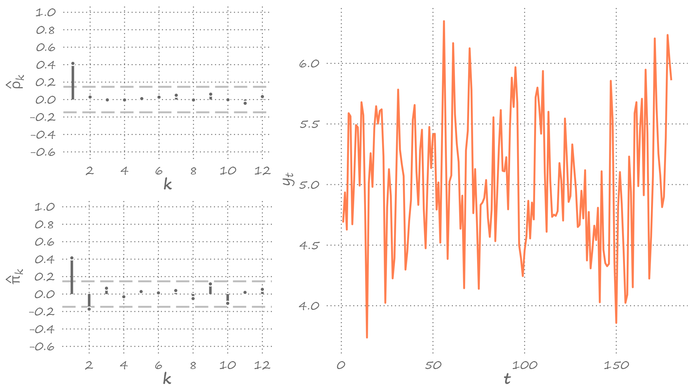
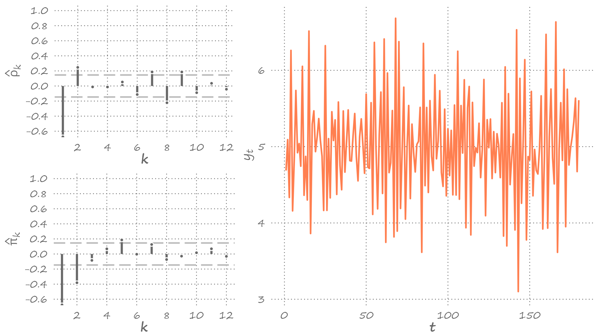
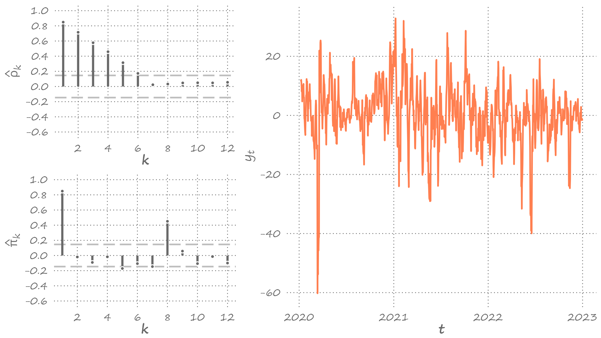
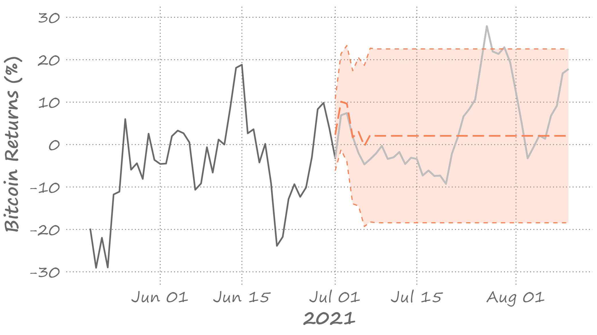
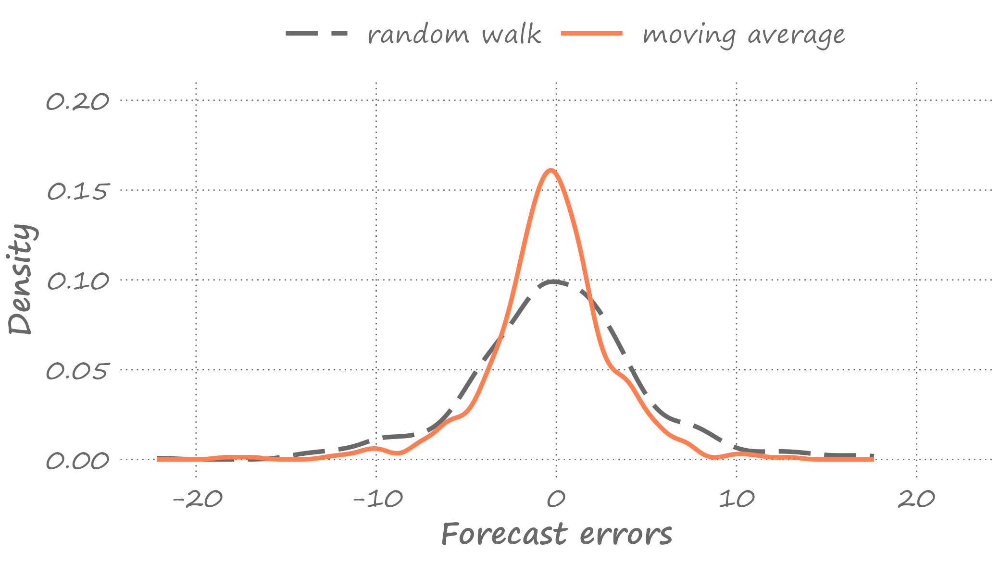

```{r setup, include=FALSE}
knitr::opts_chunk$set(echo = FALSE, fig.width = 11, fig.height = 7)
```


```{r echo=FALSE, include=FALSE, message=FALSE}
library(ggplot2)
library(data.table)
library(cowplot)
library(forecast)
```

# Wold decomposition

.pull-left[

]

.pull-right[
It is possible to decompose any covariance stationary autoregression into a weighted sum of its error terms (plus a constant).

Recall, for example, that using recursive substitution we can represent an $AR(1)$ process as:
$$y_t = \alpha + \beta y_{t-1} + \varepsilon_t = \frac{\alpha}{1-\beta} + \sum_{i=0}^{\infty}\beta^i\varepsilon_{t-i}$$
This is known as the *Wold decomposition*.
]

---


# Moving average process

.right-column[
Specifically, the *Wold Decomposition Theorem* states that if $\{Y_t\}$ is a covariance stationary process, and $\{\varepsilon_t\}$ is a white noise process, then there exists a unique linear representation as: $$Y_t = \mu + \sum_{i=0}^{\infty}\theta_i\varepsilon_{t-i}$$
where $\mu$ is the deterministic component, and the rest is the stochastic component with $\theta_0=1$, and $\sum_{i=0}^{\infty}\theta_i^2 < \infty$.

This is an infinite-order moving average process, $MA(\infty)$.
]

---


# First-order moving average

.right-column[
What does a time series of a moving average process looks like?

To develop an intuition, let's begin with a $MA(1)$: $$y_t = \mu + \varepsilon_t + \theta\varepsilon_{t-1},\;~~\varepsilon_t\sim iid~\text{N}\left(0,\sigma^2_{\varepsilon}\right)$$
Suppose $\mu = 5$, and $\sigma_{\varepsilon}=0.5$, and let's simulate time series by setting $\theta$ to $0.5$, $-1$, and $2$, respectively.

The next three slides will present these simulated time series along with the associated aucocorrelograms.
]

---


# First-order moving average: $\theta=0.5$

.right-column[

]

---


# First-order moving average: $\theta=-1$

.right-column[

]

---


# First-order moving average: $\theta=2$

.right-column[

]

---


# Features of the first-order moving average process

.right-column[
Several features of interest are apparent:
- only one spike at the first lag (i.e., only $\rho_1 \neq 0$), the remaining autocorrelations are zero; 
- the size of the spike is directly proportional to the size of $\theta$, for $|\theta| < 1$; 
- the sign of the spike is the same as that of $\theta$.
]

---


# Mean and variance of the first-order moving average

.right-column[
The unconditional mean of the series is equal to its deterministic component, $\mu$. That is: $$E(y_t) = E(\mu + \varepsilon_t + \theta\varepsilon_{t-1}) = \mu$$
The unconditional variance is proportional to $\theta$. $$Var(y_t) = E(y_t - \mu)^2 = E(\varepsilon_t + \theta\varepsilon_{t-1})^2 = (1+\theta^2)\sigma^2_{\varepsilon}$$
]

---


# Covariances of the first-order moving average

.right-column[
The first-order autocovariance: 
$$\begin{align}
\gamma_1 &= E\left[(y_t - \mu)(y_{t-1} - \mu)\right] \\
&= E\left[(\varepsilon_t + \theta\varepsilon_{t-1})(\varepsilon_{t-1} + \theta\varepsilon_{t-2})\right] = \theta\sigma^2_{\varepsilon}
\end{align}$$

The higher-order covariances are zero.

The time-invariant autocovariance, in conjunction with time-invariant mean and variance measures, suggest that MA(1) is a covariance stationary process.
]

---


# Autocorrelation of the first-order moving average

.right-column[
Note that the two cases, $\theta=0.5$ and $\theta=2$ produce identical autocorrelation functions (and that $\theta=0.5$ is the inverse of $\theta=2$). 

That's because the first-order autocorrelation: $$\rho_1 = \frac{\gamma_1}{\gamma_0} = \frac{\theta}{1+\theta^2}$$

So, for any $\theta$: $\rho_1\left(\theta\right)=\rho_1\left(1/\theta\right)$
]

---


# Invertability of the moving average process

.right-column[
That is, two different MA processes can produce the same autocorrelation. But only that with the moving average parameter less than unity is *invertible*.

Invertability of a moving average process is a useful feature as it allows us to represent the unobserved error term as a function of past observations of the series.
]

---


# Second-order moving average

.right-column[
Everything that we said about a MA(1) process can be generalized to any MA(q) process. Let's focus on MA(2): $$y_t = \mu + \varepsilon_t+\theta_1\varepsilon_{t-1}+\theta_2\varepsilon_{t-2}$$

Suppose, as before, $\mu = 5$, and $\sigma_{\varepsilon}=0.5$, and let's simulate time series by setting $\{\theta_1,\theta_2\}$ to $\{0.5,0.5\}$, $\{-1,0.5\}$, and $\{2,-0.5\}$, respectively.

]

---


# Second-order moving average: $\theta_1=0.5; \theta_2=0.5$

.right-column[

]

---


# Second-order moving average: $\theta_1=-1; \theta_2=0.5$

.right-column[

]

---


# Second-order moving average: $\theta_1=2; \theta_2=-0.5$

.right-column[

]

---

# Mean and variance of the second-order moving average

.right-column[
The unconditional mean and variance are: $$E(y_t) = E(\mu + \varepsilon_t+\theta_1\varepsilon_{t-1}+\theta_2\varepsilon_{t-2}) = \mu$$ and $$Var(y_t) = E(y_t-\mu)^2 = (1+\theta_1^2+\theta_2^2)\sigma_{\varepsilon}^2$$
]

---


# Covariances of the second-order moving average

.right-column[
The autocovariance at the first lag is: $$\gamma_1 = E[(y_t-\mu)(y_{t-1}-\mu)] = (\theta_1+\theta_1\theta_2)\sigma_{\varepsilon}^2$$ 

The autocovariance at the second lag is: $$\gamma_2 = E[(y_t-\mu)(y_{t-2}-\mu)] = \theta_2\sigma_{\varepsilon}^2$$

The autocovariance and autocorrelation at higher lags are zero.
]

---


# Autocorrelations of the second-order moving average

.right-column[
The autocorrelation at the first lag is: $$\rho_1 = \frac{\gamma_1}{\gamma_0} = \frac{\theta_1+\theta_1\theta_2}{1+\theta_1^2+\theta_2^2}$$

The autocorrelation at the second lag is: $$\rho_2 = \frac{\gamma_2}{\gamma_0} = \frac{\theta_2}{1+\theta_1^2+\theta_2^2}$$

The autocorrelations at higher lags are zero.

In general, for any $MA(q)$, $\rho_k=0,\;\;\forall\; k>q$.
]

---


# Bitcoin weekly returns

.right-column[

]

---


# Order selection using information criteria

.right-column[
```{r echo=FALSE, message=FALSE, cache=FALSE}
load("figures/lecture8/btc.RData")

btc_dt <- btc_dt[,.(date=as.Date(substr(timestamp,1,10)),BTC=close/1000)]

btc_dt[,`:=`(lnBTC=log(BTC))]
btc_dt[,`:=`(BTC1=shift(BTC,7),lnBTC1=shift(lnBTC,7))]
btc_dt[,`:=`(dBTC=BTC-BTC1,rBTC=(lnBTC-lnBTC1)*100)]
btc_dt <- btc_dt[complete.cases(btc_dt)]

y <- btc_dt$rBTC

dt <- data.table(q=1:9,AIC=NA,SIC=NA)

ma1 <- arima(y,order=c(0,0,1))
ma2 <- arima(y,order=c(0,0,2))
ma3 <- arima(y,order=c(0,0,3))
ma4 <- arima(y,order=c(0,0,4))
ma5 <- arima(y,order=c(0,0,5))
ma6 <- arima(y,order=c(0,0,6))
ma7 <- arima(y,order=c(0,0,7))
ma8 <- arima(y,order=c(0,0,8))
ma9 <- arima(y,order=c(0,0,9))

dt$AIC[1] <- log(sum(ma1$resid^2,na.rm=T))+2*length(ma1$coef)/length(ma1$resid)
dt$AIC[2] <- log(sum(ma2$resid^2,na.rm=T))+2*length(ma2$coef)/length(ma2$resid)
dt$AIC[3] <- log(sum(ma3$resid^2,na.rm=T))+2*length(ma3$coef)/length(ma3$resid)
dt$AIC[4] <- log(sum(ma4$resid^2,na.rm=T))+2*length(ma4$coef)/length(ma4$resid)
dt$AIC[5] <- log(sum(ma5$resid^2,na.rm=T))+2*length(ma5$coef)/length(ma5$resid)
dt$AIC[6] <- log(sum(ma6$resid^2,na.rm=T))+2*length(ma6$coef)/length(ma6$resid)
dt$AIC[7] <- log(sum(ma7$resid^2,na.rm=T))+2*length(ma7$coef)/length(ma7$resid)
dt$AIC[8] <- log(sum(ma8$resid^2,na.rm=T))+2*length(ma8$coef)/length(ma8$resid)
dt$AIC[9] <- log(sum(ma9$resid^2,na.rm=T))+2*length(ma9$coef)/length(ma9$resid)

dt$SIC[1] <- log(sum(ma1$resid^2,na.rm=T))+log(length(ma1$resid))*length(ma1$coef)/length(ma1$resid)
dt$SIC[2] <- log(sum(ma2$resid^2,na.rm=T))+log(length(ma2$resid))*length(ma2$coef)/length(ma2$resid)
dt$SIC[3] <- log(sum(ma3$resid^2,na.rm=T))+log(length(ma3$resid))*length(ma3$coef)/length(ma3$resid)
dt$SIC[4] <- log(sum(ma4$resid^2,na.rm=T))+log(length(ma4$resid))*length(ma4$coef)/length(ma4$resid)
dt$SIC[5] <- log(sum(ma5$resid^2,na.rm=T))+log(length(ma5$resid))*length(ma5$coef)/length(ma5$resid)
dt$SIC[6] <- log(sum(ma6$resid^2,na.rm=T))+log(length(ma6$resid))*length(ma6$coef)/length(ma6$resid)
dt$SIC[7] <- log(sum(ma7$resid^2,na.rm=T))+log(length(ma7$resid))*length(ma7$coef)/length(ma7$resid)
dt$SIC[8] <- log(sum(ma8$resid^2,na.rm=T))+log(length(ma8$resid))*length(ma8$coef)/length(ma8$resid)
dt$SIC[9] <- log(sum(ma9$resid^2,na.rm=T))+log(length(ma9$resid))*length(ma9$coef)/length(ma9$resid)

knitr::kable(dt,digits=3,align="r",table.attr='class="myTable"')
```
]

---


# Order selection using information criteria

.right-column[
Both AIC and SIC indicate $MA(7)$.

The estimated parameters and their standard errors are:

```{r echo=FALSE, message=FALSE, cache=FALSE}
out <- rbind(ma7$coef,sqrt(diag(ma7$var.coef)))[,c(5,1:7)]
rownames(out) <- c("estimate","s.e.")
knitr::kable(out,digits=3,align="c", table.attr='class="myTable"',row.names = T,col.names = c('$\\mu$',"$\\theta_1$","$\\theta_2$","$\\theta_3$","$\\theta_4$","$\\theta_5$","$\\theta_6$","$\\theta_7$"),escape = FALSE)
```

]

---


# Forecasting MA(1) process

.right-column[
Point forecasts:
- $h=1$: $y_{t+1|t} = E(y_{t+1}|\Omega_t) = \mu + \theta \varepsilon_{t}$
- $h=2$: $y_{t+2|t} = E(y_{t+2}|\Omega_t) = \mu$
- $h>2$: $y_{t+h|t} = E(y_{t+h}|\Omega_t) = \mu$
]

---


# Forecasting MA(1) process

.right-column[
Forecast errors:
- $h=1$: $e_{t+1|t} = y_{t+1}-y_{t+1|t} = \varepsilon_{t+1}$
- $h=2$: $e_{t+2|t} = y_{t+2}-y_{t+2|t} = \varepsilon_{t+2}+\theta \varepsilon_{t+1}$
- $h>2$: $e_{t+h|t} = y_{t+h}-y_{t+h|t} = \varepsilon_{t+h}+\theta \varepsilon_{t+h-1}$
]

---


# Forecasting MA(1) process

.right-column[
Forecast variances:
- $h=1$: $\sigma_{t+1|t}^2 = E(e_{t+1|t}^2) = \sigma_{\varepsilon}^2$
- $h=2$: $\sigma_{t+2|t}^2 = E(e_{t+2|t}^2) = \sigma_{\varepsilon}^2(1+\theta^2)$
- $h>2$: $\sigma_{t+h|t}^2 = E(e_{t+h|t}^2) = \sigma_{\varepsilon}^2(1+\theta^2)$
]

---


# Forecasting MA(1) process

.right-column[
Interval forecasts (95%):
- $h=1$: $\left[\mu+\theta\varepsilon_t-1.96\sigma_{\varepsilon};\mu+\theta\varepsilon_t+1.96\sigma_{\varepsilon}\right]$
- $h=2$: $\left[\mu-1.96\sigma_{\varepsilon}\sqrt{1+\theta^2};\mu+1.96\sigma_{\varepsilon}\sqrt{1+\theta^2}\right]$
- $h>2$: $\left[\mu-1.96\sigma_{\varepsilon}\sqrt{1+\theta^2};\mu+1.96\sigma_{\varepsilon}\sqrt{1+\theta^2}\right]$

]

---


# Forecasting MA(q) process

.right-column[
Point forecasts:
- $h=1$: $y_{t+1|t} = E(y_{t+1}|\Omega_t) = \mu + \theta_1 \varepsilon_{t}+\ldots+\theta_q\varepsilon_{t-q+1}$
- $h=2$: $y_{t+2|t} = E(y_{t+2}|\Omega_t) = \mu + \theta_2 \varepsilon_{t}+\ldots+\theta_q\varepsilon_{t-q+2}$

$\vdots$

- $h \ge q$: $y_{t+h|t} = E(y_{t+h}|\Omega_t) = \mu$
]

---


# Forecasting MA(q) process

.right-column[
Forecast errors:
- $h=1$: $e_{t+1|t} = \varepsilon_{t+1}$
- $h=2$: $e_{t+2|t} = \varepsilon_{t+2}+\theta_1 \varepsilon_{t+1}$

$\vdots$

- $h \ge q$: $e_{t+h|t} = \varepsilon_{t+h}+\theta_1 \varepsilon_{t+h-1}+\ldots+\theta_q \varepsilon_{t+h-q}$
]

---


# Forecasting MA(q) process

.right-column[
Forecast variances:
- $h=1$: $\sigma_{t+1|t}^2 = E(e_{t+1|t}^2) = \sigma_{\varepsilon}^2$
- $h=2$: $\sigma_{t+2|t}^2 = E(e_{t+2|t}^2) = \sigma_{\varepsilon}^2(1+\theta_1^2)$

$\vdots$

- $h \ge q$: $\sigma_{t+h|t}^2 = E(e_{t+h|t}^2) = \sigma_{\varepsilon}^2(1+\theta_1^2+\ldots+\theta_q^2)$
]

---


# Forecasting MA(q) process

.right-column[
Interval forecasts (95%):
- $h=1$: $\left[y_{t+1|t}-1.96\sigma_{\varepsilon};y_{t+1|t}+1.96\sigma_{\varepsilon}\right]$
- $h=2$: $\left[y_{t+2|t}-1.96\sigma_{t+2|t};y_{t+2|t}+1.96\sigma_{t+2|t}\right]$

$\vdots$

- $h \ge q$: $\left[\mu-1.96\sigma_{t+h|t};\mu+1.96\sigma_{t+h|t}\right]$

]

---


# Forecasting Bitcoin weekly returns

.right-column[

]

---


# Comparing forecasts of MA(7) with RW

.right-column[
Are forecasts from MA(7), our preferred model, more accurate than those from the random walk model?

Let's generate a sequence of one-step-ahead forecasts from 4 July 2021 onward (using a recursive window approach).
]

---


# Densities of the forecast errors

.right-column[

]

---


# Comparing forecasts of MA(7) with RW

.right-column[
As it turns out, the RMSFE from MA(7) is $3.46$ and the RMSFE from RW is $4.88$.

So, the answer is *yes*, on average.

The DM statistic is $7.49$. 

So, forecasts from MA(7) are statistically significantly more accurate than those from RW.
]

---


# Readings

.pull-left[

]

.pull-right[
Gonzalez-Rivera, Chapter 6

Hyndman & Athanasopoulos, [9.4](https://otexts.com/fpp3/MA.html)
]


