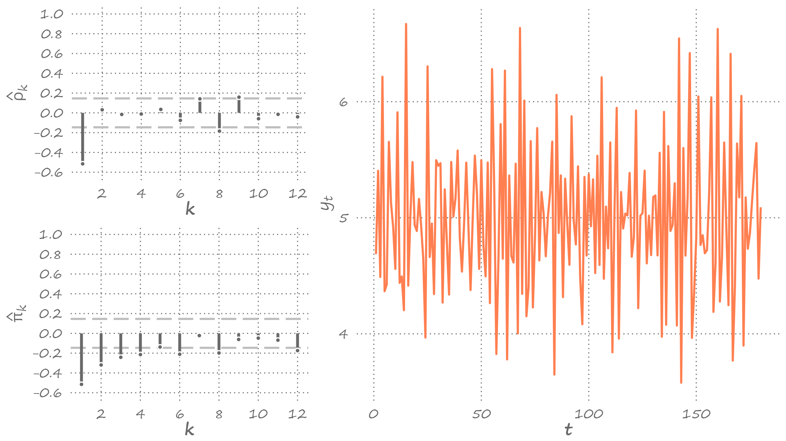
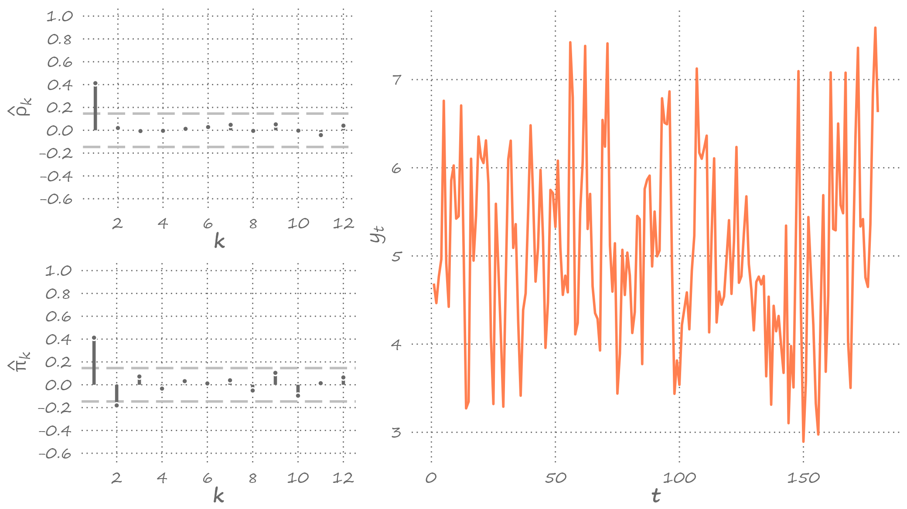
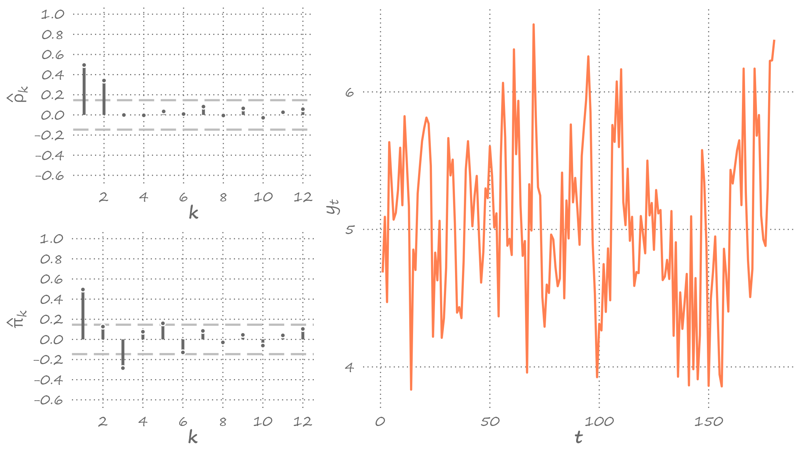

```{r setup, include=FALSE}
knitr::opts_chunk$set(echo = FALSE, fig.width = 11, fig.height = 7)
```


```{r echo=FALSE, include=FALSE, message=FALSE}
library(ggplot2)
library(data.table)
library(cowplot)
library(forecast)
```


# Wold decomposition

.pull-left[

]

.pull-right[
It is possible to decompose any covariance stationary autoregressive process into a weighted sum of its error terms (plus a constant).

This is known as the *Wold decomposition*.

]

---


# Wold decomposition

.right-column[
Substitute recursively lagged dependent variables:
$$
\begin{align}
y_t &= \alpha + \beta_1 y_{t-1} + \varepsilon_t \notag \\
y_t &= \alpha + \beta_1 (\alpha + \beta_1 y_{t-2} + \varepsilon_{t-1}) + \varepsilon_t \notag \\
&= \alpha(1+\beta_1) + \beta_1^2 (\alpha + \beta_1 y_{t-3} + \varepsilon_{t-2}) + \beta_1\varepsilon_{t-1} + \varepsilon_t \notag \\
&\vdots  \notag \\
&= \alpha\sum_{i=0}^{k-1}\beta_1^i + \beta_1^k y_{t-k} + \sum_{i=0}^{k-1}\beta_1^i\varepsilon_{t-i}
\end{align}
$$
]

---


# Wold decomposition

.right-column[
The end-result is a general linear process with geometrically declining coefficients. The $|\beta_1| < 1$ (i.e., covariance-stationarity) is required for convergence.

Then, as $k \to \infty$: $$y_t = \frac{\alpha}{1-\beta_1} + \sum_{i=0}^{\infty}\beta_1^i\varepsilon_{t-i}$$
]

---


# Moving average process

.right-column[
Specifically, the *Wold Decomposition Theorem* states that if $\{Y_t\}$ is a covariance stationary process, and $\{\varepsilon_t\}$ is a white noise process, then there exists a unique linear representation as: $$Y_t = \mu + \sum_{i=0}^{\infty}\theta_i\varepsilon_{t-i}$$
where $\mu$ is the deterministic component, and the rest is the stochastic component with $\theta_0=1$, and $\sum_{i=0}^{\infty}\theta_i^2 < \infty$.

This is an infinite-order moving average process, $MA(\infty)$.
]

---


# MA(1) process

.right-column[
What does a time series of a moving average process looks like?

To develop an intuition, let's begin with a $MA(1)$: $$y_t = \mu + \varepsilon_t + \theta\varepsilon_{t-1},\;~~\varepsilon_t\sim iid~\text{N}\left(0,\sigma^2_{\varepsilon}\right)$$
Suppose $\mu = 5$, and $\sigma_{\varepsilon}=0.5$, and let's simulate time series by setting $\theta$ to $0.5$, $-1$, and $2$, respectively.

The next three slides will present these simulated time series along with the associated aucocorrelograms.
]

---


# MA(1) process: $\theta=0.5$

.right-figure[

]

---


# MA(1) process: $\theta=-1$

.right-figure[

]

---


# MA(1) process: $\theta=2$

.right-figure[

]

---


# General features of a MA(1) process

.right-column[
Several features of interest are apparent:
- only one spike at the first lag (i.e., only $\rho_1 \neq 0$), the remaining autocorrelations are zero; 
- the size of the spike is proportional to the size of $\theta$, for $|\theta| < 1$; 
- the sign of the spike is the same as that of $\theta$.
]

---


# Mean and variance of a MA(1) process

.right-column[
The unconditional mean of the series is equal to its deterministic component, $\mu$. That is: $$E(y_t) = E(\mu + \varepsilon_t + \theta\varepsilon_{t-1}) = \mu$$
The unconditional variance is proportional to $\theta$. $$Var(y_t) = E(y_t - \mu)^2 = E(\varepsilon_t + \theta\varepsilon_{t-1})^2 = (1+\theta^2)\sigma^2_{\varepsilon}$$
]

---


# Covariances of a MA(1) process

.right-column[
The first-order autocovariance: 
$$\begin{align}
\gamma_1 &= E\left[(y_t - \mu)(y_{t-1} - \mu)\right] \\
&= E\left[(\varepsilon_t + \theta\varepsilon_{t-1})(\varepsilon_{t-1} + \theta\varepsilon_{t-2})\right] = \theta\sigma^2_{\varepsilon}
\end{align}$$

The higher-order covariances are zero.

The time-invariant autocovariance, in conjunction with time-invariant mean and variance, suggest that MA(1) is a covariance stationary process.
]

---


# Autocorrelation of a MA(1) process

.right-column[
Note that the two cases, $\theta=0.5$ and $\theta=2$ produce identical autocorrelation functions (and that $\theta=0.5$ is the inverse of $\theta=2$). 

That's because the first-order autocorrelation: $$\rho_1 = \frac{\gamma_1}{\gamma_0} = \frac{\theta}{1+\theta^2}$$

So, for any $\theta$: $\rho_1\left(\theta\right)=\rho_1\left(1/\theta\right)$
]

---


# Invertability of the moving average process

.right-column[
That is, two different MA processes can produce the same autocorrelation. But only that with the moving average parameter less than unity is *invertible*.

Invertability of a moving average process is a useful feature as it allows us to represent the unobserved error term as a function of past observations of the series.
]

---


# MA(2) process

.right-column[
Everything that we said about a MA(1) process can be generalized to any MA(q) process. Let's focus on MA(2): $$y_t = \mu + \varepsilon_t+\theta_1\varepsilon_{t-1}+\theta_2\varepsilon_{t-2}$$

Suppose, as before, $\mu = 5$, and $\sigma_{\varepsilon}=0.5$, and let's simulate time series by setting $\{\theta_1,\theta_2\}$ to $\{0.5,0.5\}$, $\{-1,0.5\}$, and $\{2,-0.5\}$, respectively.

]

---


# MA(2) process: $\theta_1=0.5; \theta_2=0.5$

.right-figure[

]

---


# MA(2) process: $\theta_1=-1; \theta_2=0.5$

.right-figure[

]

---


# MA(2) process: $\theta_1=2; \theta_2=-0.5$

.right-figure[

]

---

# Mean and variance of a MA(2) process

.right-column[
The unconditional mean and variance are: $$E(y_t) = E(\mu + \varepsilon_t+\theta_1\varepsilon_{t-1}+\theta_2\varepsilon_{t-2}) = \mu$$ and $$Var(y_t) = E(y_t-\mu)^2 = (1+\theta_1^2+\theta_2^2)\sigma_{\varepsilon}^2$$
]

---


# Covariances of a MA(2) process

.right-column[
The autocovariance at the first lag is: $$\gamma_1 = E[(y_t-\mu)(y_{t-1}-\mu)] = (\theta_1+\theta_1\theta_2)\sigma_{\varepsilon}^2$$ 

The autocovariance at the second lag is: $$\gamma_2 = E[(y_t-\mu)(y_{t-2}-\mu)] = \theta_2\sigma_{\varepsilon}^2$$

The autocovariance and autocorrelation at higher lags are zero.
]

---


# Autocorrelations of a MA(2) process

.right-column[
The autocorrelation at the first lag is: $$\rho_1 = \frac{\gamma_1}{\gamma_0} = \frac{\theta_1+\theta_1\theta_2}{1+\theta_1^2+\theta_2^2}$$

The autocorrelation at the second lag is: $$\rho_2 = \frac{\gamma_2}{\gamma_0} = \frac{\theta_2}{1+\theta_1^2+\theta_2^2}$$

The autocorrelations at higher lags are zero.

In general, for any $MA(q)$, $\rho_k=0,\;\;\forall\; k>q$.
]

---


# Forecasting a MA(1) process

.right-column[
Point forecasts:
- $h=1$: $y_{t+1|t} = E(y_{t+1}|\Omega_t) = \mu + \theta \varepsilon_{t}$
- $h=2$: $y_{t+2|t} = E(y_{t+2}|\Omega_t) = \mu$
- $h>2$: $y_{t+h|t} = E(y_{t+h}|\Omega_t) = \mu$
]

---


# Forecasting a MA(1) process

.right-column[
Forecast errors:
- $h=1$: $e_{t+1|t} = y_{t+1}-y_{t+1|t} = \varepsilon_{t+1}$
- $h=2$: $e_{t+2|t} = y_{t+2}-y_{t+2|t} = \varepsilon_{t+2}+\theta \varepsilon_{t+1}$
- $h>2$: $e_{t+h|t} = y_{t+h}-y_{t+h|t} = \varepsilon_{t+h}+\theta \varepsilon_{t+h-1}$
]

---


# Forecasting a MA(1) process

.right-column[
Forecast variances:
- $h=1$: $\sigma_{t+1|t}^2 = E(e_{t+1|t}^2) = \sigma_{\varepsilon}^2$
- $h=2$: $\sigma_{t+2|t}^2 = E(e_{t+2|t}^2) = \sigma_{\varepsilon}^2(1+\theta^2)$
- $h>2$: $\sigma_{t+h|t}^2 = E(e_{t+h|t}^2) = \sigma_{\varepsilon}^2(1+\theta^2)$
]

---


# Forecasting a MA(1) process

.right-column[
Interval forecasts (95%):
- $h=1$: $\left[\mu+\theta\varepsilon_t-1.96\sigma_{\varepsilon};\mu+\theta\varepsilon_t+1.96\sigma_{\varepsilon}\right]$
- $h=2$: $\left[\mu-1.96\sigma_{\varepsilon}\sqrt{1+\theta^2};\mu+1.96\sigma_{\varepsilon}\sqrt{1+\theta^2}\right]$
- $h>2$: $\left[\mu-1.96\sigma_{\varepsilon}\sqrt{1+\theta^2};\mu+1.96\sigma_{\varepsilon}\sqrt{1+\theta^2}\right]$

]

---


# Forecasting a MA(q) process

.right-column[
Point forecasts:
- $h=1$: $y_{t+1|t} = E(y_{t+1}|\Omega_t) = \mu + \theta_1 \varepsilon_{t}+\ldots+\theta_q\varepsilon_{t-q+1}$
- $h=2$: $y_{t+2|t} = E(y_{t+2}|\Omega_t) = \mu + \theta_2 \varepsilon_{t}+\ldots+\theta_q\varepsilon_{t-q+2}$

$\vdots$

- $h \ge q$: $y_{t+h|t} = E(y_{t+h}|\Omega_t) = \mu$
]

---


# Forecasting a MA(q) process

.right-column[
Forecast errors:
- $h=1$: $e_{t+1|t} = \varepsilon_{t+1}$
- $h=2$: $e_{t+2|t} = \varepsilon_{t+2}+\theta_1 \varepsilon_{t+1}$

$\vdots$

- $h \ge q$: $e_{t+h|t} = \varepsilon_{t+h}+\theta_1 \varepsilon_{t+h-1}+\ldots+\theta_q \varepsilon_{t+h-q}$
]

---


# Forecasting a MA(q) process

.right-column[
Forecast variances:
- $h=1$: $\sigma_{t+1|t}^2 = E(e_{t+1|t}^2) = \sigma_{\varepsilon}^2$
- $h=2$: $\sigma_{t+2|t}^2 = E(e_{t+2|t}^2) = \sigma_{\varepsilon}^2(1+\theta_1^2)$

$\vdots$

- $h \ge q$: $\sigma_{t+h|t}^2 = E(e_{t+h|t}^2) = \sigma_{\varepsilon}^2(1+\theta_1^2+\ldots+\theta_q^2)$
]

---


# Forecasting a MA(q) process

.right-column[
Interval forecasts (95%):
- $h=1$: $\left[y_{t+1|t}-1.96\sigma_{\varepsilon};y_{t+1|t}+1.96\sigma_{\varepsilon}\right]$
- $h=2$: $\left[y_{t+2|t}-1.96\sigma_{t+2|t};y_{t+2|t}+1.96\sigma_{t+2|t}\right]$

$\vdots$

- $h \ge q$: $\left[\mu-1.96\sigma_{t+h|t};\mu+1.96\sigma_{t+h|t}\right]$

]

---


# Key takeaways

.pull-left[

]

.pull-right[
- The dynamics of some time series can be best characterized as a linear function of past errors. Such a process is referred to as the moving average process.
- A finite-order moving average process is a short-memory process, insofar as the shocks (or forecast errors) from distant past are irrelevant in predicting the ourcome of the random variable.
]


