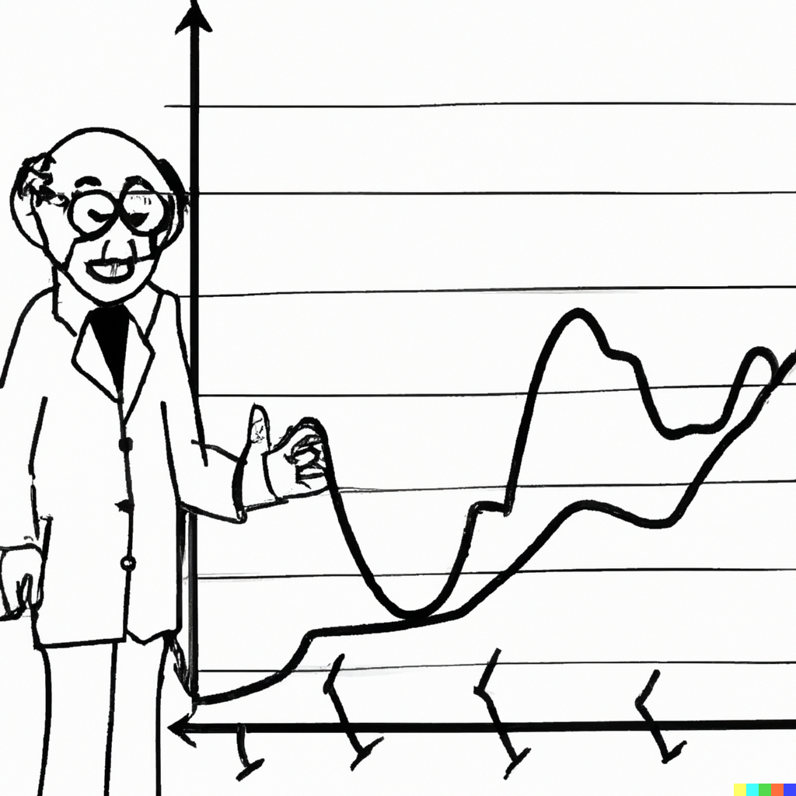

```{r setup, include=FALSE}
knitr::opts_chunk$set(echo = FALSE, fig.width = 11, fig.height = 7)
```


```{r echo=FALSE, include=FALSE, message=FALSE}
library(ggplot2)
library(data.table)
library(knitr)
```


# Nonlinear Models

.pull-left[

]

.pull-right[
Thus far we have considered linear models (i.e., the cases where a stochastic process is linear function of the information set). 

In contrast, a nonlinear process is characterized by a conditional mean that is a nonlinear function of the information set.

There can be a wide range of functional forms of nonlinear models.
]

---


# Nonlinear Models

.right-column[
Consider an AR(p) process with a deterministic trend: $$y_t = \alpha_0 + \alpha_1 t + \sum_{i=1}^{p}\beta_i y_{t-i} + \varepsilon_t,$$ where $\alpha_0 + \alpha_1 t$ is the time-specific deterministic component.

This specification implies a linear trend, but that doesn't need to be the case. We can have quadratic or cubic trends, for example, or we can have no trend component at all.
]

---


# Time-Varying Models

.right-column[
A simple augmentation of the foregoing model is an autoregressive model with a switching trend component: $$y_t = \delta_{0} + \delta_{1} t + \delta_{2}(t-\tau)I(t>\tau) + \beta y_{t-1} + \varepsilon_t,$$ where $\tau$ is the threshold parameter.

Such switch can be extended to the whole autoregressive process. 
]

---


# Time-Varying Models

.right-column[
Consider a two-regime AR(p) with drift: $$y_t = \delta_0 + \delta_1 t + \sum_{i=1}^{p}\beta_{1i} y_{t-i} + \left[\delta_2(t-\tau) + \sum_{i=1}^{p}\beta_{2i} y_{t-i}\right]I(t>\tau) + \varepsilon_t$$ This equation implies that not only the trend, but also the autoregressive process changes around $\tau$.
]

---


# Regime-Dependent Models

.right-column[
Thus far we have assumed that the switch occurs at some point in time, i.e. the regime-switching variable is a function of time. 

But the regime-switching variable can also be a function of the dependent variable, or other (potentially) related variables: $$y_t = \alpha_0 + \sum_{i=1}^{p}\beta_{0i} y_{t-i} + \left(\alpha_1 + \sum_{i=1}^{p}\beta_{1i} y_{t-i}\right)I(s_t>\kappa) + \varepsilon_t,$$ where $s_t$ is the regime-switching variable, and $\kappa$ is the threshold parameter. This model is referred as a threshold autoregression of order $p$, TAR(p). 
]

---


# Regime-Dependent Models

.right-column[
If in TAR(p), $s_t = y_{t-d}$, where $d$ is a positive integer referred to as the delay factor&mdash;usually bounded by the order of the autoregression&mdash;then the model is referred to as a self-exciting threshold autoregression, or SETAR(p).

If in TAR(p), $s_t = \Delta y_{t-d}$, then the model is referred to as a momentum threshold autoregression, or momentum-TAR(p).
]

---


# Regime-Dependent Models

.right-column[
TAR (or any version of it) can take any multiple-regime form: $$y_t = \alpha_1 + \sum_{i=1}^{p}\beta_{1i} y_{t-i} + \sum_{j=2}^{K}{\left(\alpha_j + \sum_{i=1}^{p}\beta_{ji} y_{t-i}\right)I(s_t>c_j)} + \varepsilon_t,$$ where $K$ depicts the number of regimes in the equation.
]

---

# Regime-Dependent Models

.right-column[
When we estimate TAR-type models, we have no *a priori* knowledge on the number of regimes, the order of autoregression in each regime, the regime-switching variable, and the value(s) of threshold parameter(s). 

When threshold values are unknown (and need to be estimated), standard statistical inference is no longer valid. Otherwise, and given that the process is stationary, standard statistical inference applies.
]

---

# U.S. Inflation

.right-column[
```{r echo=FALSE, message=FALSE, cache=FALSE}
load("../../Books/forecasting/data/inflation.RData")

ggplot(inflation,aes(x=date,y=y))+
  geom_line(size=.8,color="powderblue")+
  labs(x="Year",y="Year-on-Year Inflation (%)",caption="retrieved from FRED, Federal Reserve Bank of St. Louis\nhttps://fred.stlouisfed.org/series/CPIAUCNS")+
  theme_classic()+
  theme(axis.title = element_text(size=22),axis.text = element_text(size=18),legend.position="top",legend.title=element_blank(),legend.text=element_text(size=18))
```
]

---

# Order of autoregression and threshold parameter

.pull-left[
```{r echo=FALSE, message=FALSE, cache=FALSE}
inflation[,`:=`(y1=shift(y,1),y2=shift(y,2),y3=shift(y,3),y4=shift(y,4))]

inflation <- inflation[complete.cases(inflation)]

ar1 <- lm(y~y1,data=inflation)
ar2 <- lm(y~y1+y2,data=inflation)
ar3 <- lm(y~y1+y2+y3,data=inflation)
ar4 <- lm(y~y1+y2+y3+y4,data=inflation)

aic1 <- log(sum(ar1$residuals^2))+2*length(ar1$coefficients)/nrow(inflation)
aic2 <- log(sum(ar2$residuals^2))+2*length(ar2$coefficients)/nrow(inflation)
aic3 <- log(sum(ar3$residuals^2))+2*length(ar3$coefficients)/nrow(inflation)
aic4 <- log(sum(ar4$residuals^2))+2*length(ar4$coefficients)/nrow(inflation)

aic_dt <- data.table(p=1:4,AIC=NA)

aic_dt$AIC[1] <- aic1
aic_dt$AIC[2] <- aic2
aic_dt$AIC[3] <- aic3
aic_dt$AIC[4] <- aic4

knitr::kable(aic_dt,format='html',digits=3,align="l", table.attr='class="myTable"')

```
]

.pull-right[
```{r echo=FALSE, message=FALSE, cache=FALSE}

quantiles <- round(quantile(inflation$y,c(.25,.75)),1)

candidates <- seq(quantiles[1],quantiles[2],by=.1)

ssr_dt <- data.table(candidates,ssr=NA)
for(i in 1:length(candidates)){
  inflation[,`:=`(ind=ifelse(y1>candidates[i],1,0))]
  setar3 <- lm(y~(y1+y2+y3):I(1-ind)+(y1+y2+y3):I(ind),data=inflation)
  ssr_dt$ssr[i] <- sum(setar3$residuals^2)
}

trs <- ssr_dt[ssr==min(ssr)]$candidates

ggplot(ssr_dt,aes(x=candidates,y=ssr))+
  geom_line(size=.8,color="coral")+
  labs(x="Threshold",y="Sum of Squared Residuals")+
  theme_classic()+
  theme(axis.title = element_text(size=22),axis.text = element_text(size=18),legend.position="top",legend.title=element_blank(),legend.text=element_text(size=18))

```
]

---

# Estimated SETAR(3)

.right-column[
We thus estimate the SETAR(3) model with $y_{t-1}$ as the regime-switching variable, while setting the threshold parameter to `r trs`. 
```{r echo=FALSE, message=FALSE, cache=FALSE}
inflation[,`:=`(ind=ifelse(y1>trs,1,0))]
setar3 <- lm(y~(y1+y2+y3):I(1-ind)+(y1+y2+y3):I(ind),data=inflation)

aic3s <- log(sum(setar3$residuals^2))+2*length(setar3$coefficients)/nrow(inflation)


out <- t(summary(setar3)$coef[,c(1,2)])
rownames(out) <- c("estimate","s.e.")

knitr::kable(out,format="html",digits=3,align="r",row.names = T,col.names = c("$\\alpha$","$\\beta_{11}$","$\\beta_{12}$","$\\beta_{13}$","$\\beta_{21}$","$\\beta_{22}$","$\\beta_{23}$"),escape = FALSE)
```

The AIC of this SETAR(3) model is `r round(aic3s,3)`, which is less than the AIC of the AR(3) model.
]


---


# Forecasting with Nonlinear Models

.right-column[
In the case of time-varying shifting trend (mean) models, the most recent trend component is used to obtain forecasts. To that end, the forecasting routine is similar to that of linear trend models.

In the case of regime-switching models (e.g., TAR), one-step-ahead point forecast is obtained the usual way: 
$$\begin{aligned}
y_{t+1|t} &= \alpha_0+\beta_{01}y_{t}+\beta_{02}y_{t-1}+\ldots \\
          &+ (\alpha_1+\beta_{11}y_{t}+\beta_{12}y_{t-1}+\ldots)I(s_t>\kappa)
\end{aligned}$$
]

---


# Forecasting with Nonlinear Models

.right-column[
Obtaining $h$-step-ahead forecasts (where $h \ge 1$) is a less trivial exercise (because of the nonlinearity). Several options are available to the forecaster:

- The iterated method (or, the so-called skeleton extrapolation) is an easy option, but but it yields biased forecasts and is inefficient. 
- The analytical method yields unbiased (assuming the model is correctly specified) and efficient forecasts, but can be tedious.
- The numerical method addresses the issues of the iterated method and offers a suitable approximation to the analytical method.
]

---


# Iterated Method - Skeleton Extrapolation

.right-column[
Consider a $\text{SETAR}(p,y_{t-1})$ model:

One-step-ahead point forecast: 
$$\begin{aligned}
y_{t+1|t} &= (\alpha_1 + \beta_{11} y_{t} + \ldots + \beta_{1p} y_{t+1-p})I(y_{t} \leq \kappa) \\ 
                &+ (\alpha_2 + \beta_{21} y_{t} + \ldots + \beta_{2p} y_{t+1-p})I(y_{t} > \kappa)
\end{aligned}$$
]

---


# Iterated Method - Skeleton Extrapolation

.right-column[
h-step-ahead point forecast: 
$$\begin{aligned}
y_{t+h|t} &= (\alpha_1 + \beta_{11} y_{t+h-1|t} + \ldots + \beta_{1p} y_{t+h-p})I(y_{t+h-d|t} \leq \kappa) \\
                &+ (\alpha_2 + \beta_{21} y_{t+h-1|t} + \ldots + \beta_{2p} y_{t+h-p})I(y_{t+h-d|t} > \kappa),
\end{aligned}$$

where $y_{t+h-j|t}=y_{t+h-j}$ if $j\ge h$. 

Skeleton extrapolation yields biased point forecasts for horizons $h>d$. That's because the expectation of a nonlinear function (which what point forecast should be) is not equal to the nonlinear function of the expectation (which what skeleton extrapolate is).
]

---


# Numerical Method - Bootstrap Resampling

.right-column[
Bootstrap (or Monte Carlo) resampling helps approximate the optimal forecast from nonlinear models and circumvents the complexity of integration (which would be needed for generating forecasts using the analytical method).

As an additional benefit, the procedure generates empirical density of bootstrap extrapolates, which allows us to examine the potential multimodality of these densities&mdash;a characteristic feature of those generated from regime-dependent nonlinear models such as SETAR, for example.
]

---


# Numerical Method - Bootstrap Resampling

.right-column[
Algorithm:

1. Estimate the regime-dependent model and store the residuals.
2. From this set of residuals, sample (with replacement) a vector of shocks for a bootstrap iteration, $\varepsilon^b = (\varepsilon_{t+1}^b,\varepsilon_{t+2}^b,\ldots,\varepsilon_{t+h}^b)'$.
3. Use this sample of shocks, along with the estimated parameters and historical observations, to generate a forecast path for the given bootstrap iteration.
4. Repeat steps 2-3 many times to generate an empirical distribution of bootstrap extrapolates.
5. Calculate horizon-specific averages of the bootstrap extrapolates to generate point forecasts.
]

---


# Numerical Method - Bootstrap Resampling

.right-column[
Consider a $\text{SETAR}(p,y_{t-1})$:

One-step-ahead bootstrap extrapolate: 
$$\begin{aligned}
y_{t+1|t}^b &= (\alpha_1 + \beta_{11} y_{t} + \ldots + \beta_{1p} y_{t+1-p})I(y_{t} \leq \kappa) \\ 
                &+ (\alpha_2 + \beta_{21} y_{t} + \ldots + \beta_{2p} y_{t+1-p})I(y_{t} > \kappa)+\varepsilon_{t+1}^b
\end{aligned}$$
]

---


# Numerical Method - Bootstrap Resampling

.right-column[
Consider a $\text{SETAR}(p,y_{t-1})$:

Two-step-ahead bootstrap extrapolate: 
$$\begin{aligned}
y_{t+2|t}^b &= (\alpha_1 + \beta_{11} y_{t+1|t}^b + \ldots + \beta_{1p} y_{t+2-p})I(y_{t+1|t}^b \leq \kappa) \\
                &+ (\alpha_2 + \beta_{21} y_{t+1|t}^b + \ldots + \beta_{2p} y_{t+2-p})I(y_{t+1|t}^b > \kappa)+\varepsilon_{t+2}^b
\end{aligned}$$
]

---


# Numerical Method - Bootstrap Resampling

.right-column[
Point forecast at horizon $h$ is: $$\bar{y}_{t+h|t} = B^{-1}\sum_{b=1}^{B}y_{t+h|t}^b,$$ where $B$ is the total number of bootstrap iterations (usually many thousands of iterations).
]

---


# Numerical Method - Bootstrap Resampling

.right-column[
Forecast error at horizon $h$ is: $$e_{t+h|t}=y_{t+h}-\bar{y}_{t+h|t}.$$ Measures of forecast accuracy measures (such as RMSFE, for example) can be obtained based on this forecast error.
]

---


# Numerical Method - Bootstrap Resampling

.right-column[
For interval forecasts, we will need to resort to the relevant percentiles of the empirical distribution of the bootstrap extrapolates. This is because the multi-step forecast density from nonlinear models, usually, is no longer symmetric or normally distributed.  
]

---

# Multistep forecasts of the inflation rate

.right-column[
```{r echo=FALSE, message=FALSE, cache=TRUE}
est_end <- paste0(substr(inflation$date[round(.75*length(inflation$date))],1,4),"-12-01")
R <- which(inflation$date==est_end)
P <- nrow(inflation)-R

setar3 <- lm(y~(y1+y2+y3):I(1-ind)+(y1+y2+y3):I(ind),data=inflation[1:R])

eps <- setar3$residuals

B <- 5000

boot_mat <- matrix(nrow=R+P,ncol=B)

for(b in 1:B){
  set.seed(b)
  inflation[,`:=`(yb=y,eb=sample(eps,R+P,replace=T))]
  
  for(i in 1:P){
    
    inflation$yb[R+i] <- setar3$coefficients["(Intercept)"]+(setar3$coefficients["y1:I(1 - ind)"]*inflation$yb[R-1+i]+setar3$coefficients["y2:I(1 - ind)"]*inflation$yb[R-2+i]+setar3$coefficients["y3:I(1 - ind)"]*inflation$yb[R-3+i])*ifelse(inflation$yb[R-1+i]>trs,0,1)+(setar3$coefficients["y1:I(ind)"]*inflation$yb[R-1+i]+setar3$coefficients["y2:I(ind)"]*inflation$yb[R-2+i]+setar3$coefficients["y3:I(ind)"]*inflation$yb[R-3+i])*ifelse(inflation$yb[R-1+i]>trs,1,0)+inflation$eb[R+i]
    
  }
  
  boot_mat[,b] <- inflation$yb
}

inflation[,`:=`(f=apply(boot_mat,1,mean),l=apply(boot_mat,1,quantile,.05),u=apply(boot_mat,1,quantile,.95))]
inflation$f[1:R] <- NA
inflation$l[1:R] <- NA
inflation$u[1:R] <- NA

ggplot(inflation,aes(x=date,y=y))+
  geom_ribbon(aes(ymin=l,ymax=u),fill="coral",alpha=.2)+
  geom_line(color="powderblue",size=.8)+
  geom_line(data=inflation[date>as.Date(est_end)],color="gray",size=.8)+
  geom_line(aes(y=f),color="coral",size=.8,linetype=5,na.rm=T)+
  labs(x="Year",y="Year-Over-Year Inflation",caption="retrieved from FRED, Federal Reserve Bank of St. Louis\nhttps://fred.stlouisfed.org/series/CPIAUCNS")+
  theme_classic()+
  theme(axis.title = element_text(size=22),axis.text = element_text(size=18))
```
]

---

# The density forecast of the inflation rate

.pull-left[
This is a `r P`-step-ahead density forecast of the year-on-year inflation rate generated with a numerical method using 5000 bootstrap extrapolates.
]
.pull-right[
```{r echo=FALSE, message=FALSE, cache=FALSE}
dt <- data.table(x=boot_mat[R+P,])
ggplot(dt,aes(x=x))+
  geom_density(color="coral",size=1,fill="coral",alpha=.2)+
  labs(x="Year-Over-Year Inflation Forecast",y="Density")+
  theme_classic()+
  theme(axis.title = element_text(size=22),axis.text = element_text(size=18))
```
]

---


# Readings

.pull-left[

]

.pull-right[
Ubilava, [Chapter 8](https://davidubilava.com/forecasting/docs/threshold-autoregression.html)

Gonzalez-Rivera, Chapter 16
]


