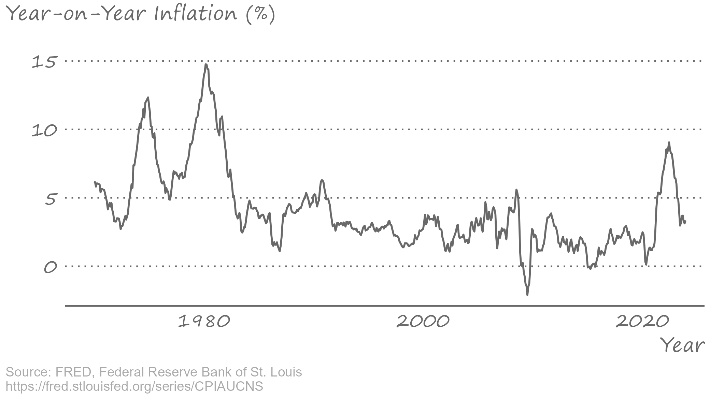
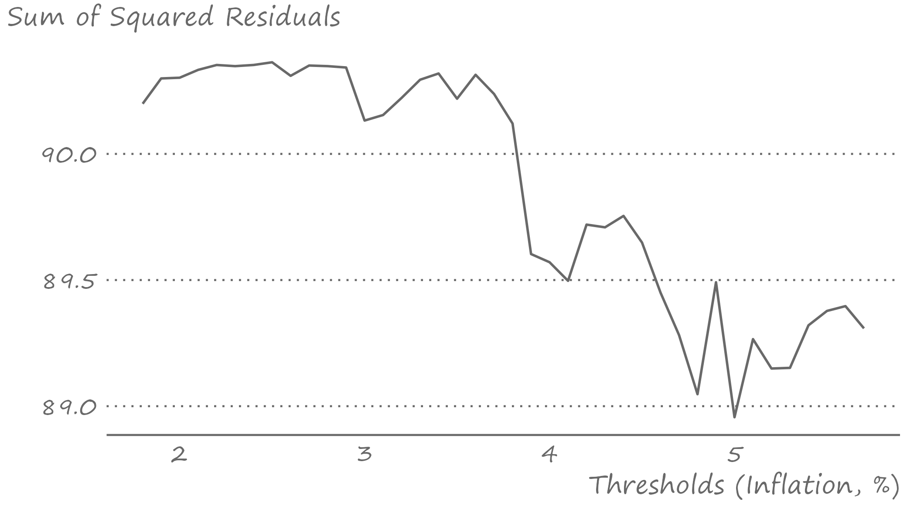
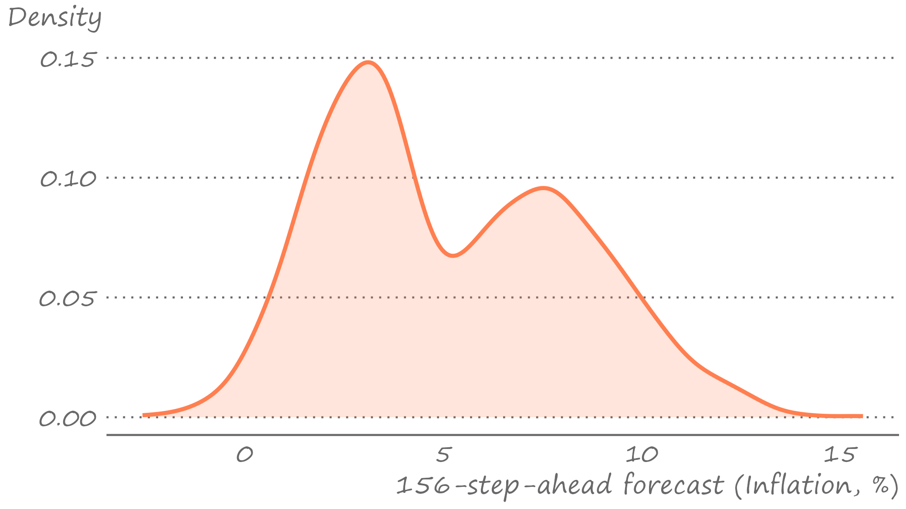

```{r setup, include=FALSE}
knitr::opts_chunk$set(echo = FALSE, fig.width = 11, fig.height = 7)
```


```{r echo=FALSE, include=FALSE, message=FALSE}
library(ggplot2)
library(data.table)
library(knitr)
```


# Nonlinear Models

.pull-left[

]

.pull-right[
Thus far we have considered linear models (i.e., the cases where a stochastic process is a linear function of the information set). 

In contrast, a nonlinear process is characterized by a process that is a nonlinear function of the information set.

There can be a wide range of functional forms of nonlinear models.
]

---


# An autoregressive model with a linear trend

.right-column[
Consider an AR(p) process with a linear trend: $$y_t = \alpha_0 + \alpha_1 t + \sum_{i=1}^{p}\beta_i y_{t-i} + \varepsilon_t,$$ where $\alpha_0 + \alpha_1 t$ is a deterministic component; denote it with $\delta_t$. 

This specification implies a linear trend, but that doesn't need to be the case. We can have quadratic or cubic trends, for example, or we can have no trend component at all.
]

---


# An autoregressive model with a nonlinear trend

.right-column[
A simple augmentation of the foregoing model is an autoregressive model with a switching trend component: $$y_t = \delta_t + \sum_{i=1}^{p}\beta_i y_{t-i} + \varepsilon_t,$$ where $$\delta_t = \delta_{0} + \delta_{1} t + \delta_{2}(t-\tau)I(t>\tau),$$ and where $\tau$ is the threshold parameter. Such a switch can be extended to the entire autoregressive process. 
]

---


# A nonlinear autoregressive model with trend

.right-column[
Consider a two-regime AR(p) with drift: $$y_t = \delta_t + \sum_{i=1}^{p}\beta_{1i} y_{t-i} + \left[\sum_{i=1}^{p}\beta_{2i} y_{t-i}\right]I(t>\tau) + \varepsilon_t,$$ where, as before, $$\delta_t = \delta_{0} + \delta_{1} t + \delta_{2}(t-\tau)I(t>\tau).$$ This equation implies that not only the trend, but also the autoregressive process changes around $\tau$.
]

---


# A regime-dependent autoregressive model

.right-column[
Thus far we have assumed that the switch occurs at some point in time, i.e. the regime-switching variable is a function of time. 

But the regime-switching variable can also be a function of the dependent variable, or other (potentially) related variables: $$y_t = \alpha_0 + \sum_{i=1}^{p}\beta_{0i} y_{t-i} + \left(\alpha_1 + \sum_{i=1}^{p}\beta_{1i} y_{t-i}\right)I(s_t>\kappa) + \varepsilon_t,$$ where $s_t$ is the regime-switching variable, and $\kappa$ is the threshold parameter. This is a threshold autoregression of order $p$, TAR(p). 
]

---


# Threshold autoregressive models

.right-column[
If in TAR(p), $s_t = y_{t-d}$, where $d\le p$ is a positive integer referred to as the delay factor, then the model is referred to as a self-exciting threshold autoregression, or SETAR(p).

If in TAR(p), $s_t = \Delta y_{t-d}$, then the model is referred to as a momentum threshold autoregression, or momentum-TAR(p).
]

---


# A multiple-regime threshold autoregressive model

.right-column[
TAR (or any version of it) can take any multiple-regime form: $$y_t = \alpha_1 + \sum_{i=1}^{p}\beta_{1i} y_{t-i} + \sum_{j=2}^{K}{\left(\alpha_j + \sum_{i=1}^{p}\beta_{ji} y_{t-i}\right)I(s_t>c_j)} + \varepsilon_t,$$ where $K$ depicts the number of regimes in the equation.
]

---

# Nuances of regime-dependent nonlinear models

.right-column[
When we estimate TAR-type models, we have no *a priori* knowledge on the number of regimes, the order of autoregression in each regime, the regime-switching variable, and the value(s) of threshold parameter(s). 

When threshold values are unknown (and need to be estimated), standard statistical inference is no longer valid. Otherwise, and given that the process is stationary, standard statistical inference applies.
]

---

# U.S. Inflation

.right-figure[

]

---

# Order of autoregression and threshold parameter

.pull-left[
```{r echo=FALSE, message=FALSE, cache=FALSE}
load("figures/lecture9/inflation.RData")

inflation_dt[,y:=value]

inflation_dt[,`:=`(y1=shift(y,1),y2=shift(y,2),y3=shift(y,3),y4=shift(y,4))]

inflation_dt <- inflation_dt[complete.cases(inflation_dt)]

ar1 <- lm(y~y1,data=inflation_dt)
ar2 <- lm(y~y1+y2,data=inflation_dt)
ar3 <- lm(y~y1+y2+y3,data=inflation_dt)
ar4 <- lm(y~y1+y2+y3+y4,data=inflation_dt)

icf <- function(m,ic){
  aic=log(crossprod(m$residuals))+2*length(m$coefficients)/length(m$residuals)
  sic=log(crossprod(m$residuals))+log(length(m$residuals))*length(m$coefficients)/length(m$residuals)
  if(ic=="a"){return(aic)}else{return(sic)}
}

dt <- data.table(AIC=round(sapply(list(ar1,ar2,ar3,ar4),icf,ic="a"),3),SIC=round(sapply(list(ar1,ar2,ar3,ar4),icf,ic="s"),3))

quantiles <- round(quantile(inflation_dt$y,c(.25,.75)),1)

candidates <- seq(quantiles[1],quantiles[2],by=.1)

ssr_dt <- data.table(candidates,ssr=NA)
for(i in 1:length(candidates)){
  inflation_dt[,`:=`(ind=ifelse(y1>candidates[i],1,0))]
  setar3 <- lm(y~(y1+y2):I(1-ind)+(y1+y2):I(ind),data=inflation_dt)
  ssr_dt$ssr[i] <- sum(setar3$residuals^2)
}

trs <- ssr_dt[ssr==min(ssr)]$candidates

knitr::kable(dt,format='html',digits=3,align="c", table.attr='class="myTable"')
```
]

.pull-right[

]

---

# Estimated SETAR(2)

.right-column[
We thus estimate the SETAR(2) model with $y_{t-1}$ as the regime-switching variable, while setting the threshold parameter to `r trs`. 
```{r echo=FALSE, message=FALSE, cache=FALSE}
inflation_dt[,`:=`(ind=ifelse(y1>trs,1,0))]
setar2 <- lm(y~(y1+y2):I(1-ind)+(y1+y2):I(ind),data=inflation_dt)

aic <- round(icf(setar2,ic="a"),3)
sic <- round(icf(setar2,ic="s"),3)

out <- t(summary(setar2)$coef[,c(1,2)])
rownames(out) <- c("estimate","s.e.")

knitr::kable(out,format="html",digits=3,align="r",row.names = T,col.names = c("$\\alpha$","$\\beta_{11}$","$\\beta_{12}$","$\\beta_{21}$","$\\beta_{22}$"),escape = FALSE)
```

The AIC of this SETAR(2) is `r round(aic,3)`, which is less than the AIC of the AR(2). But the SIC is `r round(sic,3)` which is greater than the SIC of the AR(2). 
]


---


# Forecasting with Nonlinear Models

.right-column[
In the case of time-varying shifting trend (mean) models, the most recent trend component is used to obtain forecasts. To that end, the forecasting routine is similar to that of linear trend models.

In the case of regime-switching models (e.g., TAR), one-step-ahead point forecast is obtained the usual way: 
$$\begin{aligned}
y_{t+1|t} &= \alpha_0+\beta_{01}y_{t}+\beta_{02}y_{t-1}+\ldots \\
          &+ (\alpha_1+\beta_{11}y_{t}+\beta_{12}y_{t-1}+\ldots)I(s_t>\kappa)
\end{aligned}$$
]

---


# Forecasting with Nonlinear Models

.right-column[
Obtaining $h$-step-ahead forecasts (where $h \ge 1$) is less trivial (because of the nonlinearity). Several options are available to a forecaster:

- The iterated method (or, the so-called skeleton extrapolation) is an easy option, but but it yields biased and inefficient forecasts. 
- The analytical method (assuming the model is correctly specified) yields unbiased and efficient forecasts, but can be tedious.
- The numerical method addresses the issues of the iterated method and offers a suitable approximation to the analytical method.
]

---


# Iterated Method - Skeleton Extrapolation

.right-column[
Consider a $\text{SETAR}(p,y_{t-1})$ model:

One-step-ahead point forecast: 
$$\begin{aligned}
y_{t+1|t} &= (\alpha_1 + \beta_{11} y_{t} + \ldots + \beta_{1p} y_{t+1-p})I(y_{t} \leq \kappa) \\ 
                &+ (\alpha_2 + \beta_{21} y_{t} + \ldots + \beta_{2p} y_{t+1-p})I(y_{t} > \kappa)
\end{aligned}$$
]

---


# Iterated Method - Skeleton Extrapolation

.right-column[
h-step-ahead point forecast: 
$$\begin{aligned}
y_{t+h|t} &= (\alpha_1 + \beta_{11} y_{t+h-1|t} + \ldots + \beta_{1p} y_{t+h-p})I(y_{t+h-d|t} \leq \kappa) \\
                &+ (\alpha_2 + \beta_{21} y_{t+h-1|t} + \ldots + \beta_{2p} y_{t+h-p})I(y_{t+h-d|t} > \kappa),
\end{aligned}$$

where $y_{t+h-j|t}=y_{t+h-j}$ if $j\ge h$. 

Skeleton extrapolation yields biased point forecasts for horizons $h>d$. That's because the expectation of a nonlinear function (which what point forecast should be) is not equal to the nonlinear function of the expectation (which what skeleton extrapolate is).
]

---


# Numerical Method - Bootstrap Resampling

.right-column[
Bootstrap (or Monte Carlo) resampling helps approximate the optimal forecast from nonlinear models and circumvents the complexity of integration (which would be needed for generating forecasts using the analytical method).

As an additional benefit, the procedure generates empirical density of bootstrap projections, which allows us to examine potential multimodality of these densities&mdash;a characteristic feature of those generated from regime-dependent nonlinear models such as SETAR.
]

---


# Numerical Method - Bootstrap Resampling

.right-column[
1. Estimate the regime-dependent model and store the residuals.
2. From this set of residuals, sample (with replacement) a vector of shocks for a bootstrap iteration, $\varepsilon^b = (\varepsilon_{t+1}^b,\varepsilon_{t+2}^b,\ldots,\varepsilon_{t+h}^b)'$.
3. Use this sample of shocks, along with the estimated parameters and historical observations, to generate a forecast path for the given bootstrap iteration.
4. Repeat steps 2-3 many times to generate an empirical distribution of bootstrap extrapolates.
5. Calculate horizon-specific averages of the bootstrap extrapolates to generate point forecasts.
]

---


# Numerical Method - Bootstrap Resampling

.right-column[
Consider a $\text{SETAR}(p,y_{t-1})$:

One-step-ahead bootstrap extrapolate: 
$$\begin{aligned}
y_{t+1|t}^b &= (\alpha_1 + \beta_{11} y_{t} + \ldots + \beta_{1p} y_{t+1-p})I(y_{t} \leq \kappa) \\ 
                &+ (\alpha_2 + \beta_{21} y_{t} + \ldots + \beta_{2p} y_{t+1-p})I(y_{t} > \kappa)+\varepsilon_{t+1}^b
\end{aligned}$$
]

---


# Numerical Method - Bootstrap Resampling

.right-column[
Consider a $\text{SETAR}(p,y_{t-1})$:

Two-step-ahead bootstrap extrapolate: 
$$\begin{aligned}
y_{t+2|t}^b &= (\alpha_1 + \beta_{11} y_{t+1|t}^b + \ldots + \beta_{1p} y_{t+2-p})I(y_{t+1|t}^b \leq \kappa) \\
                &+ (\alpha_2 + \beta_{21} y_{t+1|t}^b + \ldots + \beta_{2p} y_{t+2-p})I(y_{t+1|t}^b > \kappa)+\varepsilon_{t+2}^b
\end{aligned}$$
]

---


# Numerical Method - Bootstrap Resampling

.right-column[
Point forecast at horizon $h$ is: $$\bar{y}_{t+h|t} = B^{-1}\sum_{b=1}^{B}y_{t+h|t}^b,$$ where $B$ is the total number of bootstrap iterations (usually many thousands of iterations).
]

---


# Numerical Method - Bootstrap Resampling

.right-column[
Forecast error at horizon $h$ is: $$e_{t+h|t}=y_{t+h}-\bar{y}_{t+h|t}.$$ Measures of forecast accuracy measures (such as RMSFE, for example) can be obtained based on this forecast error.
]

---


# Numerical Method - Bootstrap Resampling

.right-column[
For interval forecasts, we will need to resort to the relevant percentiles of the empirical distribution of the bootstrap extrapolates. This is because the multi-step forecast density from nonlinear models, usually, is no longer symmetric or normally distributed.  
]

---

# Multistep forecasts of the inflation rate

.right-figure[

]

---

# The density forecast of the inflation rate

.right-figure[

]

---


# Key takeaways

.pull-left[

]

.pull-right[
- Nonlinear modeling is a way to address dynamic intricacies of some time series. An example of such a time series is that characterized by asymmetric cycles.
- Regime-dependent nonlinear models is one of many options available to a forecaster.
- One-step-ahead forecasts are obtained the "usual" way. For multi-step-ahead forecasts, a numerical approximation is, typically, the way to generate point and interval forecasts. 
]


