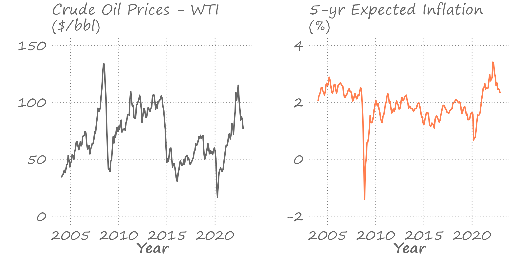
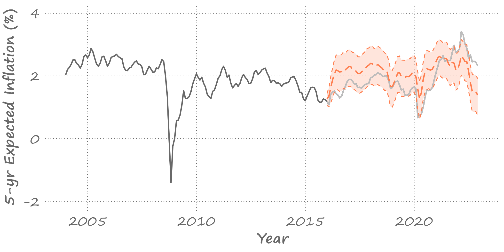
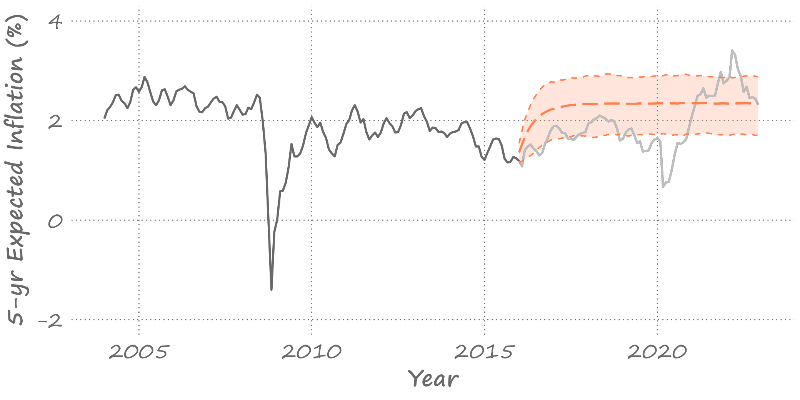
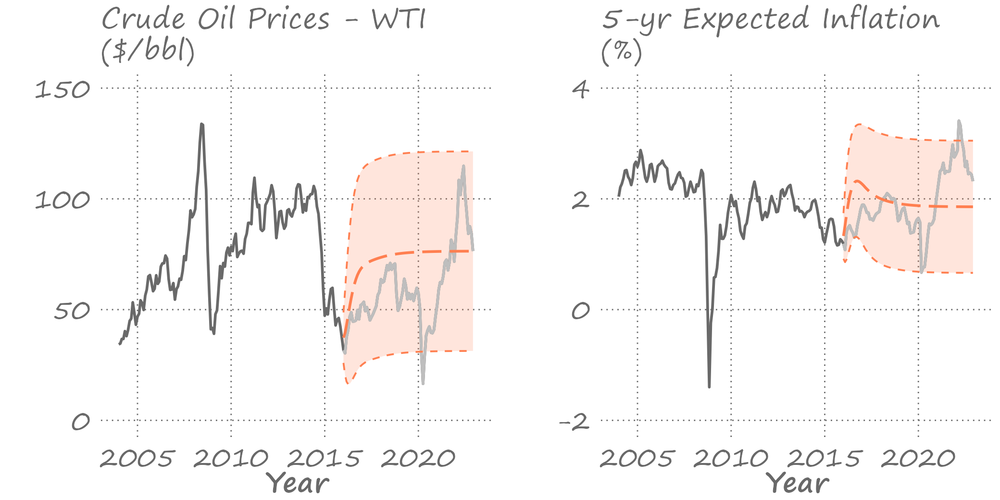

```{r setup, include=FALSE}
knitr::opts_chunk$set(echo = FALSE, fig.width = 11, fig.height = 7)
```


```{r echo=FALSE, include=FALSE, message=FALSE}
library(ggplot2)
library(data.table)
library(vars)
library(stringr)
library(forecast)
library(knitr)
library(kableExtra)
```

# Economic variables are inter-related

.pull-left[

]

.pull-right[
Economic variables are often (and usually) inter-related; for example,

- when incomes increase, people consume more; 
- when interest rates increase, people invest less.

We can model these relationships by regressing one variable on the other(s). 
]

---


# Autoregressive distributed lag (ARDL)

.right-column[
Because of possible delays in adjustment to a new equilibrium, we typically need to include lagged values in the regression.

This leads to an autoregressive distributed lag (ARDL) model, as follows: $$y_t=\alpha+\beta_1y_{t-1}+\ldots+\beta_py_{t-p}+\delta_0x_t+\ldots+\delta_qx_{t-q}+\varepsilon_t$$

Note that an autoregressive model and a distributed lag model are special cases of the ARDL.

As usual, we can use an information criterion to select $p$ and $q$.
]

---


# A relationship between oil prices and inflation

.right-column[

]

---


# ARDL lag length and estimated parameters

.pull-left[
Obtain AIC and SIC for lags 1 through 4
```{r echo=FALSE, message=FALSE, cache=FALSE}
load("figures/lecture10/inflation.RData")
load("figures/lecture10/crudeoil.RData")

ts_dt <- merge(inflation_dt[,.(date,y=value)],crudeoil_dt[,.(date,x=value)],by="date")

ts_dt[,`:=`(y1=shift(y,1),y2=shift(y,2),y3=shift(y,3),y4=shift(y,4),x1=shift(x,1),x2=shift(x,2),x3=shift(x,3),x4=shift(x,4))]

ts_dt <- ts_dt[complete.cases(ts_dt)]

ardl1 <- lm(y~y1+x+x1,data=ts_dt)
ardl2 <- lm(y~y1+y2+x+x1+x2,data=ts_dt)
ardl3 <- lm(y~y1+y2+y3+x+x1+x2+x3,data=ts_dt)
ardl4 <- lm(y~y1+y2+y3+y4+x+x1+x2+x3+x4,data=ts_dt)

icf <- function(m,ic){
  aic=log(crossprod(m$residuals))+2*length(m$coefficients)/length(m$residuals)
  sic=log(crossprod(m$residuals))+log(length(m$residuals))*length(m$coefficients)/length(m$residuals)
  if(ic=="a"){return(aic)}else{return(sic)}
}

ic_dt <- data.table(AIC=round(sapply(list(ardl1,ardl2,ardl3,ardl4),icf,ic="a"),3),SIC=round(sapply(list(ardl1,ardl2,ardl3,ardl4),icf,ic="s"),3))

knitr::kable(ic_dt,format='html',digits=3,align="c", table.attr='class="myTable"')
```
]

.pull-right[
AIC suggests four lags while SIC indicates two lags. Let's go with SIC.
```{r echo=FALSE, message=FALSE, cache=FALSE}
ardl2 <- lm(y~y1+y2+x+x1+x2,data=ts_dt)

aic <- round(icf(ardl2,ic="a"),3)
sic <- round(icf(ardl2,ic="s"),3)

out <- t(summary(ardl2)$coef[,c(1,2)])
rownames(out) <- c("estimate","s.e.")

knitr::kable(out,format="html",digits=3,align="r",row.names = T,col.names = c("$\\alpha$","$\\beta_{1}$","$\\beta_{2}$","$\\delta_{0}$","$\\delta_{1}$","$\\delta_{2}$"),escape=F,booktabs=T)
```
]

---


# Forecasting with ARDL

.right-column[
Point forecasts:

$$\begin{align}
y_{t+1|t} &= \alpha + \beta_1y_{t} + \beta_2y_{t-1}+\delta_0\hat{x}_{t+1}+\delta_1x_{t}+\delta_2x_{t-1}\\
y_{t+2|t} &= \alpha + \beta_1y_{t+1|t} + \beta_2y_{t}+\delta_0\hat{x}_{t+2}+\delta_1\hat{x}_{t+1}+\delta_2x_{t}\\
y_{t+h|t} &= \alpha + \beta_1y_{t+h-1|t} + \beta_2y_{t+h-2|t}\\
&+\delta_0\hat{x}_{t+h}+\delta_1\hat{x}_{t+h-1}+\delta_2\hat{x}_{t+h-2}
\end{align}$$

Note, and this is one of the caveats of using ARDL in forecasting, we need to have a knowledge of future realized values of $x$. Often, that involves also (separately) forecasting those values, or setting them to some values (e.g., scenario forecasting).
]

---


# Forecasting with ARDL

.right-column[
If we assume (somewhat unrealistically) that we know the future realized values of $x$, then the forecast errors and forecast error variances from the ARDL model will be the same as those from an AR model. 

This is, in a way, akin to working with an AR model that includes a trend or a seasonal component.

Of course, obtaining direct multistep forecasts is always an option.
]

---


# If we knew future realized values of oil prices

.right-column[

]

---


# If we set future realized values to the current oil price

.right-column[

]

---


# Vector autoregression

.right-column[
More generally, dynamic linkages between two (or more) economic variables can be modeled as a *system of equations*, better known as a vector autoregression (VAR).
]

---

# Vector autoregression

.right-column[
To begin, consider a bivariate first-order VAR. 

Let $\{X_{1t}\}$ and $\{X_{2t}\}$ be the stationary stochastic processes. A bivariate VAR(1), is then given by:
$$\begin{aligned}
x_{1t} &= \alpha_1 + \pi_{111}x_{1t-1} + \pi_{121}x_{2t-1} + \varepsilon_{1t} \\
x_{2t} &= \alpha_2 + \pi_{211}x_{1t-1} + \pi_{221}x_{2t-1} + \varepsilon_{2t}
\end{aligned}$$

where $\varepsilon_{1t} \sim iid(0,\sigma_1^2)$ and $\varepsilon_{2t} \sim iid(0,\sigma_2^2)$, and the two can be correlated, i.e., $Cov(\varepsilon_{1t},\varepsilon_{2t}) \neq 0$.
]

---

# Vector autoregression

.right-column[
An $n$-dimensional VAR of order $p$, VAR(p), presented in matrix notation: $$\mathbf{x}_t = \mathbf{\alpha} + \Pi_1 \mathbf{x}_{t-1} + \ldots + \Pi_p \mathbf{x}_{t-p} + \mathbf{\varepsilon}_t,$$ where $\mathbf{x}_t = (x_{1t},\ldots,x_{nt})'$ is a vector of $n$ (potentially) related variables; $\mathbf{\varepsilon}_t = (\varepsilon_{1t},\ldots,\varepsilon_{nt})'$ is a vector of error terms, such that $\mathbb{E}\left(\mathbf{\varepsilon}_t\right) = \mathbf{0}$, $\mathbb{E}\left(\mathbf{\varepsilon}_t^{}\mathbf{\varepsilon}_t^{\prime}\right) = \Sigma_{\mathbf{\varepsilon}}$, and $\mathbb{E}\left(\mathbf{\varepsilon}_{t}^{}\mathbf{\varepsilon}_{s \neq t}^{\prime}\right) = 0$.
]
		
---

# A parameter matrix of a vector autoregression

.right-column[
$\Pi_1,\ldots,\Pi_p$ are $n$-dimensional parameter matrices such that: 
$$\Pi_j = 
	    \left[ 
		\begin{array}{cccc} 
		\pi_{11j} & \pi_{12j} & \cdots &  \pi_{1nj} \\ 
		\pi_{21j} & \pi_{22j} & \cdots &  \pi_{2nj} \\  
		\vdots & \vdots & \ddots &  \vdots \\  
		\pi_{n1j} & \pi_{n2j} & \cdots &  \pi_{nnj} 
		\end{array} 
		\right],\;~~j=1,\ldots,p$$
]
		
---


# Features of vector autoregression

.right-column[
General features of a (reduced-form) vector autoregression are that:
- only the lagged (i.e., no contemporaneous) values of the dependent variables are on the right-hand-side of the equations.
  * Although, trends and seasonal variables can also be included.
- each equation has the same set of right-hand-side variables.
  * However, it is possible to impose different lag structure across the equations, especially when $p$ is relatively large. This is because the number of parameters increases very quickly with the number of lags or the number of variables in the system.
- the autregressive order, $p$, is the largest lag across all equations.
]

---

# Modeling vector autoregression

.right-column[
The autoregressive order, $p$, can be determined using system-wide information criteria:

$$\begin{aligned}
& AIC = \ln\left|\Sigma_{\mathbf{\varepsilon}}\right| + \frac{2}{T}(pn^2+n) \\
& SIC = \ln\left|\Sigma_{\mathbf{\varepsilon}}\right| + \frac{\ln{T}}{T}(pn^2+n)
\end{aligned}$$

where $\left|\Sigma_{\mathbf{\varepsilon}}\right|$ is the determinant of the residual covariance matrix; $n$ is the number of equations, and $T$ is the total number of observations.
]

---

# Estimating vector autoregression

.right-column[
When each equation of VAR has the same regressors, the OLS can be applied to each equation individually to estimate the regression parameters - i.e., the estimation can be carried out on the equation-by-equation basis.

Indeed, taken separately, each equation is just an ARDL (albeit without any contemporaneous regressors in the right-hand side of the equation).

When processes are covariance-stationarity, conventional t-tests and F-tests are applicable for hypotheses testing.
]

---


# Testing in-sample Granger causality

.right-column[
Consider a bivariate VAR(p): 
$$\begin{aligned}
x_{1t} &= \alpha_1 + \pi_{111} x_{1t-1} + \cdots + \pi_{11p} x_{1t-p} \\
&+ \pi_{121} x_{2t-1} + \cdots + \pi_{12p} x_{2t-p} +\varepsilon_{1t}  \\
x_{2t} &= \alpha_1 + \pi_{211} x_{1t-1} + \cdots + \pi_{21p} x_{1t-p} \\
&+ \pi_{221} x_{2t-1} + \cdots + \pi_{22p} x_{2t-p} +\varepsilon_{2t} 
\end{aligned}$$

- $\{X_2\}$ does not Granger cause $\{X_1\}$ if $\pi_{121}=\cdots=\pi_{12p}=0$
- $\{X_1\}$ does not Granger cause $\{X_2\}$ if $\pi_{211}=\cdots=\pi_{21p}=0$
]

---


# Testing in-sample Granger causality

.right-column[
In our example:
```{r echo=FALSE, message=FALSE, cache=FALSE}
ar21 <- lm(y~y1+y2,data=ts_dt)
ar22 <- lm(x~x1+x2,data=ts_dt)

var21 <- lm(y~y1+y2+x1+x2,data=ts_dt)
var22 <- lm(x~y1+y2+x1+x2,data=ts_dt)

f21 <- anova(var21,ar21)
f22 <- anova(var22,ar22)

```

$\text{Crude Oil}\xrightarrow{gc}\text{Inflation}$: F statistic is `r round(f21[2,5],2)`

$\text{Inflation}\xrightarrow{gc}\text{Crude Oil}$: F statistic is `r round(f22[2,5],2)`

So, we have a unidirectional Granger causality (from crude oil prices to 5-year expected inflation).
]

---


# Forecasting with VAR models: one-step ahead

.right-column[
To keep things simple, we illustrate using bivariate VAR(1).

Point forecasts:
$$\begin{aligned}
x_{1t+1|t} &= \alpha_1 + \pi_{111} x_{1t} + \pi_{121} x_{2t} \\
x_{2t+1|t} &= \alpha_2 + \pi_{211} x_{1t} + \pi_{221} x_{2t}
\end{aligned}$$

Forecast errors: 
$$\begin{aligned}
e_{1t+1} &= x_{1t+1} - x_{1t+1|t} = \varepsilon_{1t+1} \\
e_{2t+1} &= x_{2t+1} - x_{2t+1|t} = \varepsilon_{2t+1}
\end{aligned}$$
]

---

# Forecasting with VAR models: one-step ahead

.right-column[
Forecast variances:
$$\begin{aligned}
\sigma_{1t+1}^2 &= \mathbb{E}(e_{1t+1}|\Omega_t)^2 = \mathbb{E}(\varepsilon_{1t+1}^2) = \sigma_{1}^2 \\
\sigma_{2t+1}^2 &= \mathbb{E}(e_{2t+1}|\Omega_t)^2 = \mathbb{E}(\varepsilon_{2t+1}^2) = \sigma_{2}^2
\end{aligned}$$

Assuming normality of forecast errors, interval forecasts are obtained the usual way.
]

---

# Forecasting with VAR models: multi-step ahead

.right-column[
Point forecasts:
$$\begin{aligned}
x_{1t+h|t} &= \alpha_1 + \pi_{111} x_{1t+h-1|t} + \pi_{121} x_{2t+h-1|t} \\
x_{2t+h|t} &= \alpha_2 + \pi_{211} x_{1t+h-1|t} + \pi_{221} x_{2t+h-1|t}
\end{aligned}$$

Forecast errors: 
$$\begin{aligned}
e_{1t+h} &= \pi_{111} e_{1t+h-1} + \pi_{121} e_{2t+h-1} + \varepsilon_{1t+h} \\
e_{2t+h} &= \pi_{211} e_{1t+h-1} + \pi_{221} e_{2t+h-1} + \varepsilon_{2t+h}
\end{aligned}$$

Forecast variances are the functions of error variances and covariances, and the model parameters.
]

---


# Forecasting oil prices and inflation

.right-column[

]

---


# Direct multi-step ahead forecasts

.right-column[
For a given horizon, $h$, the estimated model:
$$\begin{aligned}
x_{1t} &= \phi_1 + \psi_{111} x_{1t-h} + \psi_{121} x_{2t-h} + \upsilon_{1ht} \\
x_{2t} &= \phi_2 + \psi_{211} x_{1t-h} + \psi_{221} x_{2t-h} + \upsilon_{2ht}
\end{aligned}$$

where $\upsilon_{1ht} \sim iid(0,\sigma_{1h}^2)$ and $\upsilon_{2ht} \sim iid(0,\sigma_{2h}^2)$, and the two can be correlated, i.e., $Cov(\upsilon_{1ht},\upsilon_{2ht}) \neq 0$.

Point forecasts:
$$\begin{aligned}
x_{1t+h|t} &= \phi_1 + \psi_{111} x_{1t} + \psi_{121} x_{2t} \\
x_{2t+h|t} &= \phi_2 + \psi_{211} x_{1t} + \psi_{221} x_{2t}
\end{aligned}$$
]

---


# Direct multi-step ahead forecasts

.right-column[
Forecast errors: 
$$\begin{aligned}
e_{1t+h} &= \upsilon_{1t+h} \\
e_{2t+h} &= \upsilon_{2t+h}
\end{aligned}$$

Forecast variances:
$$\begin{aligned}
\sigma_{1t+h}^2 &= \mathbb{E}(e_{1t+h}|\Omega_t)^2 = \mathbb{E}(\upsilon_{1t+h}^2) = \sigma_{1h}^2 \\
\sigma_{2t+h}^2 &= \mathbb{E}(e_{2t+h}|\Omega_t)^2 = \mathbb{E}(\upsilon_{2t+h}^2) = \sigma_{2h}^2
\end{aligned}$$

Assuming normality, interval forecasts are obtained directly from these variances, the usual way.
]

---


# Out-of-Sample Granger Causality

.right-column[
The previously discussed (in sample) tests of causality in Granger sense are frequently performed in practice, but the 'true spirit' of such test is to assess the ability of a variable to help predict another variable in an out-of-sample setting.
]

---


# Out-of-Sample Granger Causality

.right-column[
Consider restricted and unrestricted information sets:
$$\begin{aligned}
&\Omega_{t}^{(r)} \equiv \Omega_{t}(X_1) = \{x_{1,t},x_{1,t-1},\ldots\} \\
&\Omega_{t}^{(u)} \equiv \Omega_{t}(X_1,X_2) = \{x_{1,t},x_{1,t-1},\ldots,x_{2,t},x_{2,t-1},\ldots\}
\end{aligned}$$

Following Granger's definition of causality: $\{X_2\}$ is said to cause $\{X_1\}$ if $\sigma_{x_1}^2\left(\Omega_{t}^{(u)}\right) < \sigma_{x_1}^2\left(\Omega_{t}^{(r)}\right)$, meaning that we can better predict $X_1$ using all available information on $X_1$ and $X_2$, rather than that on $X_1$ only.
]

---

# Out-of-Sample Granger Causality

.right-column[
Let the forecasts based on each of the information sets be:
$$\begin{aligned}
	&x_{1t+h|t}^{(r)} = E\left(x_{1t+h}|\Omega_{t}^{(r)}\right) \\
	&x_{1t+h|t}^{(u)} = E\left(x_{1t+h}|\Omega_{t}^{(u)}\right)
\end{aligned}$$
]

---


# Out-of-Sample Granger Causality

.right-column[
For these forecasts, the corresponding forecast errors are:
$$\begin{aligned}
	& e_{1t+h}^{(r)} = x_{1t+h} - x_{1t+h|t}^{(r)}\\
	& e_{1t+h}^{(u)} = x_{1t+h} - x_{1t+h|t}^{(u)}
\end{aligned}$$

The out-of-sample forecast errors are then evaluated by comparing the loss functions based on these forecasts errors.

The out of sample Granger causality test is, in effect, a test of relative forecast accuracy between the two models.
]

---

# Accuracy Tests for Nested Models

.right-column[
In testing Out-of-sample Granger causality, we compare nested models.

For example, consider a bivariate VAR(1). A test of out-of-sample Granger causality involves comparing forecasts from these two models:
$$\begin{aligned}
(A):~~x_{1t} &= \beta_0+\beta_{1}x_{1t-1}+\beta_{2}x_{2t-1}+\upsilon_t \\
(B):~~x_{1t} &= \alpha_0+\alpha_{1}x_{1t-1}+\varepsilon_t
\end{aligned}$$

Obviously, here model (B) is nested in model (A). Under the null of Granger non-causality, the disturbances of the two models are identical. This leads to 'issues' in the usual tests. 
]

---


# Accuracy Tests for Nested Models

.right-column[
There is a way to circumvent these issues, which involves an adjustment of the loss differential. 

In particular, the loss differential now becomes: $$d(e_{t+h,ij})=e_{t+h,i}^2-e_{t+h,j}^2+(y_{t+h|t,i}-y_{t+h|t,j})^2,$$ where model $i$ is nested in model $j$.

The testing procedure is otherwise similar to the Diebold-Mariano test.
]

---


# Readings

.pull-left[

]

.pull-right[
Gonzalez-Rivera, Chapter 11

Hyndman & Athanasopoulos, [12.3](https://otexts.com/fpp3/VAR.html)
]


